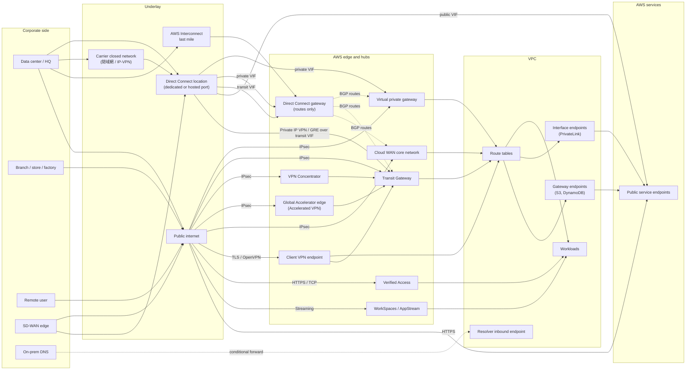

# 01. The map: every path from a corporate network to AWS

This page is the index for the whole research set. It sorts every way a corporate network (head office, branch, factory, data center, colocation cage, or a person working from home) can reach AWS. It sorts them two ways: by network layer and by who is connecting. It then compares every path side by side. Each path has its own deep-dive page; this page only gives the overview and the comparison. Facts are verified as of 2026-10-10 against AWS documentation, What's New posts, SLA pages and AWS blogs listed under Sources. Where a number is a quota or list price, check the linked page before relying on it, because AWS changes these often (four of the numbers on this page changed between November 2025 and September 2026).

The backbone of this map is the AWS whitepaper *Hybrid Connectivity* (published 2023-07-06). It groups requirements into security, time to deploy, performance, reliability, communication model and scalability, then uses decision trees to rule options out. The companion whitepaper *Building a Scalable and Secure Multi-VPC AWS Network Infrastructure* (2024-04-17) covers what happens after the link lands in AWS: hubs, centralized inspection, endpoints and hybrid DNS. Two AWS Networking blog decision frameworks from 2026 cover the newer options the whitepaper predates: *Selecting the Right AWS VPN Solution* (2026-05-04) and *Selecting the right AWS private connectivity options* (2026).

## The one-sentence model

A hybrid path is always the same five layers stacked on top of each other: a **physical underlay** (the internet, a Direct Connect port, or a carrier's closed network), an optional **overlay** (IPsec, GRE, MACsec, TLS), an **AWS-side termination or hub** (virtual private gateway, transit gateway, Cloud WAN, Client VPN endpoint, Verified Access), the **VPC** (route tables, security groups, endpoints, DNS), and finally the **service** you wanted to reach. Most confusion comes from choosing the right option at one layer and the wrong one at another. For example, people pick Direct Connect for privacy but forget it is not encrypted, or they build a private path and leave DNS resolving to public IPs.

## Taxonomy 1: by layer

| Layer | What it decides | Options on AWS | Notes |
| --- | --- | --- | --- |
| L0 Physical underlay | Which wire or carrier carries the packets | Public internet (any ISP); Direct Connect dedicated connection (1/10/100/400 Gbps); Direct Connect hosted connection (50 Mbps to 25 Gbps via a partner); AWS Interconnect – last mile (1 to 100 Gbps, partner-managed, GA 2026-04); carrier closed network or IP-VPN that ends at a Direct Connect location | Only Direct Connect and Interconnect keep traffic off the public internet. A carrier "closed network" (閉域網) usually lands on AWS *as* a Direct Connect hosted connection. |
| L1 Overlay / encryption | Whether the traffic is wrapped, and by what | IPsec Site-to-Site VPN (over the internet, Accelerated over Global Accelerator, or Private IP VPN over a DX transit VIF); MACsec (802.1AE, on the DX port); GRE (Transit Gateway Connect for SD-WAN); TLS/OpenVPN (Client VPN); HTTPS/TLS (Verified Access, SSM, public AWS APIs) | Direct Connect itself does **not** encrypt. Encryption comes from MACsec, an IPsec VPN on top, or TLS at the application. |
| L2 AWS edge and hub | Where the path ends and how it fans out to VPCs | Virtual private gateway (VGW, one VPC); Direct Connect gateway (DXGW, global, routes only); Transit Gateway (TGW, regional hub); AWS Cloud WAN core network (global, policy-driven); VPN Concentrator (many small sites on one TGW attachment); Client VPN endpoint; Verified Access instance | DXGW is a distributed BGP route reflector, not a forwarding hub. It does not move traffic between the VPCs or VIFs attached to it. |
| L3 VPC | What happens inside the VPC | Route tables and route propagation; security groups and network ACLs; Route 53 VPC Resolver (inbound/outbound endpoints, rules); VPC Block Public Access; VPC Encryption Controls | Route priority rules decide DX vs VPN when both advertise the same prefix. |
| L4 Service reach | How you reach the actual service | Public AWS endpoints (over the internet or a DX public VIF); gateway endpoints (S3, DynamoDB; **not reachable from on-premises**); interface endpoints (AWS PrivateLink, reachable from on-premises); resource endpoints and service-network endpoints (PrivateLink + VPC Lattice, 2024-12); cross-Region interface endpoints (2024-11 for endpoint services, 2025-11 for some AWS services) | Picking a private link at L0 does not make L4 private. Each service call must resolve to a private address too. |

## Taxonomy 2: by who connects

| Who | Typical need | Paths | Deep-dive topic |
| --- | --- | --- | --- |
| Sites: data center, head office | High bandwidth, steady latency, many VPCs | Direct Connect (dedicated or hosted) + DXGW + TGW or Cloud WAN, with Site-to-Site VPN as backup; Interconnect – last mile | Direct Connect, hubs |
| Sites: branches, stores, factories | Many small links, quick to add | Site-to-Site VPN to TGW; VPN Concentrator (25+ sites under 100 Mbps); SD-WAN via TGW Connect or Cloud WAN; Accelerated VPN for far-away sites | VPN, SD-WAN |
| Sites to each other | Replace or back up MPLS | Direct Connect SiteLink; VPN CloudHub (on a VGW); TGW or Cloud WAN as a transit | Direct Connect, hubs |
| People | Remote users reach internal apps | AWS Client VPN (network-level, OpenVPN); AWS Verified Access (per-application, zero trust, HTTP(S) plus TCP/SSH/RDP since 2025-02); Amazon WorkSpaces / AppStream 2.0 (pixels only); Systems Manager Session Manager (admin shell, no inbound ports) | Remote access |
| Services and apps | On-premises code calls AWS APIs or private apps | Public endpoints over the internet or a public VIF; interface endpoints over DX or VPN; PrivateLink resource endpoints and VPC Lattice | PrivateLink / Lattice, hybrid DNS |
| Data | Bulk or continuous transfer | DataSync, Storage Gateway, Transfer Family over any of the above; AWS Data Transfer Terminal for physical drop-off; Snowball Edge (no longer offered to new customers) | Data paths |
| On-premises compute that *is* AWS | AWS hardware in your building | AWS Outposts (service link back to its parent Region, over DX or the internet); Local Zones | Outposts / edge |

## The big map

The diagram reads left to right: where you are, how you get out, what wraps the traffic, where AWS receives it, and what it finally reaches. Solid arrows carry data. Dotted arrows carry only control (BGP routes or DNS).

Three things the diagram makes visible:

- Every DX path goes *through* a Direct Connect location, but traffic to VPCs goes *around* the DXGW (it only hands out routes). That is why "the DXGW is a hub" is a wrong mental model.
- Gateway endpoints hang off the VPC route table, so traffic arriving from on-premises cannot use them. Only interface endpoints are reachable from on-premises.
- People have four separate paths (Client VPN, Verified Access, WorkSpaces, Session Manager). They reach different layers: the network, one app, a remote desktop, or a shell.

## Comparison matrix

Bandwidth figures are AWS-side per-unit limits. What you actually get depends on your circuit, device, packet size and the path. "Lead time" is the typical time from decision to traffic flowing. AWS does not publish lead times for Direct Connect. The whitepaper only says "within hours" for internet-based links and "weeks or months if additional circuits must be installed".

| Path | Bandwidth (AWS-side unit) | Latency / jitter | Setup lead time | Cost model | Encryption by default | AWS SLA | Typical use |
| --- | --- | --- | --- | --- | --- | --- | --- |
| Site-to-Site VPN → VGW | Up to 1.25 Gbps per tunnel, 140k PPS; 2 tunnels per connection; no ECMP on VGW | Internet: variable | Minutes to hours (needs a CGW with a public IP) | Per connection-hour + data transfer out | Yes (IPsec) | 99.95% per VPN connection | Small office with one VPC; DX backup for one VPC |
| Site-to-Site VPN → TGW / Cloud WAN (standard) | 1.25 Gbps per tunnel; ECMP across tunnels and connections with BGP | Internet: variable | Minutes to hours | Per connection-hour + TGW attachment-hour + TGW per-GB processing + DTO | Yes (IPsec) | 99.95% per VPN connection | Multi-VPC branch connectivity; DX backup |
| Large bandwidth tunnel (2025-11) | Up to 5 Gbps and 400k PPS per tunnel | Internet: variable | Minutes to hours; tunnel size can be changed in place since 2026-05 | As above, higher rate | Yes (IPsec) | 99.95% per VPN connection | Factory or DC needing 3–5 Gbps without managing ECMP |
| Accelerated Site-to-Site VPN | 1.25 Gbps per tunnel | Better: enters the AWS backbone at the nearest edge | Minutes; must be set at creation (no in-place upgrade) | VPN + Global Accelerator charges | Yes (IPsec) | 99.95% per VPN connection | Far-away offices, intercontinental |
| VPN Concentrator (2025-11) | Up to 100 Mbps per site tunnel; up to 5 Gbps shared per concentrator; up to 100 sites per concentrator | Internet: variable | Minutes per site | Concentrator + per-site charges; one TGW attachment | Yes (IPsec) | See VPN SLA | 25+ small sites (stores, kiosks, IoT) |
| SD-WAN via TGW Connect | 5 Gbps per GRE peer, 4 peers = 20 Gbps per Connect attachment | Same as transport (DX or VPC) | Days (partner automation) | TGW Connect attachment-hour + per-GB | No (GRE). The SD-WAN fabric adds its own encryption | TGW SLA (99.99% multi-AZ) | Extend an existing SD-WAN into AWS |
| Direct Connect dedicated | 1, 10, 100, 400 Gbps ports; LAG up to 2×100/400 or 4×lower | Consistent, private | Weeks to months (LOA-CFA, cross connect, carrier tail) | Port-hour + DTO per GB, or flat-rate per 10G/100G port (2026-09) | No | 99.99% Multi-Site Redundant, 99.9% Multi-Site Non-Redundant, 95% Single Connection | Data center primary link |
| Direct Connect hosted | 50 Mbps to 25 Gbps (partner-policed); one VIF per connection | Consistent, private | Days to weeks via partner | Partner fee + AWS hosted port-hour + DTO | No | Same SLA framework, depends on design | Mid-size sites, faster start |
| DX + MACsec | Line rate on 10/100/400G dedicated at select locations | As DX | As DX + key setup | As DX (MACsec-capable port) | Yes, hop-by-hop L2 (your router ↔ AWS DX router) | As DX | Regulated, high-throughput encryption |
| Private IP VPN over DX | 1.25 Gbps per tunnel (ECMP to scale); requires TGW | As DX | Hours on top of an existing transit VIF | VPN + TGW + DX | Yes (IPsec, private addresses) | VPN + DX | Regulated "encrypt everything, no public IPs" |
| AWS Interconnect – last mile (GA 2026-04) | 1 to 100 Gbps, changeable from the console | Consistent, private | Minutes to days (partner pre-provisioned; Lumen GA, AT&T gated preview, US only) | Single fee by bandwidth and scope | Yes (MACsec on by default) | 99.99% to the DX port | Branch or DC without its own DX presence |
| Direct Connect SiteLink | Inherits VIF/port speed | AWS backbone, shortest path between DX locations | Minutes once DX exists | Per-hour per VIF + per-GB | No | — | Site-to-site, MPLS replacement or backup |
| DX public VIF | DX port speed | Consistent | As DX | As DX | No (use TLS / IPsec) | As DX | Private path to public AWS endpoints (S3, APIs) |
| Internet HTTPS to public endpoints | Your ISP | Variable | None | DTO only | Yes (TLS) | Per-service SLA | Default for SaaS-style AWS API use |
| AWS Client VPN | Blog guidance: up to about 50 Mbps per user; scales with subnets | Internet + user's Wi-Fi | Hours (certs or SAML IdP) | Endpoint association-hour + connection-hour | Yes (TLS / OpenVPN) | 99.9% per Region | Remote workforce network access |
| AWS Verified Access | Per-app | Internet | Hours (IdP + device trust provider) | Per app-hour + per-GB | Yes (TLS) | 99.9% per endpoint per Region | VPN-less per-app zero-trust access |
| SSM Session Manager | Shell / port forward | Internet or interface endpoints | Minutes (agent + IAM) | No extra charge for sessions (endpoints cost extra) | Yes (TLS; optional KMS) | — | Admin access with no inbound ports or bastions |
| WorkSpaces / AppStream 2.0 | Display stream | Internet | Hours | Per desktop or per streaming hour | Yes | Per-service SLA | Data stays in AWS; only pixels leave |
| AWS Interconnect – multicloud (GA 2026-04) | By tier | Private | Minutes | Single fee by bandwidth and scope; one free 500 Mbps local link per Region | Yes (MACsec) | Built-in redundancy | AWS ↔ Google Cloud / OCI (Azure planned for later in 2026) |

Encryption note: "No" for Direct Connect means AWS does not add encryption on the link. AWS states that all data crossing the AWS global network between AWS facilities is encrypted at the physical layer. That is a different segment from the customer router ↔ DX router hop, which MACsec covers.

## How to read the matrix

1. Start with **who** connects (taxonomy 2). People paths and site paths almost never replace each other.
2. For sites, decide **underlay** on bandwidth, jitter and lead time. Internet VPN is a day; DX is weeks; Interconnect – last mile shrinks that where it is offered.
3. Decide **encryption** separately from privacy. Private ≠ encrypted.
4. Decide the **hub**: VGW for one VPC, TGW for one Region with many VPCs, Cloud WAN for several Regions run as one policy-driven network.
5. Then fix **L3/L4**: DNS (Resolver endpoints), interface endpoints for AWS services, and route priority between DX and VPN.

## Sources

- <https://docs.aws.amazon.com/whitepapers/latest/hybrid-connectivity/hybrid-connectivity.html>
- <https://docs.aws.amazon.com/whitepapers/latest/hybrid-connectivity/time-to-deploy.html>
- <https://docs.aws.amazon.com/whitepapers/latest/building-scalable-secure-multi-vpc-network-infrastructure/welcome.html>
- <https://docs.aws.amazon.com/wellarchitected/latest/hybrid-networking-lens/hybrid-networking-lens.html>
- <https://aws.amazon.com/blogs/networking-and-content-delivery/selecting-the-right-aws-vpn-solution-a-decision-framework/>
- <https://aws.amazon.com/blogs/networking-and-content-delivery/selecting-the-right-aws-private-connectivity-options-a-decision-framework/>
- <https://docs.aws.amazon.com/vpn/latest/s2svpn/vpn-limits.html>
- <https://aws.amazon.com/vpn/site-to-site-vpn-sla>
- <https://aws.amazon.com/vpn/client-vpn-sla>
- <https://aws.amazon.com/directconnect/sla/>
- <https://aws.amazon.com/transit-gateway/sla/>
- <https://aws.amazon.com/verified-access/sla/>
- <https://aws.amazon.com/directconnect/partners/>
- <https://docs.aws.amazon.com/directconnect/latest/UserGuide/encryption-in-transit.html>
- <https://docs.aws.amazon.com/directconnect/latest/UserGuide/virtualgateways.html>
- <https://docs.aws.amazon.com/directconnect/latest/UserGuide/WorkingWithVirtualInterfaces.html>
- <https://aws.amazon.com/blogs/networking-and-content-delivery/hybrid-cloud-architectures-using-aws-direct-connect-gateway/>
- <https://aws.amazon.com/blogs/networking-and-content-delivery/simplify-sd-wan-connectivity-with-aws-transit-gateway-connect/>
- <https://aws.amazon.com/blogs/networking-and-content-delivery/implementing-encryption-in-transit-across-connectivity-patterns-with-vpc-encryption-controls/>
- <https://repost.aws/knowledge-center/s3-bucket-access-direct-connect>
- <https://docs.aws.amazon.com/vpn/latest/clientvpn-admin/what-is.html>
- <https://aws.amazon.com/vpn/pricing/>
- <https://aws.amazon.com/about-aws/whats-new/2025/11/aws-site-to-site-vpn-5-gbps-bandwidth-tunnels/>
- <https://aws.amazon.com/about-aws/whats-new/2025/11/aws-site-to-site-vpn-concentrator/>
- <https://aws.amazon.com/about-aws/whats-new/2026/05/aws-site-to-site-vpn-modify-bandwidth/>
- <https://aws.amazon.com/about-aws/whats-new/2026/04/aws-announces-ga-AWS-interconnect-last-mile/>
- <https://aws.amazon.com/about-aws/whats-new/2026/04/aws-announces-ga-AWS-interconnect-multicloud/>
- <https://aws.amazon.com/about-aws/whats-new/2026/09/aws-direct-connect-announces-flat-rate-pricing/>
- <https://aws.amazon.com/about-aws/whats-new/2024/12/access-vpc-resources-aws-privatelink>
- <https://aws.amazon.com/about-aws/whats-new/2025/02/aws-verified-access-zero-trust-resources-non-https-protocols/>
- <https://docs.aws.amazon.com/snowball/latest/developer-guide/snowball-edge-availability-change.html>
