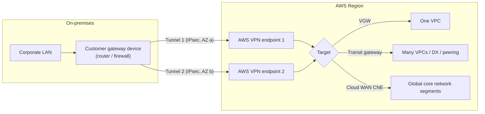
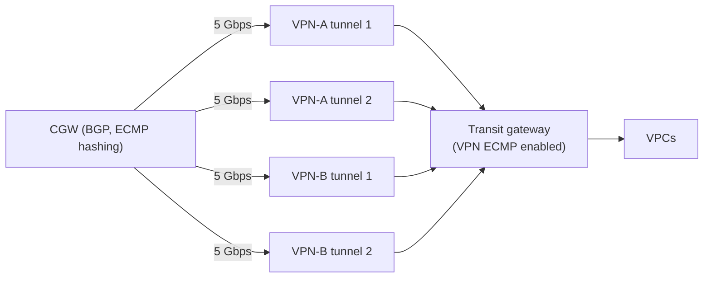
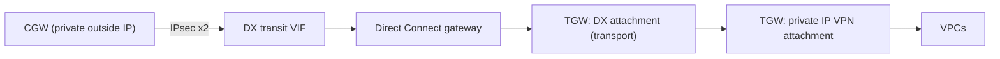
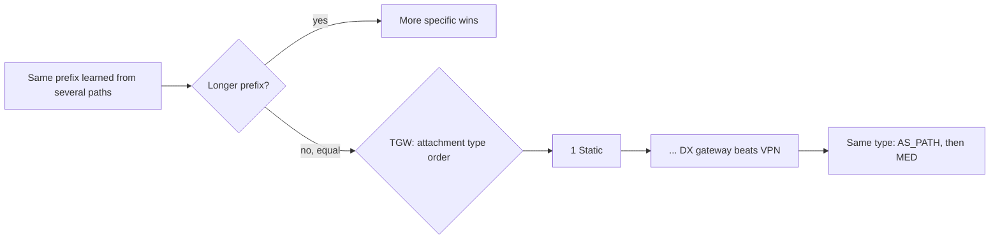

# AWS Site-to-Site VPN

This page covers AWS Site-to-Site VPN, the managed IPsec service that connects an on-premises network (data center, office, branch) to AWS over the internet or over Direct Connect. It covers where a VPN can terminate on the AWS side, the customer gateway, tunnels and routing, crypto options, bandwidth, acceleration, private IP VPN, IPv6, logging, route priority, quotas, pricing and the SLA. Every number was checked against AWS documentation, What's New posts, the AWS Price List API and AWS blogs, verified as of 2026-10-10. Where AWS sources disagree with each other, the page says so instead of picking one silently.

## At a glance

| Item | Value |
| --- | --- |
| Protocol | IPsec, route-based only (policy-based VPN is not supported as a design; AWS proposes 0.0.0.0/0 traffic selectors by default) |
| Tunnels per VPN connection | 2, each with its own AWS outside IP, terminating in different Availability Zones |
| AWS-side termination | Virtual private gateway (VGW), transit gateway (TGW), AWS Cloud WAN core network edge, or a Site-to-Site VPN Concentrator (on a TGW) |
| Routing | Static or dynamic (BGP); Cloud WAN and Concentrator connections are BGP only |
| IKE | IKEv1 and IKEv2 both allowed by default; AWS strongly recommends IKEv2 |
| Bandwidth per tunnel | Standard up to 1.25 Gbps / 140,000 PPS; Large up to 5 Gbps / 400,000 PPS; Concentrator site up to 100 Mbps / 10,000 PPS |
| MTU / MSS | 1446 / 1406 bytes maximum (best case, AES-GCM without NAT-T); no jumbo frames; no PMTUD |
| SLA | 99.95% monthly uptime per VPN connection |
| Price (Tokyo) | USD 0.048 per standard connection-hour; USD 0.60 per Large (5 Gbps) connection-hour |

## Building blocks

A Site-to-Site VPN connection always has three parts: a customer gateway (CGW) resource that describes your on-premises device, a target on the AWS side, and the VPN connection object itself that holds two tunnels.

### Customer gateway

The customer gateway resource records the device's outside IP address, its BGP ASN (for dynamic routing) and optionally an ACM private certificate ARN for certificate-based authentication.

The outside IP must be static; it can be IPv4 or IPv6, and IPv6 outside addresses are only supported for VPNs on a transit gateway or Cloud WAN. If the device is behind NAT, you register the NAT device's public IP and must allow UDP 500 and UDP 4500 (NAT-T).

When you use a private certificate from AWS Private Certificate Authority on a public VPN, the CGW IP address is optional, which is how dynamic-IP branch sites can connect.

CGW BGP ASNs from 1 to 4,294,967,295 are accepted, except 7224 (reserved in all Regions), 9059 (eu-west-1), 10124 (ap-northeast-1, Tokyo) and 17943 (ap-southeast-1). Private ASNs are 64,512–65,534 and 4,200,000,000–4,294,967,294. ASNs above 2,147,483,647 must be passed with `BgpAsnExtended` in the API.

### AWS-side termination options

| Termination | What it is | Key limits and features |
| --- | --- | --- |
| Virtual private gateway (VGW) | Per-VPC VPN concentrator attached to exactly one VPC at a time | 10 VPN connections per VGW (adjustable); no ECMP; no IPv6; no Large Bandwidth Tunnels; no acceleration; one tunnel across all connections on the VGW is chosen for AWS-to-on-premises egress, with an aggregate AWS-to-on-premises throughput of up to 1.25 Gbps per the VPN FAQ; supports VPN CloudHub |
| Transit gateway (TGW) | Regional hub with route tables; VPN is one attachment type | ECMP across tunnels and connections (BGP only); Large Bandwidth Tunnels; accelerated VPN; private IP VPN over Direct Connect; IPv6 inner and outer; VPN Concentrator |
| AWS Cloud WAN | VPN attaches to a core network edge (CNE) in a Region and is mapped to a segment by attachment policy | Create the VPN as "Not associated" first, then attach it in Network Manager; BGP only; Large Bandwidth Tunnels supported; IPv6 supported; the VPN must be in the same account as the core network |
| Site-to-Site VPN Concentrator | Launched 2025-11-19; one shared TGW attachment that aggregates many low-bandwidth sites | Transit gateway only (not VGW, not Cloud WAN per the feature page); 100 sites per Concentrator; 100 Mbps per site; 5 Gbps aggregate; BGP only; no ECMP; no private IP VPN; new connections only; no dual-stack connections; accelerated VPN supported; no TGW encryption support |

The Site-to-Site VPN "create connection" page says both TGW and Cloud WAN connections "can optionally use Site-to-Site VPN Concentrators", and the quotas page names a quota "VPN Concentrators per Transit Gateway or Cloud WAN", but the Concentrator feature page and its launch blog say Cloud WAN is not supported. Treat Concentrator as TGW only until AWS documents Cloud WAN support explicitly.

## Two tunnels and why

Every VPN connection has two tunnels with distinct AWS outside IPs, and each tunnel terminates in a different Availability Zone.

AWS periodically replaces tunnel endpoints (patching, hardware retirement, unhealthy endpoint) one tunnel at a time, and the outside IP does not change. With only one tunnel configured you lose connectivity during each replacement; with both, you only lose redundancy briefly.

Traffic from on-premises to AWS can use both tunnels. Traffic from AWS to on-premises prefers one tunnel and fails over to the other, so the CGW must accept asymmetric routing.

Tunnel endpoint lifecycle control (off by default) gives you AWS Health notifications of pending replacements and lets you apply them at a time you choose before a "Maintenance auto applied after" deadline.

## Static vs dynamic routing

| Aspect | Static | Dynamic (BGP) |
| --- | --- | --- |
| Configuration | You enter on-premises prefixes on the VPN connection | CGW advertises prefixes over BGP inside each tunnel |
| Failover | Relies on IKE/DPD tunnel state; primary tunnel visible only from traffic metrics | BGP plus DPD; primary tunnel identifiable via MED |
| ECMP on TGW | Not supported | Supported |
| Cloud WAN / Concentrator | Not supported | Required |
| Limit on VGW | 100 static routes | 100 prefixes from CGW to VGW |
| Limit on TGW | n/a | 1,000 prefixes from CGW to TGW; 5,000 from TGW to CGW |

BGP timers on the AWS side default to a 30-second hold time; AWS sends DPD R-U-THERE every 10 seconds and declares the peer dead after three missed replies (re:Post knowledge center). Exceeding the prefix limit causes "Cease/Maximum Number of Prefixes Reached" and the tunnel goes DOWN.

## Tunnel options

These are the configurable tunnel options and their defaults from the Site-to-Site VPN user guide.

| Option | Allowed values | Default |
| --- | --- | --- |
| IKE versions | ikev1, ikev2 | both |
| Phase 1 DH groups | 2, 14, 15, 16, 17, 18, 19, 20, 21, 22, 23, 24 | all |
| Phase 2 DH groups | 2, 5, 14, 15, 16, 17, 18, 19, 20, 21, 22, 23, 24 | all |
| Phase 1 / Phase 2 encryption | AES128, AES256, AES128-GCM-16, AES256-GCM-16 | all |
| Phase 1 / Phase 2 integrity | SHA1, SHA2-256, SHA2-384, SHA2-512 | all |
| Phase 1 lifetime | 900–28,800 s | 28,800 s (8 h) |
| Phase 2 lifetime | 900–3,600 s, less than Phase 1 | 3,600 s (1 h) |
| Rekey margin time | 60 s to half of Phase 2 lifetime | 270 s |
| Rekey fuzz | 0–100% | 100% |
| Replay window | 64–2048 packets | 1024 |
| DPD timeout | 30 s or more | 40 s in the user guide; 30 s in the EC2 API reference (sources disagree) |
| DPD timeout action | Clear, None, Restart | Clear |
| Startup action | Add (CGW initiates), Start (AWS initiates; needs a CGW IP) | Add |
| Inside tunnel IPv4 CIDR | /30 from 169.254.0.0/16, excluding 169.254.0.0/30 through 169.254.5.0/30 and 169.254.169.252/30 | auto |
| Inside tunnel IPv6 CIDR | /126 from fd00::/8 (TGW / Cloud WAN only) | auto |
| Pre-shared key | 8–64 chars, alphanumeric, period, underscore; cannot start with 0 | random 32 chars |
| Pre-shared key storage | Standard or AWS Secrets Manager | Standard |
| Tunnel bandwidth | Standard (1.25 Gbps) or Large (5 Gbps) | Standard |
| Outside IP type | PublicIpv4, PrivateIpv4 (over DX), Ipv6 (TGW / Cloud WAN only) | PublicIpv4 |
| Tunnel endpoint lifecycle control | on / off | off |
| Logging | tunnel (IKE) and BGP logs to CloudWatch Logs, json or text | off |

AWS endpoints evaluate proposals starting from the lowest configured value regardless of the order your device proposes them, so restrict the allowed list with `modify-vpn-connection-options` / tunnel options if you want a specific algorithm to be chosen.

The `GetActiveVpnTunnelStatus` API (2025-06-03) returns the currently negotiated IKE version, DH groups and algorithms, and `GetVpnConnectionDeviceSampleConfiguration` gained a `recommended` parameter that emits best-practice crypto settings.

### Authentication

Tunnels authenticate with a pre-shared key or with certificates. Certificate-based authentication requires a private certificate issued from AWS Private Certificate Authority (via ACM); external self-signed certificates are not accepted. Certificate-based tunnels can break on accelerated VPNs unless the CGW supports IKE fragmentation, because Global Accelerator has limited fragmentation support.

## Bandwidth, PPS and ECMP

| Tunnel type | Max bandwidth per tunnel | Max PPS per tunnel | Where available |
| --- | --- | --- | --- |
| Standard | up to 1.25 Gbps | up to 140,000 | VGW, TGW, Cloud WAN |
| Large Bandwidth Tunnel (LBT) | up to 5 Gbps | up to 400,000 | TGW and Cloud WAN only |
| Concentrator site tunnel | up to 100 Mbps | up to 10,000 | TGW Concentrator only |

Large Bandwidth Tunnels launched on 2025-11-12. Constraints: TGW or Cloud WAN only; both tunnels of a connection use the same bandwidth; accelerated VPN is not supported; the CGW must have a fixed IP (CGWs without an IP, as used with certificate-only setups, cannot use LBT); NAT-T port changes are not supported while the tunnel is up; fragmented packets may perform worse. LBT is not available in ap-southeast-4 (Melbourne), ca-west-1 (Calgary), eu-central-2 (Zurich), il-central-1 (Tel Aviv) or me-central-1 (UAE). Tokyo and Osaka are supported.

Since 2026-05-06 you can modify tunnel bandwidth between Standard and Large on an existing connection while keeping tunnel IPs, inside CIDRs, PSKs and other settings. The launch post lists Tokyo and Osaka among the supported Regions. Before that date, changing bandwidth meant creating a new connection.

On a transit gateway or Cloud WAN, ECMP aggregates tunnels and connections, but only with BGP. On a transit gateway it is the VPN ECMP support option, enabled by default when you create the TGW ([TransitGatewayRequestOptions](https://docs.aws.amazon.com/AWSEC2/latest/APIReference/API_TransitGatewayRequestOptions.html): "Enabled by default"); Cloud WAN enables VPN ECMP by default (`vpn-ecmp-support: true` in the core network policy). Two LBT connections give four 5 Gbps tunnels, which AWS describes as 20 Gbps aggregate. A single TCP or UDP flow is hashed onto one tunnel, so one flow never exceeds that tunnel's limit (1.25 or 5 Gbps). Public-IP and private-IP VPN connections cannot be combined in one ECMP set.

## MTU and MSS

The maximum MTU through a Site-to-Site VPN tunnel is 1446 bytes with MSS 1406 bytes, which is only reachable with AES-GCM and NAT-T disabled. Jumbo frames and Path MTU Discovery are not supported, and the same limits apply to IPv6 VPNs.

| Encryption | Integrity | NAT-T | MTU | MSS (IPv4) | MSS (IPv6-in-IPv4) |
| --- | --- | --- | --- | --- | --- |
| AES-GCM-16 | n/a | off | 1446 | 1406 | 1386 |
| AES-GCM-16 | n/a | on | 1438 | 1398 | 1378 |
| AES-CBC | SHA1 / SHA2-256 | off | 1438 | 1398 | 1378 |
| AES-CBC | SHA1 / SHA2-256 | on | 1422 | 1382 | 1362 |
| AES-CBC | SHA2-384 | off or on | 1422 | 1382 | 1362 |
| AES-CBC | SHA2-512 | off | 1422 | 1382 | 1362 |
| AES-CBC | SHA2-512 | on | 1406 | 1366 | 1346 |

AWS recommends fragmenting before encryption, resetting the DF bit where the device can, and disabling "IKE unique IDs" on the CGW. The transit gateway itself clamps MSS and does not support PMTUD on VPN attachments.

## Accelerated VPN

An accelerated VPN uses AWS Global Accelerator: AWS creates two accelerators (one per tunnel) that you cannot see or manage, and traffic enters the AWS backbone at the edge location closest to the CGW.

Rules: TGW attachments only (and Concentrator connections); not on VGW; not usable over a Direct Connect public VIF; acceleration cannot be toggled on an existing connection; NAT-T is required; the CGW must initiate IKE; not combinable with Large Bandwidth Tunnels; certificate auth needs IKE fragmentation support.

The VPN FAQ lists 20 Regions for accelerated VPN, including Tokyo (ap-northeast-1) but not Osaka (ap-northeast-3).

Accelerated VPN is billed as the normal VPN connection fee plus two accelerator fixed fees (the pricing example uses USD 0.025 per accelerator-hour) plus Global Accelerator Data Transfer-Premium per GB.

## Private IP VPN over Direct Connect

Private IP VPN runs IPsec over a Direct Connect transit VIF, through a Direct Connect gateway, to a transit gateway (the only supported termination; Cloud WAN reaches it through a peered TGW, per [private-ip-dx](https://docs.aws.amazon.com/vpn/latest/s2svpn/private-ip-dx.html)), with private (RFC 1918 or RFC 6598) outside IPs on both ends. It encrypts DX traffic without a public VIF or third-party VPN appliances. It was announced on 2022-06-22.

Prerequisites: a TGW with a TGW CIDR block for tunnel outside addresses, a Direct Connect gateway associated with the TGW, and that TGW CIDR listed in the allowed prefixes of the association. The VPN attachment references the DX attachment as transport, and many private IP VPNs can share one DX attachment.

The VPN attachment can use a different TGW route table from the DX attachment, so encrypted and unencrypted traffic can coexist on the same circuit. Route scale is the TGW VPN scale (5,000 out, 1,000 in), higher than the DX limits quoted on the same page (200 out, 100 in). Large Bandwidth Tunnels work with private IP VPN; the Concentrator does not.

Billing: the TGW pricing page says there is no extra data processing charge for a private IP VPN attachment beyond the underlying DX attachment's charge. The VPN connection-hour and TGW attachment-hour still apply.

## IPv6

IPv6 inner traffic (tunnel inside IP version IPv6) is supported on TGW and Cloud WAN, not on a VGW (VGWs do not support IPv6 traffic). A single connection carries either IPv4 or IPv6 inside, not both, so dual-stack needs two connections.

IPv6 outer tunnel addresses launched on 2025-07-08 for TGW and Cloud WAN in all commercial and GovCloud (US) Regions except Europe (Milan) at launch. It removes the need for public IPv4 tunnel addresses and their public IPv4 charge. The VPN FAQ still says outside addresses are IPv4 only, which is out of date.

IPv6 VPNs have the same throughput, PPS, MTU and route limits as IPv4 VPNs.

## Logging and monitoring

Site-to-Site VPN logs publish to CloudWatch Logs in json or text. Tunnel (IKE) logs cover Phase 1 and Phase 2 negotiation, NAT-T detection, DPD and rekeys. BGP logs (2025-11-20) add session state transitions, prefix limit warnings, and route advertisements and withdrawals. Each tunnel produces separate IKE and BGP log streams named `<vpn-id>_<tunnel-outside-ip>-IKE.log` and `-BGP.log`.

There is no VPN-specific logging fee; standard CloudWatch Logs charges apply. CloudWatch metrics include `TunnelState`, `TunnelDataIn` and `TunnelDataOut`.

## Route priority

### On a virtual private gateway (VPC route table view)

The VPC route table always uses longest prefix match first. The VPC local route beats any propagated route even if the propagated route is more specific. For identical prefixes, a static route (to an IGW, NAT gateway, ENI, instance, peering, TGW, gateway endpoint, GWLB endpoint or VGW) beats a propagated route.

### Inside the VGW (identical prefixes)

Tunnel endpoint health takes precedence over everything. Then, from most to least preferred:

1. BGP-propagated routes from Direct Connect
2. Static routes configured on a Site-to-Site VPN connection
3. BGP-propagated routes from a Site-to-Site VPN connection
4. Among BGP VPN routes, shortest AS_PATH
5. If AS_PATH length and first AS are equal, lowest MED

AWS discourages AS_PATH prepending between the two tunnels of one connection when the CGW supports asymmetric routing, because AWS sets MED itself during endpoint maintenance.

### Inside a transit gateway (identical prefixes)

Longest prefix wins. For the same prefix from different attachment types the order is: static routes, prefix-list referenced routes, VPC-propagated, Direct Connect gateway-propagated, TGW Connect-propagated, VPN over private DX-propagated, Site-to-Site VPN-propagated, VPN Concentrator-propagated, Client VPN, TGW peering (Cloud WAN). Within the same attachment type, shorter AS_PATH, then lower MED, then eBGP over iBGP. TGW assigns a default MED of 100 to routes from VPN and Connect attachments and 0 to DX. Only the preferred route is shown; the backup appears only after the preferred one is withdrawn.

## VPN CloudHub

VPN CloudHub turns a single VGW into a hub-and-spoke between branch sites: each site has its own CGW with a unique BGP ASN, non-overlapping prefixes, and a dynamic VPN connection to the same VGW; the VGW re-advertises each site's routes to the others. Sites connected to the VGW over Direct Connect can participate too. CloudHub is a VGW feature; on a TGW the same result comes from route tables and propagation.

## Quotas

| Quota | Default | Adjustable |
| --- | --- | --- |
| Customer gateways per Region | 50 | Yes |
| Virtual private gateways per Region | 5 | Yes |
| Site-to-Site VPN connections per Region | 50 | Yes |
| VPN connections per VGW | 10 | Yes |
| Accelerated VPN connections per Region | 10 | Yes |
| Unassociated VPN connections per Region | 10 | Yes |
| Large Bandwidth Tunnel connections per Region | 50 | Yes |
| VPN Concentrators per Region | 50 | Yes |
| VPN Concentrators per TGW (or Cloud WAN) | 5 | Yes in the VPN guide; No in the TGW guide |
| Remote sites per Concentrator | 100 | Yes in the VPN guide; No in the TGW guide |
| Dynamic routes CGW to VGW | 100 | No |
| Routes VGW to CGW | 1,000 | No |
| Dynamic routes CGW to TGW | 1,000 | No |
| Routes TGW to CGW | 5,000 | No |
| Static routes CGW to VGW | 100 | No |
| Routes over VPN to Cloud WAN / from Cloud WAN | 1,000 / 5,000 | Contact SA/TAM |

Accelerated and unassociated connections count toward the 50 connections per Region. VPN attachments on a TGW also count toward the TGW's 5,000 attachments. The Cloud WAN quotas page still lists only "up to 1.25 Gbps" per VPN tunnel even though Large Bandwidth Tunnels are supported on Cloud WAN.

## Pricing

Prices below come from the AWS Price List API (publication 2026-09-17) and the VPN pricing page.

| Item | Tokyo (ap-northeast-1) | Osaka (ap-northeast-3) | N. Virginia (us-east-1) |
| --- | --- | --- | --- |
| Standard VPN connection-hour | USD 0.048 | USD 0.048 | USD 0.05 |
| Large (5 Gbps) VPN connection-hour | USD 0.60 | USD 0.60 | USD 0.60 |
| VPN Concentrator-hour | USD 1.95 | USD 1.95 | USD 1.95 |
| Per site connected to a Concentrator, per hour | USD 0.01 | USD 0.01 | USD 0.01 |
| TGW VPN attachment-hour | USD 0.07 | USD 0.07 | USD 0.05 |
| TGW VPN Concentrator attachment-hour | USD 0.07 | USD 0.07 | USD 0.05 |
| TGW data processing (VPN and Concentrator attachments) | USD 0.02/GB | USD 0.02/GB | USD 0.02/GB |
| Cloud WAN VPN attachment-hour | USD 0.09 | USD 0.09 | USD 0.065 |
| Cloud WAN VPN data processing | USD 0.02/GB | USD 0.02/GB | USD 0.02/GB |
| Public IPv4 address (per tunnel outside IP) | USD 0.005/hour | USD 0.005/hour | USD 0.005/hour |
| Internet data transfer out, first 10 TB/month | USD 0.114/GB | not checked | USD 0.09/GB |

Tokyo internet data transfer out tiers: USD 0.114/GB for the first 10 TB beyond the global free tier, 0.089 for the next 40 TB, 0.086 for the next 100 TB, 0.084 above 150 TB. Inbound data transfer is free.

Rough Tokyo monthly cost for one standard VPN to a TGW, 730 hours, before data transfer: VPN 0.048 x 730 = USD 35.04, TGW attachment 0.07 x 730 = USD 51.10, total about USD 86. The same with a Large connection: 0.60 x 730 = USD 438 plus USD 51.10.

The VPN pricing page says each connection uses unique public IPv4 addresses that incur standard public IPv4 charges, but does not state how many addresses are billed per connection. The pricing page's worked examples omit the TGW data processing charge of USD 0.02/GB, even though the TGW pricing page says data processing applies to each GB sent from a VPN to the TGW. Its 5 Gbps example also contains a USD 0.50 arithmetic error.

## SLA

AWS commits to a 99.95% Monthly Uptime Percentage per Site-to-Site VPN connection (SLA last updated 2022-05-05). A connection is Unavailable when both AWS-side VPN endpoints of the connection have no external connectivity. Service credits are 10% below 99.95%, 25% below 99.0%, and 100% below 95.0%. Classic VPN is excluded.

## Tokyo and Osaka notes

| Feature | Tokyo (ap-northeast-1) | Osaka (ap-northeast-3) |
| --- | --- | --- |
| Site-to-Site VPN, TGW, Cloud WAN, VPN logs | Available | Available |
| Large Bandwidth Tunnels | Available (not in the exclusion list) | Available (not in the exclusion list) |
| Modify tunnel bandwidth in place | Listed at launch | Listed at launch |
| VPN Concentrator | All commercial Regions with Site-to-Site VPN | All commercial Regions with Site-to-Site VPN |
| Accelerated VPN | Listed in the VPN FAQ | Not listed in the VPN FAQ |
| Reserved CGW ASN | 10124 cannot be used | none listed |

## Launches 2024–2026

| Date | Launch |
| --- | --- |
| 2025-06-03 | Secrets Manager storage for PSKs, `GetActiveVpnTunnelStatus` API, `recommended` sample configuration |
| 2025-07-08 | IPv6 outer tunnel IPs (TGW / Cloud WAN) |
| 2025-11-12 | Large Bandwidth Tunnels, 5 Gbps per tunnel |
| 2025-11 | Collaboration with eero for one-click branch VPNs (US) |
| 2025-11-19 | Site-to-Site VPN Concentrator |
| 2025-11-20 | BGP logs for VPN tunnels in CloudWatch |
| 2026-05-06 | Modify tunnel bandwidth (Standard and Large) on existing connections |

## Common traps

- Configuring only one tunnel. AWS replaces endpoints one tunnel at a time, so a single-tunnel setup goes down during routine maintenance.
- Expecting more than 1.25 Gbps from a VGW. LBT and ECMP are TGW / Cloud WAN features and acceleration is TGW only; the VGW picks one egress tunnel across all of its connections.
- Expecting ECMP with static routing. ECMP on TGW needs BGP, and the CGW must hash flows across tunnels.
- Expecting one big transfer to use the aggregate. A single flow stays on one tunnel and is capped at 1.25 or 5 Gbps.
- Combining Large Bandwidth Tunnels with accelerated VPN. Not supported.
- Assuming a Concentrator works on Cloud WAN or VGW. The feature page says TGW only, despite wording elsewhere.
- Leaving MTU at 1500 on the CGW tunnel interface. Set MTU and MSS from the algorithm table; there is no PMTUD.
- Advertising more than 100 prefixes to a VGW or 1,000 to a TGW. The BGP session is torn down.
- Using IKEv1 with startup action Add and no traffic. After an endpoint replacement the tunnel can stay DOWN until the CGW initiates.
- Assuming the AWS side honors your proposal order. AWS picks the lowest configured value from its own list; restrict the list.
- Using ASN 10124 in Tokyo or 7224 anywhere for the CGW.
- Reading the pricing page examples as the full bill. They omit TGW data processing.
- Mixing public-IP and private-IP VPNs in one ECMP group. Not supported.

## Sources

- <https://docs.aws.amazon.com/vpn/latest/s2svpn/vpn-limits.html>
- <https://docs.aws.amazon.com/vpn/latest/s2svpn/VPNTunnels.html>
- <https://docs.aws.amazon.com/vpn/latest/s2svpn/tunnel-configure.html>
- <https://docs.aws.amazon.com/vpn/latest/s2svpn/vpn-concentrator.html>
- <https://docs.aws.amazon.com/vpn/latest/s2svpn/create-vpn-connection.html>
- <https://docs.aws.amazon.com/vpn/latest/s2svpn/create-vpn-concentrator.html>
- <https://docs.aws.amazon.com/vpn/latest/s2svpn/accelerated-vpn.html>
- <https://docs.aws.amazon.com/vpn/latest/s2svpn/vpn-route-priority.html>
- <https://docs.aws.amazon.com/vpn/latest/s2svpn/private-ip-dx.html>
- <https://docs.aws.amazon.com/vpn/latest/s2svpn/private-ip-dx-steps.html>
- <https://docs.aws.amazon.com/vpn/latest/s2svpn/cgw-options.html>
- <https://docs.aws.amazon.com/vpn/latest/s2svpn/cgw-best-practice.html>
- <https://docs.aws.amazon.com/vpn/latest/s2svpn/VPN_CloudHub.html>
- <https://docs.aws.amazon.com/vpn/latest/s2svpn/endpoint-replacements.html>
- <https://docs.aws.amazon.com/vpn/latest/s2svpn/tunnel-endpoint-lifecycle.html>
- <https://docs.aws.amazon.com/AWSEC2/latest/APIReference/API_CreateCustomerGateway.html>
- <https://docs.aws.amazon.com/AWSEC2/latest/APIReference/API_TunnelOption.html>
- <https://docs.aws.amazon.com/vpc/latest/tgw/how-transit-gateways-work.html>
- <https://docs.aws.amazon.com/vpc/latest/tgw/transit-gateway-quotas.html>
- <https://docs.aws.amazon.com/vpc/latest/userguide/route-tables-priority.html>
- <https://docs.aws.amazon.com/network-manager/latest/cloudwan/cloudwan-s2s-vpn-attachment.html>
- <https://docs.aws.amazon.com/network-manager/latest/cloudwan/cloudwan-quotas.html>
- <https://aws.amazon.com/vpn/pricing/>
- <https://aws.amazon.com/vpn/faqs/>
- <https://aws.amazon.com/vpn/site-to-site-vpn-sla>
- <https://aws.amazon.com/transit-gateway/pricing/>
- <https://pricing.us-east-1.amazonaws.com/offers/v1.0/aws/AmazonVPC/current/ap-northeast-1/index.json>
- <https://pricing.us-east-1.amazonaws.com/offers/v1.0/aws/AmazonVPC/current/ap-northeast-3/index.json>
- <https://pricing.us-east-1.amazonaws.com/offers/v1.0/aws/AWSCloudWAN/current/index.json>
- <https://pricing.us-east-1.amazonaws.com/offers/v1.0/aws/AWSDataTransfer/current/ap-northeast-1/index.json>
- <https://aws.amazon.com/about-aws/whats-new/2025/06/aws-site-to-site-vpn-three-capabilities-enhanced-security/>
- <https://aws.amazon.com/about-aws/whats-new/2025/07/aws-site-to-site-vpn-secrets-manager-integration/>
- <https://aws.amazon.com/about-aws/whats-new/2025/07/aws-site-to-site-vpn-supports-ipv6-addresses-outer-tunnel-ips/>
- <https://aws.amazon.com/about-aws/whats-new/2025/11/aws-site-to-site-vpn-5-gbps-bandwidth-tunnels/>
- <https://aws.amazon.com/about-aws/whats-new/2025/11/aws-site-to-site-vpn-concentrator/>
- <https://aws.amazon.com/about-aws/whats-new/2025/11/site-to-site-vpn-bgp-logging-vpn-tunnels/>
- <https://aws.amazon.com/about-aws/whats-new/2025/11/site-to-site-vpn-eero-simplify-remote-connectivity/>
- <https://aws.amazon.com/about-aws/whats-new/2026/05/aws-site-to-site-vpn-modify-bandwidth/>
- <https://aws.amazon.com/blogs/networking-and-content-delivery/introducing-aws-site-to-site-vpn-5-gbps-tunnels-to-support-high-throughput-workloads/>
- <https://aws.amazon.com/blogs/networking-and-content-delivery/introducing-aws-site-to-site-vpn-concentrator-for-multi-site-connectivity/>
- <https://aws.amazon.com/blogs/networking-and-content-delivery/introducing-aws-site-to-site-vpn-private-ip-vpns/>
- <https://aws.amazon.com/blogs/networking-and-content-delivery/intelligent-vpn-observability-decoding-aws-site-to-site-vpn-logs/>
- <https://repost.aws/knowledge-center/vpn-bgp-logs-troubleshoot-tunnel>
- <https://repost.aws/knowledge-center/vpn-bgp-session-fail-flap>
- <https://repost.aws/knowledge-center/vpn-tunnel-instability-inactivity>
- <https://repost.aws/knowledge-center/vpn-tunnel-endpoint-replacement>
- <https://repost.aws/knowledge-center/vpn-certificate-based-site-to-site>
