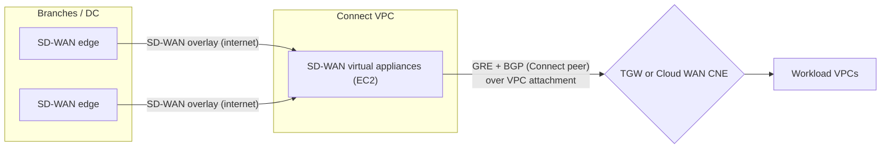
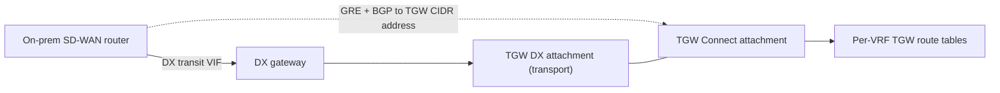
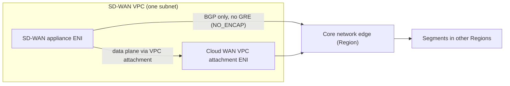

# SD-WAN, Connect attachments and self-managed overlays

This page covers overlay paths between a corporate network and AWS that are not plain AWS Site-to-Site VPN: Transit Gateway Connect (GRE plus BGP), AWS Cloud WAN Connect attachments including Tunnel-less Connect, self-managed VPN or SD-WAN appliances on Amazon EC2 (strongSwan, AWS Marketplace NVAs), and where Gateway Load Balancer fits. Every number was checked against AWS documentation, What's New posts, the AWS Price List API and AWS blogs, verified as of 2026-10-10. Managed IPsec VPN is covered in `02-site-to-site-vpn.md`.

## Why an overlay at all

Branch and data center networks that already run an SD-WAN fabric (Cisco Catalyst SD-WAN, Fortinet, Palo Alto Prisma SD-WAN, HPE Aruba EdgeConnect, VMware VeloCloud, Versa and others) usually want AWS to become another site in that fabric, keeping the vendor's path selection, segmentation (VRFs) and central policy. The standard pattern is a pair of SD-WAN virtual appliances in a "Connect VPC" (or on-premises over Direct Connect) that peer with the AWS hub using BGP.

Before Transit Gateway Connect (2020-12-10), the only native option was multiple IPsec VPNs from each appliance to the transit gateway, limited to 1.25 Gbps per tunnel and needing ECMP.

## Transit Gateway Connect

A Connect attachment is a TGW attachment type that rides on an existing transport attachment, either a VPC attachment (appliance in a VPC) or a Direct Connect attachment (appliance on-premises reached over DX). On it you create Connect peers, each of which is one GRE tunnel carrying two BGP sessions to AWS-managed infrastructure.

| Item | Value |
| --- | --- |
| Encapsulation | GRE (no encryption; the transport is the VPC fabric or DX) |
| Routing | BGP only; static routes not supported; routes propagate to the TGW route table by default |
| Connect peers per Connect attachment | 4 (not adjustable) |
| Bandwidth per Connect peer | up to 5 Gbps |
| PPS per Connect peer | up to 300,000 |
| Bandwidth per Connect attachment | up to 20 Gbps (4 peers with ECMP), if the transport attachment supports it |
| BGP sessions per Connect peer | 2, for routing-plane redundancy; configure both |
| Inside (BGP) CIDR | /29 from 169.254.0.0/16 (optional /125 from fd00::/8 for IPv6), unique per TGW; appliance uses the first address |
| Reserved inside CIDRs | 169.254.0.0/29 through 169.254.5.0/29, 169.254.169.248/29 |
| GRE outer address on AWS side | from a TGW CIDR block (max 5 CIDR blocks per TGW), shared pool with private IP VPN outside IPs and Client VPN |
| BGP timers | keepalive 10 s, hold 30 s |
| BGP flavors | eBGP (requires ebgp-multihop TTL 2), iBGP (if no peer ASN is given the TGW ASN is used), MP-BGP for IPv6 prefixes over IPv4 peering |
| Not supported | BFD, BGP graceful restart, IPv6 BGP peering addresses, ECMP between the two BGP sessions of one peer |
| Routes appliance to TGW | 1,000 per Connect peer |
| Routes TGW to appliance | 5,000 per Connect peer |
| GRE tunnel MTU | outer MTU minus 24 bytes (1476 for a 1500 outer MTU); TGW supports 8500 MTU on Connect and supports PMTUD on traffic entering via Connect |

ECMP: the TGW can ECMP across Connect peers of one attachment or across Connect attachments on the same TGW, but the appliances must advertise the same prefixes with the same AS_PATH and ASN. For equal prefixes from different attachment types, Connect-propagated routes rank below static, prefix-list, VPC and DX gateway routes and above VPN-propagated routes. TGW assigns MED 100 by default to routes received on Connect attachments.

### Per-flow limit to remember

GRE and IPsec flows are hashed on the 3-tuple (source IP, destination IP, protocol) by EC2 networking, so one GRE tunnel between a single appliance address and the TGW address is one "flow". EC2 caps a single flow at 5 Gbps outside a cluster placement group, and traffic through an internet gateway is limited to 5 Gbps for instances with fewer than 32 vCPUs. Size the appliance instance for the aggregate, and spread traffic across multiple peers.

### Connect over Direct Connect

With a DX attachment as transport, the SD-WAN appliance can sit on-premises and run GRE plus BGP directly to the TGW over a transit VIF, which gives higher route scale than DX alone and lets each Connect peer and TGW route table extend a separate on-premises VRF. TGW Connect over DX is unencrypted; use the SD-WAN fabric's own encryption, MACsec on DX, or Site-to-Site private IP VPN if encryption is required.

## AWS Cloud WAN Connect attachments

Cloud WAN supports the same Connect concept on a core network edge (CNE), with two protocols: GRE (same model as TGW Connect) and Tunnel-less Connect (protocol `NO_ENCAP`), launched 2023-10-24.

| Item | GRE Connect (Cloud WAN) | Tunnel-less Connect (Cloud WAN) |
| --- | --- | --- |
| Transport | VPC attachment | VPC attachment (same segment as the Connect attachment) |
| Encapsulation | GRE | none, native BGP peering with the CNE |
| Peers per attachment | 4 | 4 |
| Bandwidth per peer | up to 5 Gbps | up to 100 Gbps per Availability Zone (the VPC attachment limit) |
| Attachments per VPC | multiple | 1 Tunnel-less Connect attachment per VPC; GRE and Tunnel-less can coexist in one VPC |
| Routes | 1,000 in / 5,000 out per peer | 1,000 in / 10,000 out per peer |
| Inside CIDR | you supply it | taken from the CNE, not an input |
| BGP | eBGP / iBGP / MP-BGP | BGP and MP-BGP; AWS recommends a different ASN from the CNE |
| MTU | GRE overhead applies | Cloud WAN supports 8500 MTU on Tunnel-less Connect VPC attachments |

Tunnel-less placement rules: if the appliance is in the same subnet as the Cloud WAN VPC attachment, only the CNE BGP addresses need VPC routes and IPv4 next hops are the attachment ENI address; if in a different subnet, you must also add the prefixes learned from the CNE (or a summary) to the VPC route table. AWS recommends the same subnet.

Trade-off reported by AWS (SD-WAN segmentation blog part 2): Tunnel-less Connect needs a separate ENI per VRF on the appliance, so the instance type's ENI limit and network performance bound the number of segments; adding a VRF with GRE only needs another Connect attachment on existing transport.

Cloud WAN Connect attachments must be in the same account as the core network. Cloud WAN Connect uses a VPC attachment as transport; it does not take a Direct Connect attachment as transport. To bring on-premises SD-WAN over DX into Cloud WAN, AWS documents TGW Connect over DX plus TGW-to-Cloud WAN peering.

## Self-managed VPN or SD-WAN on EC2

You can run your own IPsec or SD-WAN head-end on EC2 (strongSwan or Libreswan on Linux, or a vendor image from AWS Marketplace) instead of, or in addition to, the managed services.

Reasons to do it: features AWS-managed VPN does not offer (policy-based VPN with multiple security association pairs, specific crypto suites, other overlay protocols, NAT between overlapping ranges, deep inspection in the same box); keeping one vendor's SD-WAN policy end to end; or a lab CGW simulator, which is how AWS's own strongSwan blog uses it.

What you take on: no AWS SLA for the tunnel, your own HA (two instances in two AZs with health-check-driven route changes or BGP), patching, licensing, and EC2 limits.

| Self-managed concern | What to set or check |
| --- | --- |
| Forwarding | Disable source/destination check on the instance ENI; point VPC route tables at the ENI |
| Bandwidth | 5 Gbps per flow outside a cluster placement group; IPsec/GRE counts as one 3-tuple flow per tunnel; 5 Gbps multi-flow through an IGW for instances under 32 vCPUs |
| Hub integration | Attach the appliance VPC to a TGW or Cloud WAN and use Connect (GRE or Tunnel-less) for BGP, instead of static routes to an ENI |
| Cost | EC2 instance hours plus license plus data transfer; no VPN connection-hour charge |

## Gateway Load Balancer relevance

Gateway Load Balancer (GWLB) is not a termination point for on-premises tunnels. It is a bump-in-the-wire that sends traffic to a fleet of inspection appliances using GENEVE, reached through GWLB endpoints.

In hybrid designs, GWLB matters when traffic arriving from on-premises over VPN, DX or Connect must be inspected: the TGW routes on-premises-bound and VPC-bound traffic through an inspection VPC containing GWLB endpoints, and TGW appliance mode on that VPC attachment keeps flows symmetric. A GWLB endpoint is also a valid static-route target in VPC route tables.

## Typical vendor integrations

At the TGW Connect launch (2020-12-10) AWS listed Cisco (SD-WAN, ACI), Aruba (HPE), Silver Peak, Fortinet, Versa Networks, Palo Alto Networks (CloudGenix, VM-Series), Citrix, Aviatrix, 128 Technology, Sophos, Arista Networks, Aryaka and Alkira as partners. That is a launch-day list, not a current partner list; several of those vendors have since been renamed or acquired. Tunnel-less Connect launched with Cisco as the first partner per AWS.

Common deployment shapes:

| Shape | Data path | When |
| --- | --- | --- |
| SD-WAN in Connect VPC + TGW Connect (GRE) | Branch to appliance over internet SD-WAN, appliance to TGW over GRE | Regional TGW hub, VRF per Connect attachment |
| SD-WAN in VPC + Cloud WAN Tunnel-less Connect | Branch to appliance, appliance BGP-peers with CNE | Global multi-Region SD-WAN, up to 100 Gbps per AZ |
| On-prem SD-WAN router + DX + TGW Connect | GRE over DX transit VIF | Large route tables per VRF over DX |
| SD-WAN edge with plain IPsec to Site-to-Site VPN | Managed VPN, BGP | Small sites; or many small sites via VPN Concentrator |

## Quotas

| Quota | TGW | Cloud WAN |
| --- | --- | --- |
| Connect peers per Connect attachment | 4 (fixed) | 4 (GRE) / 4 (Tunnel-less) |
| Bandwidth per GRE Connect peer | up to 5 Gbps | up to 5 Gbps |
| PPS per GRE Connect peer | up to 300,000 | not stated |
| Bandwidth per Tunnel-less peer | n/a | up to 100 Gbps per AZ |
| Routes appliance to hub | 1,000 | 1,000 |
| Routes hub to appliance | 5,000 | 5,000 (GRE), 10,000 (Tunnel-less) |
| TGW CIDR blocks per TGW | 5 | n/a |
| Attachments per hub | 5,000 per TGW | 5,000 per core network |
| Total routes | 10,000 per TGW | 10,000 per core network |
| Attachments per VPC | 5 TGWs per VPC | 5 core network attachments per VPC; 1 Tunnel-less Connect per VPC |

## Pricing

Prices from the AWS Price List API (publication 2026-09-17) and the TGW pricing page.

| Item | Tokyo (ap-northeast-1) | Osaka (ap-northeast-3) | N. Virginia (us-east-1) |
| --- | --- | --- | --- |
| TGW Connect attachment-hour | USD 0.07 | USD 0.07 | USD 0.05 |
| TGW VPC attachment-hour (transport) | USD 0.07 | USD 0.07 | USD 0.05 |
| TGW data processing | USD 0.02/GB, charged on the underlying VPC or DX attachment, none extra for Connect | same | same |
| Cloud WAN core network edge-hour | USD 0.50 | USD 0.50 | USD 0.50 |
| Cloud WAN Connect attachment-hour | USD 0.09 | USD 0.09 | USD 0.065 |
| Cloud WAN VPC attachment-hour (transport) | USD 0.09 | USD 0.09 | USD 0.065 |
| Cloud WAN data processing | USD 0.02/GB on VPC and VPN attachments; no separate Connect line in the price list | same | same |

Tunnel-less Connect has no charge beyond normal Cloud WAN attachment charges per its launch post. Self-managed appliances add EC2 instance-hours, any Marketplace license fee, and normal EC2 data transfer.

Rough Tokyo monthly cost (730 h) for one TGW Connect attachment plus its VPC transport attachment, before data: 2 x 0.07 x 730 = USD 102.20. For Cloud WAN in Tokyo: CNE 0.50 x 730 = USD 365 plus 2 x 0.09 x 730 = USD 131.40.

## Launches and dates

| Date | Launch |
| --- | --- |
| 2020-12-10 | AWS Transit Gateway Connect (GRE + BGP) |
| 2023-10-24 | Cloud WAN Tunnel-less Connect |
| 2024-12-28 | AWS reference architecture diagrams for SD-WAN with TGW / Cloud WAN and DX (publication date) |

## Common traps

- Treating GRE Connect as encrypted. It is not; encryption must come from the SD-WAN overlay, MACsec, or IPsec.
- Configuring only one of the two BGP sessions on a Connect peer. Maintenance on AWS infrastructure can then drop the peer briefly.
- Expecting more than 5 Gbps through a single GRE tunnel, or ECMP between the two BGP sessions of one peer.
- Forgetting ebgp-multihop TTL 2 with eBGP, or leaving the peer ASN empty and ending up in iBGP with the TGW, which then ignores iBGP-originated routes without next-hop-self.
- Expecting BFD or graceful restart on Connect. Neither is supported, so failover relies on the 30-second hold timer.
- Running ECMP with different AS_PATHs from two appliances. The TGW picks one path instead of balancing.
- Overlapping the TGW CIDR block with VPC or on-premises ranges. The pool is shared with private IP VPN and Client VPN.
- Assuming Cloud WAN Connect can use a Direct Connect attachment as transport. It uses VPC attachments.
- Putting a Tunnel-less appliance in a different subnet without adding the learned prefixes to the VPC route table.
- Sizing the EC2 appliance by headline bandwidth. Per-flow and IGW limits apply, and every VRF costs an ENI with Tunnel-less Connect.
- Expecting GWLB to terminate on-premises tunnels. It only load-balances inspection appliances.

## Sources

- <https://docs.aws.amazon.com/vpc/latest/tgw/tgw-connect.html>
- <https://docs.aws.amazon.com/vpc/latest/tgw/transit-gateway-quotas.html>
- <https://docs.aws.amazon.com/vpc/latest/tgw/how-transit-gateways-work.html>
- <https://docs.aws.amazon.com/network-manager/latest/cloudwan/cloudwan-connect-attachment.html>
- <https://docs.aws.amazon.com/network-manager/latest/cloudwan/cloudwan-connect-attachment-add.html>
- <https://docs.aws.amazon.com/network-manager/latest/cloudwan/cloudwan-connect-peer-attachment.html>
- <https://docs.aws.amazon.com/network-manager/latest/cloudwan/cloudwan-quotas.html>
- <https://docs.aws.amazon.com/AWSEC2/latest/UserGuide/ec2-instance-network-bandwidth.html>
- <https://docs.aws.amazon.com/reference-architecture-diagrams/latest/sd-wan-solutions/sdwan-dx-tgw.html>
- <https://docs.aws.amazon.com/reference-architecture-diagrams/latest/sd-wan-solutions/sdwan-dx-cloudwan.html>
- <https://docs.aws.amazon.com/prescriptive-guidance/latest/inline-traffic-inspection-third-party-appliances/on-premises-traffic-inspection.html>
- <https://docs.aws.amazon.com/vpc/latest/userguide/route-tables-priority.html>
- <https://aws.amazon.com/transit-gateway/pricing/>
- <https://pricing.us-east-1.amazonaws.com/offers/v1.0/aws/AmazonVPC/current/ap-northeast-1/index.json>
- <https://pricing.us-east-1.amazonaws.com/offers/v1.0/aws/AmazonVPC/current/ap-northeast-3/index.json>
- <https://pricing.us-east-1.amazonaws.com/offers/v1.0/aws/AWSCloudWAN/current/index.json>
- <https://aws.amazon.com/about-aws/whats-new/2020/12/introducing-aws-transit-gateway-connect-to-simplify-sd-wan-branch-connectivity/>
- <https://aws.amazon.com/about-aws/whats-new/2023/10/aws-cloud-wan-tunnel-less-high-performant-global-sd-wans/>
- <https://aws.amazon.com/blogs/networking-and-content-delivery/simplify-sd-wan-connectivity-with-aws-transit-gateway-connect/>
- <https://aws.amazon.com/blogs/networking-and-content-delivery/integrate-sd-wan-devices-with-aws-transit-gateway-and-aws-direct-connect/>
- <https://aws.amazon.com/blogs/networking-and-content-delivery/build-global-sd-wans-with-aws-cloud-wan-tunnel-less-connect/>
- <https://aws.amazon.com/blogs/networking-and-content-delivery/extending-sd-wan-segmentation-into-aws-cloud-wan-part-1/>
- <https://aws.amazon.com/blogs/networking-and-content-delivery/extending-sd-wan-segmentation-into-aws-cloud-wan-part-2/>
- <https://aws.amazon.com/blogs/networking-and-content-delivery/best-practices-to-optimize-failover-times-for-overlay-tunnels-on-aws-direct-connect/>
- <https://aws.amazon.com/blogs/networking-and-content-delivery/simulating-site-to-site-vpn-customer-gateways-strongswan/>
- <https://aws.amazon.com/blogs/networking-and-content-delivery/centralized-inspection-architecture-with-aws-gateway-load-balancer-and-aws-transit-gateway/>
- <https://aws.amazon.com/blogs/networking-and-content-delivery/best-buy-healths-resilient-care-centers-powered-by-aws-cloud-wan-and-sd-wan/>
