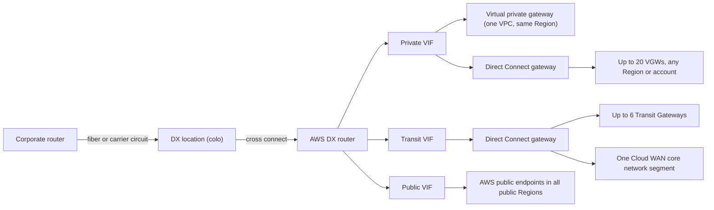

# AWS Direct Connect as a path

This page summarizes AWS Direct Connect (DX) as one of the paths between a corporate network and AWS: connection types and speeds, the three virtual interface (VIF) types and what each reaches, the Direct Connect gateway (DXGW), SiteLink, MACsec, resiliency models and the SLA, MTU, prefix limits, pricing (with Tokyo and Osaka figures), Japanese carrier closed-network services that embed DX, and lead times. It is a summary. The sibling repository [0-draft/cross-connect](https://github.com/0-draft/cross-connect/tree/main/docs) covers DX in much more depth, and this page links to it where it helps. Facts were re-verified against AWS documentation, What's New posts, the SLA page and the AWS Price List API as of 2026-10-10.

## Where DX sits among the paths

DX is a private Layer 2 circuit from your router to an AWS router in a Direct Connect location (a colocation facility), with an 802.1Q VLAN and an eBGP session per VIF. It does not touch the internet. It does not encrypt by itself (see [MACsec](#macsec-and-encryption)).

## Connection types

| Type | Speeds | Who provisions | VIFs | SLA coverage |
| --- | --- | --- | --- | --- |
| Dedicated connection | 1, 10, 100, 400 Gbps | You order a port; you or a carrier bring a circuit to the location | Up to 50 private/public plus up to 4 transit, 51 total | Yes |
| Hosted connection | 50, 100, 200, 300, 400, 500 Mbps; 1, 2, 5, 10, 25 Gbps | A Direct Connect Delivery Partner carves it from its interconnect; you accept it | Exactly 1 (private, public or transit) | No |
| Hosted VIF | No AWS-assigned capacity; shares the owner's link | The owner of a connection creates a VIF in your account | It is one VIF | No |

- 400 Gbps dedicated ports launched in July 2024 at select locations. The DX locations page lists them only at US sites as of the cross-connect snapshot (2026-09-30); no 400 Gbps port appears in the Japan price list, so treat 400G as not available in Japan.
- 25 Gbps hosted connections were added on 2024-04-24. Only select partners may sell 1 Gbps and above.
- Transit VIFs work on dedicated and hosted connections of any speed. Before 2022-08 they required 1 Gbps or more, and older Japanese blog posts still say that.
- AWS no longer accepts new partner integrations based on hosted VIFs. Partners are steered to hosted connections, which AWS polices per connection.
- Depth: [cross-connect 02-connections](https://github.com/0-draft/cross-connect/blob/main/docs/02-connections.md).

## Virtual interfaces and what they reach

| | Private VIF | Transit VIF | Public VIF |
| --- | --- | --- | --- |
| Reaches | VPC private IPs | VPCs and VPNs behind Transit Gateways, or a Cloud WAN segment | All AWS public prefixes in all public Regions (not the internet) |
| Attaches to | A VGW (same Region only) or a DXGW | A DXGW only | Nothing |
| AWS-side ASN | VGW ASN or DXGW ASN | DXGW ASN | 7224 |
| Max MTU | 9001 | 8500 | 1500 |
| Inbound prefixes from on-prem | 100 per family by default, up to 1,000 with prefix controls | Same as private | 1,000, not adjustable |
| SiteLink | Only when attached to a DXGW | Yes | No |

- A VIF is one VLAN (1 to 4094, fixed after creation) plus one BGP session per address family. MD5 is mandatory.
- Customer ASNs can be 2-byte private (64512 to 65534) or 4-byte; 4-byte ASNs on all VIF types were announced on 2025-09-12.
- On a public VIF, a private customer ASN is replaced by 7224, so AS_PATH prepending is stripped. AWS treats routes learned on a public VIF as `NO_EXPORT`.
- Gateway VPC endpoints (S3, DynamoDB) do not carry traffic that enters a VPC from DX. Use interface endpoints or a public VIF.
- Depth: [cross-connect 04-virtual-interfaces](https://github.com/0-draft/cross-connect/blob/main/docs/04-virtual-interfaces.md).

## Direct Connect gateway

A DXGW is a global, free, control-plane object (AWS describes it as a distributed set of BGP route reflectors outside the data path). It lets one set of VIFs reach many Regions and accounts.

| Fact | Value |
| --- | --- |
| VGWs per DXGW | 20 (hard) |
| Transit Gateways per DXGW | 6 (hard) |
| DXGWs per Transit Gateway | 20 (hard) |
| Private or transit VIFs per DXGW | 30 (hard) |
| Cloud WAN core network attachments per DXGW | 1 |
| DXGWs per account | 200 (SA/TAM) |
| Prefixes advertised to on-prem per TGW association (allowed prefixes) | 200 IPv4 + IPv6 combined (SA/TAM) |
| Prefixes advertised to on-prem from a Cloud WAN attachment | 5,000 (SA/TAM) |
| Total inbound prefix allocations per DXGW | 10,000 IPv4 + IPv6 (since 2026-08) |
| Charge for the DXGW | None |

- One DXGW holds either VGW associations, TGW associations, or one Cloud WAN attachment. The modes are mutually exclusive.
- Allowed prefixes are a filter for VGW associations but the literal advertisement for TGW associations. With a TGW, on-prem receives exactly the listed prefixes, even if no VPC owns them.
- A DXGW does not transit VPC to VPC or VIF to VIF, except through SiteLink.
- Cloud WAN gained a native DXGW attachment on 2024-11-25. It does not support allowed prefixes or the DX BGP communities; Cloud WAN Routing Policy (2025-11) is the replacement control.
- Depth: [cross-connect 05-direct-connect-gateway](https://github.com/0-draft/cross-connect/blob/main/docs/05-direct-connect-gateway.md) and [05-hubs.md](05-hubs.md) in this repo.

## SiteLink

SiteLink lets on-prem sites talk to each other across the AWS backbone between DX locations, without entering a Region. It is enabled per private (DXGW-attached) or transit VIF and forms a full mesh among SiteLink-enabled VIFs on the same DXGW. It costs $0.50 per SiteLink-enabled VIF-hour (the price list shows this at Japan locations too) plus per-GB SiteLink transfer. Toggling it flaps the VIF's BGP session.

## MACsec and encryption

| Option | Layer | Where it applies |
| --- | --- | --- |
| MACsec (IEEE 802.1AE) | L2, hop by hop | Dedicated 10, 100 and 400 Gbps ports at locations marked "(M)"; not 1 Gbps, not hosted connections. Partner interconnects since 2025-07 |
| Private IP Site-to-Site VPN | L3 IPsec | Over a transit VIF to a Transit Gateway (or Cloud WAN), outer IPs private |
| Public IP VPN over a public VIF | L3 IPsec | To the public VPN endpoints, not accelerated |

MACsec is hop by hop: it encrypts the link between your MACsec device and the AWS device, which need a direct Layer 2 adjacency. If your MACsec device sits in the colocation cage, that is just the cross connect; the carrier circuit to your building is covered only if your device is at your end and the carrier passes Layer 2 through transparently (ask the carrier). 100 and 400 Gbps require GCM-AES-XPN-256; 10 Gbps allows GCM-AES-256 or the XPN variant. Only static CAK mode is supported. Depth: [cross-connect 03-lag-and-macsec](https://github.com/0-draft/cross-connect/blob/main/docs/03-lag-and-macsec.md).

## LAGs

A link aggregation group bundles dedicated connections of the same speed on the same AWS device using LACP: up to 4 members below 100 Gbps, 2 members at 100 or 400 Gbps. It is a capacity tool, not a resiliency tool, because every member lands on one AWS device in one location. The SLA counts a LAG as one connection.

## Resiliency models and SLA

| Model (Resiliency Toolkit) | Topology | Survives | SLA |
| --- | --- | --- | --- |
| Maximum resiliency | 2+ locations, 2+ connections per location on separate devices (4+ connections) | Device, fiber and location failure | 99.99% (Multi-Site Redundant) |
| High resiliency | 1 connection in each of 2+ locations | Device, fiber and location failure | 99.9% (Multi-Site Non-Redundant) |
| Development and test | 2 connections on separate devices in 1 location | Device failure only | No multi-site SLA |
| Single connection | 1 connection | Nothing | 95.0% (Single Connection) |

- Multi-Site SLAs require an Enterprise Support plan, private endpoints in 2+ AZs, and for 99.99% also a Well-Architected Review with an AWS SA.
- Service credits: 10% / 25% / 100% of port-hour charges, at thresholds 99.0% and 95.0% for the multi-site tiers, and 92.5% and 90.0% for the single tier.
- Hosted connections and hosted VIFs from partners are not covered by the SLA. Dedicated connections ordered through a partner are covered.
- Planned maintenance is announced 14 days ahead and can last up to 4 hours. AWS says it will not take down redundant connections at the same time.
- Flat-rate billing (2026-09-15) includes a free second port in a "port-pair" on a different device or location, but usable bandwidth stays at one port.
- Depth: [cross-connect 07-resiliency](https://github.com/0-draft/cross-connect/blob/main/docs/07-resiliency.md).

## Failure detection

| Timer | Value |
| --- | --- |
| BGP default hold / keepalive | 90 s / 30 s |
| BGP minimum hold / keepalive | 3 s / 1 s |
| BFD (asynchronous, enabled on the AWS side of every VIF) | Minimum 300 ms interval, multiplier 3, about 900 ms detection |
| Graceful restart | 120 s; AWS recommends disabling it when BFD is on |

BFD only takes effect after you configure it on your router. Without it, a dead DX path is detected only when the BGP hold timer expires.

## MTU

| VIF | MTU options | Notes |
| --- | --- | --- |
| Private | 1500 or 9001 | Jumbo works through a VGW or a DXGW |
| Transit | 1500 or 8500 | Transit Gateway and Cloud WAN carry up to 8500 |
| Public | 1500 | No jumbo |

Enabling jumbo frames can disrupt every VIF on the connection for up to 30 seconds. If the same prefix is learned over paths with different MTUs, or also over Site-to-Site VPN, 1500 is used. Transit Gateway does not do Path MTU Discovery on DX attachments.

## Prefix limits

| Direction | Where | Limit |
| --- | --- | --- |
| On-prem to AWS | Private or transit VIF, per BGP session | 100 per family by default, up to 1,000 per family with inbound prefix controls (2026-08-20) |
| On-prem to AWS | Public VIF | 1,000 (hard) |
| On-prem to AWS | Into a VPC route table via VGW propagation | 100 propagated routes per route table (hard), regardless of the VIF allocation |
| AWS to on-prem | Per TGW on a transit VIF (allowed prefixes) | 200 combined |
| AWS to on-prem | Cloud WAN DXGW attachment | 5,000 |

Exceeding an inbound allocation drops the BGP session to Idle (reported DOWN). Withdraw routes and reset the session. Since 2026-03 CloudWatch exposes `VirtualInterfaceBgpPrefixesAccepted`, so you can alarm before the limit.

## Pricing summary

All prices are USD list, pay-as-you-go, from the AWS Price List API (Direct Connect offer for ap-northeast-1 and ap-northeast-3, published 2026-10-05). Japanese consumption tax is extra. Monthly figures use 730 hours.

### Dedicated port-hours

| Speed | Japan locations ($/h) | Japan ≈ $/month | Most other locations ($/h) |
| --- | --- | --- | --- |
| 1 Gbps | 0.285 | 208.05 | 0.30 |
| 10 Gbps | 2.142 | 1,563.66 | 2.25 |
| 100 Gbps | 22.50 | 16,425.00 | 22.50 |
| 400 Gbps | Not offered in Japan | – | 85.00 |

Japan locations in the price list: Equinix TY2 (Tokyo), AT Tokyo Chuo, NEC Inzai, Equinix OS1 (Osaka), all billed under Asia Pacific (Tokyo), and KDDI Telehouse Osaka 2, billed under Asia Pacific (Osaka). Pay-as-you-go 100 Gbps SKUs appear at AT Tokyo, NEC Inzai and Telehouse Osaka 2 in the price list; check the locations page for the speeds a specific site offers today.

### Hosted connection port-hours (Japan)

| Capacity | $/h | ≈ $/month |
| --- | --- | --- |
| 50 Mbps | 0.029 | 21.17 |
| 100 Mbps | 0.057 | 41.61 |
| 200 Mbps | 0.076 | 55.48 |
| 300 Mbps | 0.114 | 83.22 |
| 400 Mbps | 0.152 | 110.96 |
| 500 Mbps | 0.190 | 138.70 |
| 1 Gbps | 0.314 | 229.22 |
| 2 Gbps | 0.627 | 457.71 |
| 5 Gbps | 1.568 | 1,144.64 |
| 10 Gbps | 2.361 | 1,723.53 |
| 25 Gbps | 6.20 | 4,526.00 |

The partner's own fees come on top. A hosted 10 Gbps costs more per hour than a dedicated 10 Gbps port.

### Data transfer out (DTO)

Data transfer in over DX is free. DTO depends on the source Region and the geography of the DX location where traffic exits.

| From | To a Japan DX location | To Singapore / Hong Kong / KL | To a US location | To a Europe location |
| --- | --- | --- | --- | --- |
| Tokyo (ap-northeast-1) | $0.041/GB | $0.041/GB | $0.09/GB | $0.06/GB |
| Osaka (ap-northeast-3) | $0.041/GB | $0.041/GB | $0.09/GB | $0.06/GB |

For comparison, US Regions to a US location cost $0.02/GB. If a Transit Gateway is in the path, add the TGW attachment-hour and $0.02/GB data processing (see [05-hubs.md](05-hubs.md)).

### Flat-rate (2026-09-15)

Dedicated 10G and 100G connections can instead use a flat hourly rate that includes DTO from Regions in a chosen tier (Tier 1 same metro up to Tier 5 global). At Japan locations the price list shows, for a single 10G port, $10.96/h (Tier 1), $17.12/h (Tier 2) and $23.29/h (Tier 3), and for 100G $102.74, $160.96 and $219.18. Port-pair SKUs are listed at half those rates per port (for example 10G Tier 1 pair $5.48/h per port), which matches AWS's statement that a pair costs the same as a single flat-rate port. Depth: [cross-connect 10-pricing](https://github.com/0-draft/cross-connect/blob/main/docs/10-pricing.md).

## Japanese carrier closed-network services that embed DX

Most Japanese enterprises reach AWS through a carrier's closed network (閉域網) rather than by ordering a port. The carrier owns the DX ports or interconnects and hands you a hosted connection, a hosted VIF, or a fully managed L3 service.

| Service | DX model the carrier uses | Notes from the carrier's own pages |
| --- | --- | --- |
| NTT DOCOMO Business (formerly NTT Com) Flexible InterConnect (FIC) | L2: a hosted connection you accept, then you create the VIF. L3: FIC-Router creates the VIF for you | Private, transit and public VIF. 50 Mbps to 10 Gbps. Bandwidth cannot be changed in place (recreate). TGW support since 2021-01-06. Hourly billing with a monthly cap |
| KDDI Wide Area Virtual Switch 2 (cloud access) | Hosted connection or hosted VIF; TGW requires a hosted connection | Tokyo or Osaka connection location for the Tokyo Region. Shortest 5 business days from application |
| SoftBank Direct Access for AWS | Private VIF on SoftBank's own DX connection, handed to the customer as a logical line | Attach to a VGW or DXGW; TGW not listed. 10 Mbps to 2 Gbps. About 3 weeks lead time. Customer pays only AWS DTO on the VIF |
| IIJ Smart HUB (AWS connection) | Hosted connection (logical slice of IIJ's dedicated ports); IIJ or customer-held DX | 12 access points in Japan, Kanto/Kansai location redundancy, NAT included for public VIF use (S3, DynamoDB), TGW supported |

Because these are hosted connections or hosted VIFs, the AWS DX SLA does not apply. The carrier's SLA does. Carrier pages change often; confirm current terms with the carrier.

## Lead times

| Step | Published figure |
| --- | --- |
| AWS reviews a dedicated connection request and issues the LOA-CFA | Up to 72 business hours |
| Reply to an AWS request for more information | Within 7 days or the request is deleted |
| LOA-CFA validity | 90 days; port billing starts at port-up or 90 days after LOA issue, whichever is first |
| Cross connect in the colo | Set by the colo operator, not by AWS |
| Hosted connection via a Japanese carrier | KDDI: shortest 5 business days. SoftBank: about 3 weeks. NTT FIC: provisioned through its portal |

AWS does not publish an end-to-end lead time for a dedicated connection. The carrier last-mile circuit is usually the long pole and is quoted by the carrier.

## Common traps

- Single connection, single location: 95% SLA and an outage every planned maintenance window. Use two locations.
- A LAG is not redundancy: all members terminate on one AWS device.
- Hosted connections are not covered by the AWS SLA, so a carrier closed-network service is only as good as the carrier's SLA.
- Allowed prefixes on a TGW association are advertised literally; a typo advertises a prefix nobody owns.
- Raising the VIF prefix allocation to 1,000 does not raise the VPC route table cap of 100 propagated routes behind a VGW.
- Enabling jumbo frames briefly drops every VIF on the connection.
- Gateway endpoints for S3 and DynamoDB do not work for on-prem traffic arriving over DX.
- Prepending with a private ASN on a public VIF does nothing, because AWS rewrites it to 7224.
- MACsec covers the hop between your MACsec device and AWS's, not the path into the Region. With your device in the colo cage it covers only the cross connect; the carrier circuit is covered only if your device is at your end and the carrier is Layer 2 transparent.
- A DX fault inside the AWS path to one Region (for example the 2021-09-02 Tokyo event) is not fixed by location diversity. Keep a different kind of backup, such as VPN or another Region.

## Sources

- <https://github.com/0-draft/cross-connect/tree/main/docs>
- <https://docs.aws.amazon.com/directconnect/latest/UserGuide/limits.html>
- <https://docs.aws.amazon.com/directconnect/latest/UserGuide/routing-and-bgp.html>
- <https://docs.aws.amazon.com/directconnect/latest/UserGuide/hosted-vif.html>
- <https://docs.aws.amazon.com/directconnect/latest/UserGuide/WorkingWithVirtualInterfaces.html>
- <https://docs.aws.amazon.com/directconnect/latest/UserGuide/direct-connect-gateways-intro.html>
- <https://docs.aws.amazon.com/directconnect/latest/UserGuide/MACsec.html>
- <https://docs.aws.amazon.com/directconnect/latest/UserGuide/resiliency_toolkit.html>
- <https://docs.aws.amazon.com/directconnect/latest/UserGuide/dedicated_connection.html>
- <https://aws.amazon.com/directconnect/sla/>
- <https://aws.amazon.com/directconnect/faqs/>
- <https://aws.amazon.com/directconnect/partners/>
- <https://pricing.us-east-1.amazonaws.com/offers/v1.0/aws/AWSDirectConnect/current/ap-northeast-1/index.json>
- <https://pricing.us-east-1.amazonaws.com/offers/v1.0/aws/AWSDirectConnect/current/ap-northeast-3/index.json>
- <https://aws.amazon.com/about-aws/whats-new/2026/09/aws-direct-connect-announces-flat-rate-pricing/>
- <https://aws.amazon.com/about-aws/whats-new/2026/08/aws-direct-connect-new-prefix-controls/>
- <https://aws.amazon.com/about-aws/whats-new/2026/07/aws-direct-connect-bgp-visibility/>
- <https://aws.amazon.com/about-aws/whats-new/2026/03/aws-direct-connect-cloudwatch-bgp-monitoring/>
- <https://aws.amazon.com/about-aws/whats-new/2025/09/aws-direct-connect-4-byte-autonomous-system-numbers/>
- <https://aws.amazon.com/about-aws/whats-new/2024/11/aws-cloud-wan-on-premises-connectivity-direct-connect/>
- <https://aws.amazon.com/blogs/networking-and-content-delivery/integrating-sub-1-gbps-hosted-connections-with-aws-transit-gateway/>
- <https://sdpf.ntt.com/services/fic/>
- <https://sdpf.ntt.com/services/docs/fic/service-descriptions/connection-aws/connection-aws.html>
- <https://www.ntt.com/about-us/press-releases/news/article/2021/0106.html>
- <https://biz.kddi.com/service/kddi-wvs2/cloud-access/>
- <https://www.softbank.jp/biz/services/network/cloud-connect/direct-access-aws/>
- <https://www.iij.ad.jp/biz/shb-aws/>
