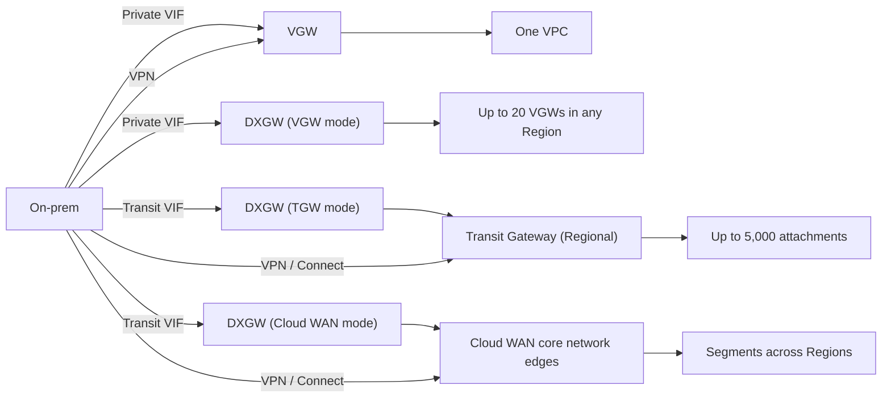
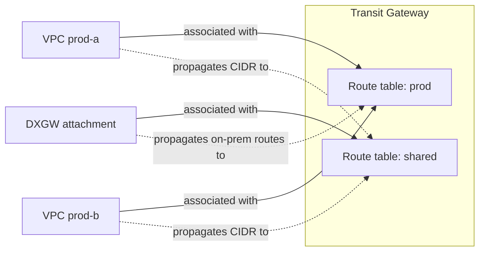
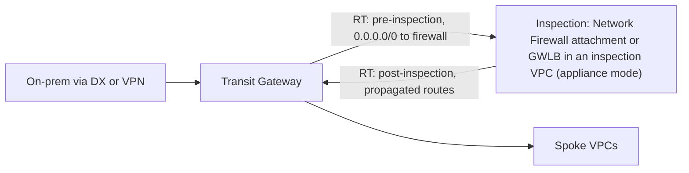
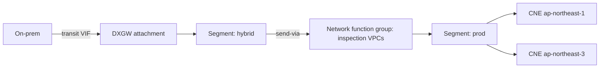

# Where the on-prem path lands: AWS-side hubs

This page covers what an on-prem connection (Direct Connect or Site-to-Site VPN) terminates on inside AWS and how routes get from there into VPCs: the virtual private gateway (VGW), the Direct Connect gateway (DXGW), AWS Transit Gateway (TGW) and AWS Cloud WAN. It explains VPC route tables and route propagation, TGW route tables, associations and propagations, Policy-Based Routing (2026), appliance mode, inspection with AWS Network Firewall and Gateway Load Balancer, TGW peering, multi-Region designs, sharing, quotas and prices including Tokyo. Path selection between overlapping routes is in [06-routing-and-path-selection.md](06-routing-and-path-selection.md). Verified against AWS documentation, What's New posts and the AWS Price List API as of 2026-10-10.

## The four hubs at a glance

| | Virtual private gateway | Direct Connect gateway | Transit Gateway | Cloud WAN |
| --- | --- | --- | --- | --- |
| Scope | One VPC, one Region | Global, control plane only | One Region (peer for more) | Global, one core network edge (CNE) per Region |
| Terminates | Private VIF, Site-to-Site VPN | Private and transit VIFs | VPN, DXGW (transit VIF), Connect (SD-WAN), VPN Concentrator, Client VPN, peering, VPCs, Network Firewall | VPN, DXGW, Connect, VPCs, TGW peering and TGW route tables |
| Transitive routing | No (VPC to on-prem only) | No (except SiteLink) | Yes, controlled by route tables | Yes, controlled by segments and policy |
| Routing control | VPC route table propagation | Allowed prefixes | Route tables, associations, propagations, static routes, prefix lists, policy tables | JSON core network policy, segments, network function groups, routing policies |
| ECMP | No | Yes across VIFs with equal attributes | Yes (VPN option, DXGW, Connect) | Yes (VPN, Connect) |
| Hub charge | None for the VGW itself | None | Per attachment-hour plus per GB | Per CNE-hour, per attachment-hour, plus per GB |

## Virtual private gateway

A VGW is the original per-VPC VPN and DX concentrator. One VGW attaches to one VPC at a time.

- The Amazon-side ASN defaults to 64512. Private 16-bit ASNs (64512 to 65534) and 32-bit ASNs (4200000000 to 4294967294) are allowed.
- Default quotas: 5 VGWs per Region, 10 Site-to-Site VPN connections per VGW, 50 VPN connections per Region.
- It can take a private VIF directly (same Region only) and also be associated with a DXGW at the same time.
- A VGW picks one tunnel across all its VPN connections for egress. It does not do ECMP across VPN tunnels.
- Site-to-Site VPN on a VGW carries IPv4 only. IPv6 over DX private VIFs to a VGW works.
- Routes from a customer gateway to a VPN on a VGW are capped at 100 dynamic and 100 static. The VPC route table accepts at most 100 propagated routes, which is the real ceiling for anything behind a VGW.

## VPC route tables and route propagation

Every subnet uses one route table. Routes point at a target: local, internet gateway, NAT gateway, network interface, VPC peering, gateway endpoint, Gateway Load Balancer endpoint, Network Firewall endpoint, VGW, TGW or Cloud WAN core network.

| Quota | Value |
| --- | --- |
| Route tables per VPC | 200 (adjustable) |
| Non-propagated routes per route table | 500 default, up to 1,000 (enforced separately for IPv4 and IPv6) |
| Propagated routes per route table | 100 (not adjustable; AWS says advertise a default route instead) |

- Route propagation exists only for a VGW. When enabled on a route table, routes the VGW learned from DX (BGP) and from VPN (static and BGP) appear as "propagated".
- Routes to a TGW or a Cloud WAN core network are always static entries that you add (or that a prefix list expands to). A VPC does not learn on-prem routes from a TGW automatically.
- Since 2021 a route can be more specific than the `local` route, but only to send traffic to an appliance (for example a network interface, a Gateway Load Balancer endpoint, a Network Firewall endpoint or a NAT gateway). A propagated route can never override `local`.
- When a VGW is associated with a DXGW, enable route propagation only after the association is complete.

## Direct Connect gateway

The DXGW is covered in [04-direct-connect.md](04-direct-connect.md#direct-connect-gateway). For hub design, three facts matter.

- One DXGW is in exactly one mode: VGW associations, TGW associations, or one Cloud WAN attachment.
- In TGW mode, on-prem learns only the allowed prefixes you configure (up to 200 per TGW), not the VPC CIDRs. In Cloud WAN mode it learns the whole segment (up to 5,000 prefixes) and AS_PATH is preserved.
- A DXGW does not route VPC to VPC. Two VPCs behind VGWs on one DXGW talk only if on-prem hairpins a covering supernet through the same VIF (a documented exception), so block that with security groups or specific routes if you need isolation.

## Transit Gateway

A TGW is a Regional layer 3 router. Attachments are both sources and destinations. Each attachment is associated with exactly one route table (or, since 2026-07, one policy table instead) and can propagate its routes into one or more route tables.

### Attachment types

| Attachment | How routes get in | Notes |
| --- | --- | --- |
| VPC | VPC CIDRs propagate | One subnet per AZ; traffic only reaches AZs that have a subnet in the attachment |
| Site-to-Site VPN | Static or BGP | ECMP across tunnels if VPN ECMP is enabled and BGP is used. 1.25 Gbps per standard tunnel, 5 Gbps per Large tunnel (2025-11) |
| VPN Concentrator (2025-11) | BGP | Many low-bandwidth sites (under 100 Mbps each) on one attachment. 5 per TGW, 100 VPN connections each. No ECMP |
| DXGW | BGP from transit VIFs | Advertises allowed prefixes to on-prem. ECMP across transit VIFs with identical prefix, length and AS_PATH |
| Connect (SD-WAN) | BGP over GRE | Up to 4 peers per attachment, 5 Gbps each, 20 Gbps per attachment |
| Client VPN (2026-04) | Propagated | Native Client VPN attachment that keeps end-user source IPs |
| Peering (intra- or inter-Region, or to a Cloud WAN CNE) | Static routes only | One peering between any two TGWs. No ECMP. Unique ASNs recommended |
| Network function (AWS Network Firewall, 2025-06/07) | Static routes only | AWS-managed firewall endpoints in a service-owned VPC; appliance mode on automatically |

### Route tables, associations and propagations

- Association decides which table is consulted for packets arriving from that attachment.
- Propagation decides which tables learn that attachment's routes. You cannot filter what an attachment propagates.
- A static route with the same destination as a propagated route wins and hides the propagated one. Remove the static route and the propagated one reappears.
- Blackhole routes drop matching traffic and are the standard way to isolate segments.
- The TGW shows only the preferred route for a prefix. A backup (for example VPN behind DX) appears only after the preferred route is withdrawn.
- If a new VPC has the same CIDR as an already attached VPC, its CIDR is not propagated. TGW cannot route between identical CIDRs.

### Policy-Based Routing (GA 2026-07)

A policy table is an ordered list of rules matching source and destination CIDR, source and destination port and protocol. The first matching rule picks the TGW route table used for the lookup. If no rule matches, the packet is dropped.

- An attachment is associated with either a route table or a policy table, never both.
- Associating a policy table with a VPN or Connect attachment stops BGP advertisements to that peer. A DXGW attachment keeps advertising its allowed prefixes.
- Not supported for customer entries on TGW-to-Cloud WAN peering attachments.
- Quotas: 20 policy tables per TGW, 200 customer-managed entries per TGW (adjustable). No extra charge.

### Appliance mode and inspection

Without appliance mode, a TGW keeps a flow in the AZ it entered. If the return path lands in a different AZ of an inspection VPC, a stateful firewall sees half a flow and drops it. Appliance mode on the inspection VPC attachment pins both directions of a flow to one AZ for its lifetime.

- Appliance mode is only supported on VPC attachments, but the flows can come from VPN, DX, Connect or peering attachments.
- Route propagation must be enabled in the route table associated with the appliance-mode attachment for AZ-aware selection; otherwise TGW falls back to flow-hash AZ selection.
- Gateway Load Balancer hashes on the 5-tuple (or 3-tuple) and keeps a flow on one appliance; combined with appliance mode, firewalls no longer need SNAT for symmetry.
- The Network Firewall network function attachment (native TGW integration) removes the inspection VPC entirely. AWS creates the firewall endpoints in a service-managed VPC and turns appliance mode on.

Typical tables: spokes and the DXGW attachment are associated with a "pre-inspection" table whose default route points to the firewall; the firewall attachment is associated with a "post-inspection" table that receives all propagations.

### TGW peering and multi-Region

- Peering works intra-Region (since 2021-12) and inter-Region, across accounts, IPv4 and IPv6. Routes are static only.
- Inter-Region peering traffic is encrypted (AES-256) on the AWS network; data processing is not charged on the receiving TGW.
- A DXGW can associate TGWs in up to 6 Regions, so on-prem can reach several Regions without peering. Give TGWs in different Regions unique ASNs.
- AWS advises against multiple TGWs in one Region for availability. A TGW is already distributed (Hyperplane).

### Sharing

A TGW is shared to other accounts with AWS Resource Access Manager (RAM). The spoke account creates VPC attachments; the TGW owner (or auto-accept) accepts them. DXGW associations across accounts use association proposals instead of RAM. A Cloud WAN core network is also shared with RAM.

### TGW quotas

| Quota | Default | Adjustable |
| --- | --- | --- |
| Transit gateways per account per Region | 5 | Yes |
| Attachments per TGW | 5,000 | Yes |
| Route tables per TGW | 20 | Yes |
| Combined routes across all route tables of one TGW | 10,000 | SA/TAM |
| Static routes for a prefix to a single attachment | 1 | No |
| Policy tables per TGW / policy entries per TGW | 20 / 200 | No / Yes |
| Peering attachments per TGW | 50 | Yes |
| Peering attachments between the same two TGWs (or TGW and CNE) | 1 | No |
| TGWs per VPC | 5 | No |
| DXGWs per TGW / TGWs per DXGW | 20 / 6 | No |
| Prefixes from a TGW to on-prem over a transit VIF | 200 IPv4 + IPv6 | SA/TAM |
| Bandwidth per VPC attachment per AZ | Up to 100 Gbps each direction | SA/TAM |
| Bandwidth per DXGW or peering attachment per AZ | Up to 100 Gbps each direction | SA/TAM |
| Packets per second per attachment per AZ | Up to 7,500,000 | SA/TAM |
| Bandwidth per Connect peer | 5 Gbps | No |
| VPN Concentrators per TGW / VPN connections per Concentrator | 5 / 100 | No |
| Routes from CGW to a VPN on a TGW / from TGW to CGW | 1,000 / 5,000 | No |
| MTU | 8500 (VPC, DX, Connect, peering); 1500 over VPN | No |

## AWS Cloud WAN

Cloud WAN is a managed global network defined by one JSON core network policy. AWS deploys a core network edge (CNE) in each Region you list and builds the BGP mesh between them.

### Building blocks

| Concept | What it is |
| --- | --- |
| Global network / core network | Container; one core network per global network |
| Core network edge (CNE) | Regional router, one per Region per core network, billed hourly |
| Segment | Global isolated routing domain (like a VRF). Up to 40 per core network |
| Attachment | VPC, Site-to-Site VPN, Connect (GRE or Tunnel-less), DXGW (since 2024-11-25), TGW peering and TGW route table |
| Attachment policy | Rules (for example by tag) that place attachments into segments, optionally requiring acceptance |
| Segment actions | `share` between segments, `create-route` (static), `send-via` and `send-to` for service insertion, `associate-routing-policy` |
| Network function group (NFG) | Managed segment holding inspection attachments; service insertion (GA 2024-06-11) steers same-segment or cross-segment traffic through it, intra- or inter-Region |
| Routing policy (GA 2025-11-20) | Inbound and outbound route filtering, summarization, AS_PATH, MED, local preference and community actions on attachments, segment shares and edge-to-edge peers |

### Cloud WAN facts relevant to on-prem paths

- A DXGW attachment covers one segment, with edge locations set to all or specific. Each CNE advertises only its local routes to the DXGW, AS_PATH preserved.
- DX BGP communities (7224:7xxx) and allowed prefixes are not supported on the Cloud WAN side. Routing policy is the replacement.
- Static routes pointing at a DXGW attachment are not supported. Private IP VPN and Connect attachments cannot use a DXGW attachment as transport.
- Routing policies are not supported on NFGs. Summarization resets attributes (MED 100, local preference 0, empty AS_PATH, no communities).
- Tunnel-less Connect (2023-10) lets SD-WAN appliances peer by plain BGP at up to 100 Gbps per AZ.
- New Regions in 2025: GovCloud (US) (2025-10), Thailand, Taipei and New Zealand (2025-11).

### Cloud WAN quotas

| Quota | Default | Adjustable |
| --- | --- | --- |
| Core networks per global network | 1 | No |
| Edges per Region per core network | 1 | No |
| Segments per core network | 40 | SA/TAM |
| Attachments per core network | 5,000 | Yes |
| Core network attachments per VPC | 5 | No |
| DXGW attachments per core network | 40 | Yes |
| Core network attachments per DXGW | 1 | No |
| TGW peers | 50 | Yes |
| Installed routes per core network, all segments | 10,000 | SA/TAM |
| Routes from VPN or Connect into the core network / out of it | 1,000 / 5,000 | SA/TAM |
| Outbound routes per DXGW attachment | 5,000 | Yes |
| Routing policy rules per policy / match conditions per rule / policies per association type | 10 / 5 / 5 | No |
| Bandwidth per VPC attachment per AZ | Up to 100 Gbps | SA/TAM |
| MTU | 8500 between VPCs; 1500 over VPN | No |

## Pricing

USD list prices from the AWS Price List API (AmazonVPC offer published 2026-09-17, AWSCloudWAN offer published 2026-09-11, AWSNetworkFirewall offer published 2026-09-11). Monthly figures use 730 hours.

| Item | Tokyo (ap-northeast-1) | Osaka (ap-northeast-3) | N. Virginia (us-east-1) |
| --- | --- | --- | --- |
| TGW attachment (VPC, VPN, DX, Connect, peering, VPN Concentrator) per hour | $0.07 | $0.07 | $0.05 |
| TGW data processing per GB | $0.02 | $0.02 | $0.02 |
| Cloud WAN CNE per hour | $0.50 | $0.50 | $0.50 |
| Cloud WAN attachment or TGW peering per hour | $0.09 | $0.09 | $0.065 |
| Cloud WAN data processing per GB | $0.02 | $0.02 | $0.02 |
| Network Firewall endpoint per hour | $0.395 | Not checked | Not checked |
| Network Firewall traffic per GB (including via TGW attachment) | $0.065 | Not checked | Not checked |

- TGW: the VPC owner pays its VPC attachment-hours and the data processing for traffic its VPC sends. The DXGW owner pays the DX attachment-hour. The TGW owner pays VPN and Connect attachments. Data processing is charged on traffic entering the TGW from a VPC, DX, VPN or Network Firewall attachment, not from a peering attachment. Connect and Private IP VPN add no processing charge beyond the underlying attachment.
- Flexible Cost Allocation (2025-11) lets a metering policy charge processing to the source, destination or central account instead of the sender.
- Cloud WAN: the Cloud WAN pricing page states DX attachments are priced like other attachments and that the DXGW owner pays the DX attachment's hourly and processing charges.
- DX DTO and port-hours are separate (see [04-direct-connect.md](04-direct-connect.md#pricing-summary)).

Worked example (Tokyo, own arithmetic): one TGW with 10 VPC attachments and one DX attachment costs 11 × $0.07 × 730 = $562.10 per month in attachment-hours; 10 TB from VPCs to on-prem adds 10,240 GB × $0.02 = $204.80 TGW processing and 10,240 GB × $0.041 = $419.84 DX DTO to a Japan location.

## 2024–2026 launches relevant to hubs

| Date | Launch |
| --- | --- |
| 2024-06-11 | Cloud WAN service insertion (network function groups) |
| 2024-11-25 | Cloud WAN native Direct Connect gateway attachment |
| 2025-06 / 2025-07 | AWS Network Firewall native TGW attachment (5 Regions, then all Regions) |
| 2025-10 | Cloud WAN in AWS GovCloud (US) |
| 2025-11 | Site-to-Site VPN Concentrator on TGW |
| 2025-11 | TGW Flexible Cost Allocation; Network Firewall flexible cost allocation |
| 2025-11-20 | Cloud WAN Routing Policy |
| 2025-11 | Cloud WAN in Thailand, Taipei and New Zealand |
| 2026-04 | Client VPN native TGW attachment |
| 2026-07 | TGW Policy-Based Routing (policy tables) |

## Common traps

- A VPC does not learn on-prem routes from a TGW. You must add static routes (or a prefix list) in each subnet route table.
- A subnet route to a TGW does nothing for an AZ where the TGW attachment has no subnet.
- Two VPCs with identical CIDRs on one TGW: the second one silently does not propagate.
- TGW allowed prefixes on the DXGW must not overlap across TGWs on the same DXGW.
- Forgetting appliance mode on the inspection VPC attachment breaks stateful firewalls only for cross-AZ flows, which makes it look intermittent.
- A policy table on a VPN or Connect attachment silently stops BGP advertisements to that peer.
- TGW peering is static only, so there is no automatic failover between Regions; plan static routes and blackholes.
- 100 propagated routes per VPC route table is a hard limit behind a VGW, even if the VIF accepts 1,000.
- Cloud WAN evaluates AS_PATH and MED before attachment type, unlike TGW (see [06-routing-and-path-selection.md](06-routing-and-path-selection.md)).
- Cloud WAN CNEs cost $0.50 per hour each in every Region whether or not traffic flows.

## Sources

- <https://docs.aws.amazon.com/vpc/latest/tgw/how-transit-gateways-work.html>
- <https://docs.aws.amazon.com/vpc/latest/tgw/transit-gateway-quotas.html>
- <https://docs.aws.amazon.com/vpc/latest/tgw/tgw-vpc-attachments.html>
- <https://docs.aws.amazon.com/vpc/latest/tgw/tgw-peering.html>
- <https://docs.aws.amazon.com/vpc/latest/tgw/tgw-policy-tables.html>
- <https://docs.aws.amazon.com/vpc/latest/tgw/tgw-policy-tables-concepts.html>
- <https://docs.aws.amazon.com/vpc/latest/tgw/tgw-policy-tables-limitations.html>
- <https://docs.aws.amazon.com/vpc/latest/userguide/amazon-vpc-limits.html>
- <https://docs.aws.amazon.com/vpc/latest/userguide/route-tables-priority.html>
- <https://docs.aws.amazon.com/vpn/latest/s2svpn/vpn-limits.html>
- <https://docs.aws.amazon.com/vpn/latest/s2svpn/vpn-route-priority.html>
- <https://docs.aws.amazon.com/directconnect/latest/UserGuide/limits.html>
- <https://docs.aws.amazon.com/network-manager/latest/cloudwan/cloudwan-quotas.html>
- <https://docs.aws.amazon.com/network-manager/latest/cloudwan/cloudwan-route-evaluation.html>
- <https://docs.aws.amazon.com/network-manager/latest/cloudwan/cloudwan-routing-policies.html>
- <https://docs.aws.amazon.com/network-manager/latest/cloudwan/cloudwan-policies-json.html>
- <https://docs.aws.amazon.com/network-manager/latest/cloudwan/cloudwan-create-policy-version.html>
- <https://aws.amazon.com/transit-gateway/pricing/>
- <https://aws.amazon.com/transit-gateway/faqs/>
- <https://aws.amazon.com/cloud-wan/pricing/>
- <https://aws.amazon.com/cloud-wan/faqs/>
- <https://pricing.us-east-1.amazonaws.com/offers/v1.0/aws/AmazonVPC/current/ap-northeast-1/index.json>
- <https://pricing.us-east-1.amazonaws.com/offers/v1.0/aws/AWSCloudWAN/current/ap-northeast-1/index.json>
- <https://pricing.us-east-1.amazonaws.com/offers/v1.0/aws/AWSNetworkFirewall/current/ap-northeast-1/index.json>
- <https://aws.amazon.com/about-aws/whats-new/2026/07/aws-transit-gateway-policy-based-routing/>
- <https://aws.amazon.com/about-aws/whats-new/2026/04/aws-client-vpn-transit-gateway/>
- <https://aws.amazon.com/about-aws/whats-new/2025/11/aws-site-to-site-vpn-concentrator/>
- <https://aws.amazon.com/about-aws/whats-new/2025/11/aws-transit-gateway-flexible-cost-allocation/>
- <https://aws.amazon.com/about-aws/whats-new/2025/11/network-firewall-flexible-cost-allocation/>
- <https://aws.amazon.com/about-aws/whats-new/2025/07/aws-network-firewall-native-transit-gateway-support/>
- <https://aws.amazon.com/about-aws/whats-new/2025/06/aws-network-firewall-transit-gateway-native-integration/>
- <https://aws.amazon.com/about-aws/whats-new/2025/11/aws-cloud-wan-routing-policy/>
- <https://aws.amazon.com/about-aws/whats-new/2025/10/aws-cloud-wan-govcloud/>
- <https://aws.amazon.com/about-aws/whats-new/2025/11/aws-cloud-wan-thailand-taipei-new-zealand/>
- <https://aws.amazon.com/about-aws/whats-new/2024/06/aws-cloud-wan-service-insertion/>
- <https://aws.amazon.com/about-aws/whats-new/2024/11/aws-cloud-wan-on-premises-connectivity-direct-connect/>
- <https://aws.amazon.com/about-aws/whats-new/2023/10/aws-cloud-wan-tunnel-less-high-performant-global-sd-wans/>
- <https://aws.amazon.com/blogs/networking-and-content-delivery/centralized-inspection-architecture-with-aws-gateway-load-balancer-and-aws-transit-gateway/>
- <https://aws.amazon.com/blogs/networking-and-content-delivery/aws-transit-gateway-now-supports-intra-region-peering/>
- <https://aws.amazon.com/blogs/networking-and-content-delivery/simplify-global-security-inspection-with-aws-cloud-wan-service-insertion/>
- <https://aws.amazon.com/blogs/aws/inspect-subnet-to-subnet-traffic-with-amazon-vpc-more-specific-routing/>
- <https://repost.aws/knowledge-center/vpn-troubleshoot-routing>
