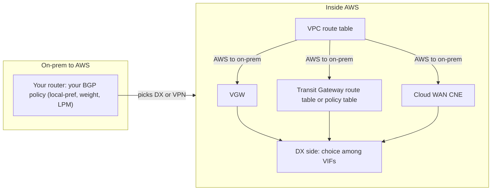

# Routing and path selection

When a corporate network reaches AWS over more than one path (two DX locations, DX plus VPN, VPN to two hubs), several independent routers each pick a path: the VPC route table, the virtual private gateway (VGW), the Transit Gateway (TGW), the Cloud WAN core network edge (CNE), the AWS side of each Direct Connect (DX) virtual interface, and your own on-prem routers. This page lists each one's decision order exactly as AWS documents it, the BGP attributes AWS honors, ECMP behavior, asymmetric routing with stateful firewalls, BFD and failover timings, overlapping CIDRs and IPv6, then walks through worked examples. Verified against AWS documentation as of 2026-10-10.

## Who decides which direction



- Traffic from on-prem to AWS follows your routers. AWS only influences it through what it advertises (allowed prefixes, MED on VPN tunnels).
- Traffic from AWS to on-prem is decided in up to three stages: the VPC route table picks a target, the hub (VGW, TGW or CNE) picks an attachment, and for DX the AWS edge picks a VIF.
- If the two directions choose different paths, you have asymmetric routing (see [Asymmetric routing](#asymmetric-routing-and-stateful-firewalls)).

## Universal rule: longest prefix match first

Every AWS router here evaluates the most specific matching prefix first. Priority rules between route types only break ties between routes with exactly the same prefix. IPv4 and IPv6 are evaluated independently.

## VPC route table priority

Documented order (route-tables-priority page):

1. Longest prefix match.
2. Static routes (internet gateway, NAT gateway, network interface, instance, gateway VPC endpoint, transit gateway, VPC peering, Gateway Load Balancer endpoint, and a static route to a VGW).
3. Prefix list routes.
4. Propagated routes (only from a VGW). Among these, the VGW's own order decides: Direct Connect BGP routes, then VPN static routes, then VPN BGP routes.

Special cases a simulator must model:

- The `local` route always wins against a propagated route, even a more specific one.
- A static route more specific than `local` is allowed (since 2021) but only for middlebox insertion targets such as a network interface, a Gateway Load Balancer endpoint, a Network Firewall endpoint or a NAT gateway.
- If several prefix lists in one route table contain overlapping CIDRs pointing to different targets, AWS picks one at random and then keeps it.
- At most 100 propagated routes per route table (hard limit).

## Virtual private gateway priority

Documented order (vpn-route-priority page), for routes the VGW knows (BGP or static) and its attached VPC CIDR:

1. Tunnel health takes precedence over all routing attributes (applies to VGW and TGW VPNs).
2. Longest prefix match.
3. For identical prefixes: BGP routes propagated from Direct Connect.
4. Static routes configured on a Site-to-Site VPN connection.
5. BGP routes propagated from a Site-to-Site VPN connection.
6. Between BGP VPN routes: shortest AS_PATH.
7. If AS_PATH lengths are equal and the first AS in the AS_SEQUENCE is the same: lowest MED.

- A VGW selects one tunnel across all VPN connections on the gateway as egress. There is no ECMP on a VGW.
- AWS sets MED on its VPN tunnels during endpoint updates to signal the preferred tunnel. AWS recommends not prepending when your device handles asymmetric routing, so that MED decides.
- A VGW only forwards to prefixes it learned by BGP or static entry, or its VPC CIDR.

## Transit Gateway priority

Documented order (how-transit-gateways-work page, "Route evaluation order"):

1. If the source attachment is associated with a policy table (Policy-Based Routing, 2026-07): rules are evaluated in order, the first match selects the TGW route table to use, and no match means drop. Then continue below in that route table.
2. Longest prefix match (blackhole routes are routes too; a matching blackhole drops).
3. For the same CIDR from different attachment types, in this order:
   1. Static routes (for example a VPN static route, or any static route you add)
   2. Prefix list referenced routes
   3. VPC-propagated routes
   4. Direct Connect gateway-propagated routes
   5. Transit Gateway Connect-propagated routes
   6. Site-to-Site VPN over private Direct Connect (Private IP VPN) propagated routes
   7. Site-to-Site VPN-propagated routes
   8. Site-to-Site VPN Concentrator-propagated routes
   9. Client VPN-propagated routes
   10. Transit Gateway peering-propagated routes (Cloud WAN)
4. For the same CIDR from the same attachment type (BGP-capable):
   1. Shorter AS_PATH
   2. Lower MED. If no MED is sent, TGW assigns 0 to routes from DX attachments and 100 to routes from VPN and Connect attachments
   3. eBGP over iBGP, where the attachment supports it
5. Ties left after that: ECMP where supported, otherwise an internal choice. AWS says it cannot guarantee a consistent order for BGP routes equal in CIDR, attachment type and the attributes above.

ECMP on TGW:

| Attachment | ECMP |
| --- | --- |
| VPN | Only if the TGW's VPN ECMP option is enabled and the VPN uses BGP. Off: TGW uses internal metrics |
| DXGW | Automatic across DXGW attachments when prefix, length and AS_PATH are exactly the same. One DXGW also does ECMP across its transit VIFs |
| Connect | Automatic |
| VPC, peering, VPN Concentrator | No |
| Across different attachment types (for example DX and VPN) | Never |
| Across different ASNs in AS_PATH | Never (BGP multipath AS-path relax is not supported) |

The TGW route table displays only the winning route. A losing backup (for example VPN behind DX) appears only after the winner is withdrawn.

## Cloud WAN priority

Documented order at each CNE (cloudwan-route-evaluation page):

1. Longest prefix match.
2. Static routes.
3. VPC-propagated routes in the same Region.
4. Dynamic routes with unequal attributes: shorter AS_PATH, then lower MED.
5. Dynamic routes with equal AS_PATH and MED, by source:
   1. Direct Connect gateway-propagated
   2. Cloud WAN Connect-propagated in the same Region
   3. Site-to-Site VPN-propagated in the same Region
   4. Everything else (TGW peering, remote CNEs over the AWS backbone); among identical routes one attachment is chosen deterministically at random, per segment or network function group

ECMP on Cloud WAN: equal BGP VPN routes are spread across tunnels when the core network policy's `vpn-ecmp-support` is true (the default), and Connect peers and Connect attachments are spread too. Static VPNs cannot attach, and AWS documents no ECMP across DX gateway attachments.

The key difference from TGW: Cloud WAN compares AS_PATH and MED before attachment type, so a VPN route with a shorter AS_PATH beats a DX route. TGW compares attachment type first, so DX beats VPN regardless of AS_PATH. Cloud WAN Routing Policy (2025-11) can set local preference, AS_PATH and MED to override this, but it does not apply to network function groups, and DX attachments ignore BGP communities.

## Direct Connect: AWS choosing among VIFs

For traffic from a Region to on-prem over private or transit VIFs (routing-and-bgp page):

1. Longest prefix match.
2. Local preference, set by your community on each prefix: `7224:7300` high, `7224:7200` medium, `7224:7100` low. With no community, AWS gives medium to DX locations associated with the sending Region and a lower value to locations associated with other Regions.
3. Shorter AS_PATH.
4. Lower MED (AWS does not recommend relying on it).
5. ECMP across the remaining VIFs. The ASNs in the AS_PATH do not need to match.

- Communities are mutually exclusive per prefix and evaluated before AS_PATH, so prepending cannot beat a local preference tag.
- Untagged ECMP works when the sending Region has two or more paths from locations in its own associated Region, or two or more from locations outside it.
- With SiteLink on a VIF, Regions prefer the shortest AS_PATH regardless of the location's associated Region.
- Not honored in Cloud WAN DXGW attachments.

Public VIFs: AWS uses longest prefix match and AS_PATH; on a full tie between two Regions' public VIFs it prefers the home Region; load balancing across public VIFs requires them to be in the same Region. Scope communities you set (`7224:9100` local Region, `7224:9200` continent, `7224:9300` global, default global) limit how far your prefixes propagate. AWS tags its own prefixes `7224:8100` (same Region), `7224:8200` (same continent) or nothing (other continents), all with `NO_EXPORT`.

## BGP attributes AWS honors

| Attribute | DX private/transit VIF (inbound to AWS) | DX public VIF | VGW (VPN) | TGW | Cloud WAN |
| --- | --- | --- | --- | --- | --- |
| Prefix length | Yes, first | Yes, first | Yes, first | Yes, first | Yes, first |
| Local preference | Via 7224:7100/7200/7300 only | No | No | No | Via routing policy |
| AS_PATH length | Yes | Yes (stripped if private ASN) | Yes (between VPNs) | Yes (within one attachment type) | Yes (before attachment type) |
| MED | Yes, low priority | Not documented | Yes, if first AS matches | Yes (defaults 0 DX, 100 VPN/Connect) | Yes |
| Communities | 7224:7xxx; others pass via SiteLink | 7224:9xxx scope | No | No | Via routing policy (not on DX or TGW peering attachments) |

## Asymmetric routing and stateful firewalls

Asymmetry happens when the forward and return paths differ. Stateless routing does not care; stateful devices (on-prem firewalls, NAT, appliances in an inspection VPC) drop the half-flows they did not see.

- DX plus VPN backup: if on-prem advertises a more specific prefix over VPN than over DX, AWS returns traffic over VPN while on-prem sends over DX. Advertise the same or less specific prefixes over the backup path.
- Active/passive DX: tagging `7224:7300` on the primary only controls AWS to on-prem. Set matching local preference on your routers for on-prem to AWS.
- TGW across AZs: without appliance mode on the inspection VPC attachment, return traffic can land in another AZ's firewall. Enable appliance mode.
- VGW tunnel choice: AWS may move the active egress tunnel during endpoint updates. AWS strongly recommends customer gateways that accept asymmetric routing across the two tunnels.

## BFD and failover timings

| Mechanism | Detection time | Source |
| --- | --- | --- |
| DX with BFD (300 ms × 3) | About 0.9 s | DX BGP settings |
| DX BGP without BFD | Hold timer, default 90 s (minimum 3 s) | DX BGP settings |
| Site-to-Site VPN BGP | Hold time default 30 s | re:Post VPN BGP troubleshooting |
| Site-to-Site VPN dead peer detection | Default DPD timeout 40 s (minimum 30 s) | EC2 VPN tunnel options API |
| DX planned maintenance | Announced 14 days ahead, up to 4-hour window | DX maintenance docs |

AWS does not publish convergence times for propagation inside a VGW, TGW or Cloud WAN after BGP withdraws a route. Test with the DX failover test (BGP down on a chosen VIF, default 180 minutes, up to 72 hours) or AWS Fault Injection Service BGP disruption (2025-12).

## Overlapping CIDRs

- On-prem range overlapping a VPC CIDR: the `local` route wins, so that on-prem range is unreachable from the VPC. Renumber or translate (for example with a private NAT gateway).
- Two VPCs with identical CIDRs on one TGW: the second VPC's CIDR is not propagated. TGW cannot route between identical CIDRs.
- VGW associations on one DXGW need non-overlapping VPC CIDRs.
- Allowed prefixes for different TGWs on one DXGW must not overlap.
- Overlapping but not identical prefixes are fine everywhere; longest prefix match decides.

## IPv6

- Prefixes are matched per address family. A default IPv4 route does nothing for IPv6.
- A DX VIF runs a separate BGP session per family. AWS always assigns a /125 for IPv6 peering. Prefix limits (100 default, up to 1,000) are per family.
- Site-to-Site VPN on a VGW does not carry IPv6. IPv6 over VPN needs a TGW or Cloud WAN.
- TGW and Cloud WAN route IPv4 and IPv6. The 200-prefix allowed-prefix limit per TGW counts IPv4 and IPv6 together.

## Worked examples

### Example 1: DX advertises /16, VPN advertises a /24 inside it

On-prem advertises `10.0.0.0/16` over DX and `10.0.1.0/24` over a BGP VPN, both into the same TGW. A VPC sends to `10.0.1.5`.

1. Longest prefix match: `10.0.1.0/24` beats `10.0.0.0/16`.
2. Result: traffic to `10.0.1.0/24` goes over the VPN; everything else in `10.0.0.0/16` goes over DX.

The same answer applies on a VGW and in Cloud WAN, because attachment-type priority is only a tie-breaker. If on-prem routers prefer DX for traffic toward AWS, `10.0.1.0/24` flows are asymmetric.

### Example 2: same prefix over DX and BGP VPN

On-prem advertises `10.0.0.0/16` over both DX and a BGP VPN, VPN with a shorter AS_PATH.

| Hub | Winner | Why |
| --- | --- | --- |
| VGW | DX | DX BGP routes outrank all VPN routes for identical prefixes |
| TGW | DX | DXGW-propagated outranks VPN-propagated; AS_PATH is compared only within one attachment type |
| Cloud WAN | VPN | AS_PATH is compared before attachment type |

### Example 3: same prefix over DX and a static VPN

On-prem advertises `10.0.0.0/16` over DX; the VPN uses static routing with `10.0.0.0/16`.

| Hub | Winner | Why |
| --- | --- | --- |
| VGW | DX | VGW order is DX BGP, then VPN static, then VPN BGP |
| TGW | VPN | A VPN static route is a static route in the TGW route table, and static beats every propagated route |

This is why AWS's TGW guide says to use a BGP VPN if you want DX preferred.

### Example 4: VPC route table static versus propagated

A subnet route table has `172.31.0.0/16 → tgw-…` (static) and `172.31.0.0/16 → vgw-…` (propagated). The static TGW route wins. Remove it and the propagated VGW route takes over.

### Example 5: propagated route more specific than local

The VPC is `10.0.0.0/16`. On-prem advertises `10.0.5.0/24` over DX to the VGW and it propagates. Traffic to `10.0.5.10` stays local, because `local` always beats propagated routes even when they are more specific.

### Example 6: two DX VIFs, community versus prepend

VIF A carries `10.0.0.0/16` with `7224:7300` and AS_PATH `65001 65001 65001`. VIF B carries `10.0.0.0/16` with `7224:7100` and AS_PATH `65001`. AWS sends traffic over VIF A: local preference is evaluated before AS_PATH.

### Example 7: two DX VIFs, no tags, different home Regions

The VPC is in ap-northeast-1. VIF A is at a Tokyo location (associated Region ap-northeast-1). VIF B is at a Singapore location (associated with ap-southeast-1). Both advertise `10.0.0.0/16` with no communities and equal AS_PATH. AWS prefers VIF A (implicit medium local preference for same-Region locations). Tag both `7224:7200` to get ECMP across them.

### Example 8: two BGP VPNs on a TGW

Two VPN attachments advertise `10.0.0.0/16` with equal AS_PATH, VPN ECMP enabled: ECMP across the tunnels (up to 1.25 Gbps per standard tunnel, 5 Gbps per Large tunnel). If VPN ECMP is disabled, or one AS_PATH is longer, a single path wins.

### Example 9: Policy-Based Routing overrides destination routing

A VPC attachment is associated with a policy table: rule 10 matches destination port 443 to `10.0.0.0/8` and points to route table `via-dx`; rule 20 matches `0.0.0.0/0` and points to `via-vpn`. HTTPS to on-prem uses whatever `via-dx` contains; all other traffic uses `via-vpn`. Traffic matching no rule is dropped.

## Simulator decision lists

These are the exact orders above, flattened for code.

```text
VPC_ROUTE_TABLE(dst):
  if dst in VPC CIDR and no more-specific static middlebox route -> local
  candidates = routes matching dst; keep longest prefix
  prefer: static > prefix_list > propagated(VGW)
  propagated(VGW) -> VGW decision

VGW(dst):
  drop unhealthy tunnels
  keep longest prefix
  prefer: DX_BGP > VPN_STATIC > VPN_BGP
  VPN_BGP: shortest AS_PATH; then lowest MED if first AS equal
  no ECMP: one tunnel across all VPN connections

TGW(src_attachment, packet):
  if src_attachment has policy_table: first matching rule -> route_table; no match -> drop
  else route_table = associated route table
  keep longest prefix (blackhole = drop)
  prefer: STATIC > PREFIX_LIST > VPC > DXGW > CONNECT > PRIVATE_IP_VPN > VPN > VPN_CONCENTRATOR > CLIENT_VPN > PEERING_CLOUDWAN
  same type: shortest AS_PATH > lowest MED (default DX=0, VPN/Connect=100) > eBGP over iBGP
  tie: ECMP if (VPN and ecmp_enabled) or DXGW (identical AS_PATH) or CONNECT; never across types or ASNs

CLOUD_WAN_CNE(dst):
  keep longest prefix
  prefer: STATIC > VPC_SAME_REGION
  dynamic: shortest AS_PATH > lowest MED
  equal: DXGW > CONNECT_SAME_REGION > VPN_SAME_REGION > OTHER (deterministic random)
  tie: ECMP if (VPN BGP and vpn-ecmp-support, default true) or CONNECT

DX_EDGE(dst) for private/transit VIFs:
  keep longest prefix
  highest local_pref: 7224:7300 > 7224:7200 > 7224:7100; untagged = 7200 if location associated with sending Region else lower
  shortest AS_PATH (with SiteLink: shortest AS_PATH regardless of Region association)
  lowest MED
  ECMP across remaining VIFs (AS numbers need not match)
```

## Common traps

- Assuming AS_PATH prepending demotes a VPN behind DX on a TGW. It does not matter: attachment type is compared first, and DX already wins. On Cloud WAN it does matter.
- Using a static VPN as a DX backup on a TGW. The static route wins over DX for the same prefix.
- Advertising more specific prefixes over the backup VPN than over DX, which steals traffic and creates asymmetry.
- Expecting a propagated more specific route to override the VPC `local` route.
- Expecting `7224:7xxx` communities to work through a Cloud WAN DXGW attachment.
- Setting AWS-side preference with communities and forgetting the on-prem side, which gives asymmetric flows through stateful firewalls.
- Reading the TGW route table to check a backup path: only the active route is shown.
- Assuming ECMP between a DX path and a VPN path. Different attachment types never share traffic.
- Leaving BFD off and then measuring a 90-second DX failover.
- Associating a policy table with a VPN attachment and losing all BGP advertisements to the customer gateway.

## Sources

- <https://docs.aws.amazon.com/vpc/latest/userguide/route-tables-priority.html>
- <https://docs.aws.amazon.com/vpn/latest/s2svpn/vpn-route-priority.html>
- <https://docs.aws.amazon.com/vpc/latest/tgw/how-transit-gateways-work.html>
- <https://docs.aws.amazon.com/vpc/latest/tgw/tgw-vpc-attachments.html>
- <https://docs.aws.amazon.com/vpc/latest/tgw/tgw-policy-tables-concepts.html>
- <https://docs.aws.amazon.com/vpc/latest/tgw/tgw-policy-tables-limitations.html>
- <https://docs.aws.amazon.com/network-manager/latest/cloudwan/cloudwan-route-evaluation.html>
- <https://docs.aws.amazon.com/network-manager/latest/cloudwan/cloudwan-routing-policies.html>
- <https://docs.aws.amazon.com/directconnect/latest/UserGuide/routing-and-bgp.html>
- <https://docs.aws.amazon.com/directconnect/latest/UserGuide/limits.html>
- <https://docs.aws.amazon.com/vpc/latest/userguide/amazon-vpc-limits.html>
- <https://docs.aws.amazon.com/vpc/latest/userguide/intra-vpc-route.html>
- <https://docs.aws.amazon.com/AWSEC2/latest/APIReference/API_CreateTransitGatewayVpcAttachment.html>
- <https://docs.aws.amazon.com/sdk-for-kotlin/api/latest/ec2/aws.sdk.kotlin.services.ec2.model/-modify-vpn-tunnel-options-specification/dpd-timeout-seconds.html>
- <https://aws.amazon.com/transit-gateway/faqs/>
- <https://aws.amazon.com/blogs/aws/inspect-subnet-to-subnet-traffic-with-amazon-vpc-more-specific-routing/>
- <https://aws.amazon.com/blogs/networking-and-content-delivery/aws-cloud-wan-routing-policy-real-world-global-network-scenarios-part-2/>
- <https://aws.amazon.com/blogs/networking-and-content-delivery/centralized-inspection-architecture-with-aws-gateway-load-balancer-and-aws-transit-gateway/>
- <https://repost.aws/knowledge-center/direct-connect-manage-asymmetric-routing>
- <https://repost.aws/knowledge-center/vpn-bgp-logs-troubleshoot-tunnel>
- <https://github.com/0-draft/cross-connect/blob/main/docs/06-bgp-and-routing.md>
- <https://github.com/0-draft/cross-connect/blob/main/docs/07-resiliency.md>
