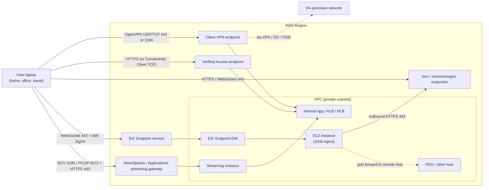
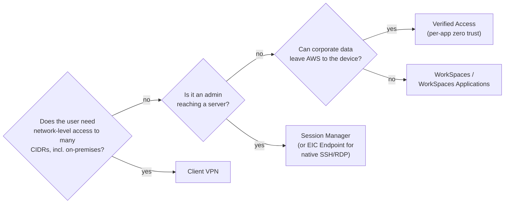

# User and device access to AWS

This page covers the paths that connect people and their devices (laptops, admin workstations, contractors) to resources in AWS, as opposed to site-to-site paths that connect whole networks. It covers AWS Client VPN, AWS Verified Access, AWS Systems Manager Session Manager, EC2 Instance Connect Endpoint, the "bring the user to AWS" services (Amazon WorkSpaces, Amazon WorkSpaces Applications formerly AppStream 2.0, Amazon WorkSpaces Secure Browser), classic bastion hosts, and how a corporate identity provider (IdP) ties in. Every number was checked against AWS documentation, What's New posts, the AWS Price List API and AWS blogs, verified as of 2026-10-10. Where something could not be verified, the page says so.

## At a glance

| Path | Who connects | Protocol on the wire | What is reachable | Inbound port on targets? | Cost model |
| --- | --- | --- | --- | --- | --- |
| AWS Client VPN | Any user with the AWS VPN Client or an OpenVPN client | OpenVPN (TLS), UDP or TCP, port 443 or 1194 | Whole networks (CIDRs) you authorize: VPC, peered VPCs, TGW-attached VPCs, on-premises, internet | Targets must allow traffic from the endpoint ENIs (or client IPs with the TGW integration) | Per endpoint association-hour plus per connection-hour |
| AWS Verified Access (HTTP) | Browser users authenticated by an IdP, optionally with device posture | HTTPS to a Verified Access public endpoint | One application per endpoint (ALB, NLB, ENI) | No public exposure of the app; targets allow the Verified Access endpoint | Per application-hour plus per GB processed |
| AWS Verified Access (non-HTTP) | Users with the Verified Access Connectivity Client | TCP (SSH, RDP, databases, git) tunneled by the client | Endpoint per NLB, ENI, CIDR+ports, or RDS | Same as above | Per endpoint-hour plus connections over 100 per endpoint-hour |
| Session Manager | IAM principals using the console or AWS CLI plus Session Manager plugin | HTTPS/WebSocket to `ssm` and `ssmmessages` endpoints; the agent dials out | Shell on a managed node; port forwarding to the node or through it to a remote host | None; the SSM Agent initiates outbound HTTPS 443 | No charge on EC2; USD 0.05 per session on hybrid/multicloud nodes from 2026-09-30 |
| EC2 Instance Connect Endpoint | IAM principals using the console, AWS CLI, or SSH/RDP clients through a local tunnel | WebSocket tunnel to the EIC Endpoint service, then TCP inside the VPC | Private IP of instances (documented for SSH and RDP) | Target SG must allow the endpoint (or client IPs with IP preservation) | No additional charge; cross-AZ data transfer applies |
| WorkSpaces / WorkSpaces Applications / Secure Browser | Any user with a client or browser | Streaming protocol (DCV/WSP, PCoIP) or HTTPS; only pixels leave AWS | Whatever the desktop, app or browser in AWS can reach | No inbound to your workloads; the streaming instance lives in AWS | Per user/month or per hour (service specific) |
| Bastion host | Anyone with SSH/RDP credentials and network reach | SSH (22) or RDP (3389) | Whatever the bastion can reach | Yes, SSH/RDP inbound on the bastion | EC2 instance-hours plus public IPv4 |

## AWS Client VPN

AWS Client VPN is a managed, OpenVPN-based remote access VPN. A client connects to the endpoint's DNS name, authenticates, receives an IP from the client CIDR, and gets access to the networks permitted by authorization rules and routes.

### How traffic flows

When the endpoint is associated with VPC subnets, Client VPN creates ENIs in those subnets and applies source NAT: the client IP is translated to the ENI IP before traffic enters the VPC, so VPC security groups and flow logs see the ENI address, not the user.

Since 2026-04-23 an endpoint can instead be attached natively to a transit gateway; in that mode source NAT is not applied and the real client IP is preserved end to end, which makes TGW flow logs and IP-based rules meaningful.

You cannot mix VPC subnet associations and a TGW association on one endpoint, security group-based authorization is not supported on TGW endpoints, routes are not propagated from the TGW automatically (you add them by hand), the endpoint and TGW must be in the same Region, and VPCs need return routes for the client CIDR pointing at the TGW.

For IPv6 traffic Client VPN does not perform NAT at all, even with VPC associations.

When several clients reach the same destination IP and port, Client VPN performs port address translation to keep flows unique.

### Authentication

| Method | Type | Notes |
| --- | --- | --- |
| Mutual authentication | Certificate-based | Server and client certificates in ACM; CRL up to 20,000 entries; self-service portal not available |
| Active Directory | User-based | AWS Managed Microsoft AD or AD Connector; optional MFA; must be in the same Region as the endpoint (no AD multi-Region replication support) |
| Federated (SAML 2.0) | User-based | Any SAML 2.0 IdP (Okta, Microsoft Entra ID, IAM Identity Center, etc.); optional separate SAML app for the self-service portal |
| Mutual + AD, or mutual + SAML | Combined | Both must succeed |
| Device posture (since 2026-10-05) | Additional check | CrowdStrike, Jamf or JumpCloud signals evaluated with Cedar policies; continuous re-evaluation; monitor-only mode; needs AWS VPN Client 6.2.0+ |

A server certificate in ACM is required for every endpoint, whatever the authentication type.

### Authorization rules, routes and split tunnel

Authorization rules act as firewall rules on destination CIDRs, optionally scoped to an AD group or SAML group; Client VPN evaluates them by longest prefix match.

A destination must have both a route in the Client VPN route table and a matching authorization rule.

By default the endpoint is full tunnel: the client's routing table gets 0.0.0.0/0 through the tunnel, so internet access requires a route and authorization rule for 0.0.0.0/0 plus a NAT path (IGW in the associated subnet route, or NAT gateway with the TGW integration).

With split tunnel enabled, only the routes in the endpoint route table are pushed to the device, and any change to the route table resets all client connections.

Client Route Enforcement (2025-04-28) makes the AWS VPN Client watch the device routing table and restore VPN routes that were changed or removed, which mitigates route-injection attacks such as TunnelVision (CVE-2024-3661).

If the client's LAN is not inside 10.0.0.0/8, 172.16.0.0/12, 192.168.0.0/16 or 169.254.0.0/16, the endpoint pushes `redirect-gateway block-local`, forcing LAN traffic into the tunnel (a TunnelCrack mitigation).

### Client-to-client access

Clients on the same endpoint can talk to each other by their client CIDR IPs if you add a route for the client CIDR with target `local` and an authorization rule for the client CIDR.

Network-based authorization rules using AD or SAML groups are not supported for the client-to-client scenario, and client-to-client is not supported for IPv6 clients.

### Settings and limits

| Item | Value |
| --- | --- |
| Client CIDR | Between /22 and /12, cannot overlap the VPC or routes, cannot be changed later; size it at 2x planned concurrent users |
| Transport | UDP (default) or TCP; VPN port 443 or 1194 |
| Bandwidth per user connection | Maximum baseline 50 Mbps (increase via Support) |
| Max session duration | 8, 10, 12 or 24 hours (default 24) |
| Subnet associations | One subnet per AZ, all in the same VPC; no dedicated-tenancy VPC |
| Login | Must use the endpoint DNS name; a custom DNS name forwarding to the endpoint IPs breaks recent AWS clients |
| IP families | IPv4, IPv6 and dual-stack endpoints (IPv6 resource access since 2025-08-26) |

### Quotas

| Quota | Default | Adjustable |
| --- | --- | --- |
| Client VPN endpoints per Region | 5 | Yes |
| Authorization rules per endpoint | 200 | Yes |
| Routes per target network association | 100 | Yes |
| Concurrent connections per endpoint | 1 association: 7,000; 2: 36,500; 3: 66,500; 4: 96,500; 5: 126,000 | Yes |
| Concurrent operations per endpoint | 10 | No |
| Client CRL entries | 20,000 | No |
| Authorization policy document size | 10,000 bytes | No |

The 200 rules and 100 routes defaults were raised from 50 and 10 on 2025-03-18.

### Pricing

| Region | Endpoint association-hour | Connection-hour |
| --- | --- | --- |
| US East (N. Virginia) | USD 0.10 | USD 0.05 |
| Asia Pacific (Tokyo) | USD 0.15 | USD 0.05 |

You pay the association fee for each subnet association (an HA endpoint with two AZs in Tokyo costs USD 0.30/hour, about USD 219/month, before any user connects), plus USD 0.05 for each active client connection-hour, plus normal data transfer.

The TGW integration adds no Client VPN surcharge, but TGW attachment-hour and data-processing charges apply; how association-hours are counted for a TGW-associated endpoint (per AZ selected) is not spelled out on the pricing page and was not verified.

## AWS Verified Access

AWS Verified Access (AVA) is AWS's zero-trust access proxy: instead of putting the user on the network, it evaluates every request (HTTP) or connection (TCP) against a Cedar policy using identity from a user trust provider and optional device posture from a device trust provider.

### Building blocks

| Component | What it is |
| --- | --- |
| Verified Access instance | Regional container that evaluates requests; you attach trust providers to it |
| Trust provider | User: `iam-identity-center` or `oidc` (one per instance); device: `jamf`, `crowdstrike`, `jumpcloud` (several allowed) |
| Group | Collection of endpoints that share a group policy |
| Endpoint | One application: load balancer (ALB/NLB), network interface, network CIDR (range + ports, auto DNS records), or RDS (instance, cluster, proxy) |
| Policy | Cedar rules on user and device trust data; group policy plus optional endpoint policy |

### HTTP and non-HTTP

HTTP(S) access went GA on 2023-04-28: the user browses to the application's domain, Verified Access redirects to the IdP, then proxies the request to the internal ALB/NLB/ENI; the connection idle timeout is 60 seconds (HTTP 504 after that).

Non-HTTP access (TCP, SSH, RDP, JDBC/ODBC) was previewed on 2024-12-01 and became GA on 2025-02-06 in 18 Regions including Tokyo.

Non-HTTP access requires the Verified Access Connectivity Client on the device; it runs as a system service, uses ephemeral OAuth tokens, adds identity and device context, and keeps the connection continuously authorized, terminating it if the policy stops matching.

### Quotas

| Quota | Default | Adjustable |
| --- | --- | --- |
| Verified Access instances per Region | 5 | Yes |
| Groups per Region | 10 | Yes |
| Trust providers per Region | 15 | Yes |
| Endpoints per Region | 50 | Yes |
| Max request header size | 64 KB (single header 16 KB) | No |
| OIDC claim size | 11 KB | No |
| IAM Identity Center groups per user | 1,000 | n/a |
| Simultaneous instance connections per device (Connectivity Client) | 5 | No |

### Pricing

| Item | US East (N. Virginia) | Asia Pacific (Tokyo) |
| --- | --- | --- |
| HTTP application-hour, first 148,800 app-hours per month | USD 0.27 | USD 0.35 |
| HTTP application-hour, beyond 148,800 | USD 0.20 | USD 0.26 |
| HTTP data processed | USD 0.02 per GB | USD 0.02 per GB |
| Non-HTTP endpoint-hour | USD 0.20 | USD 0.26 |
| Non-HTTP connections above the free 100 per endpoint per hour | USD 0.001 per connection | USD 0.001 per connection |

One HTTP application in Tokyo for a 730-hour month costs about USD 255.50 plus data processing, which is why AVA is priced per app rather than per user.

The 148,800 threshold is published in the AWS Price List API tier boundaries; the pricing page only implies it through an example (200 apps x 744 hours).

## AWS Systems Manager Session Manager

Session Manager gives an interactive shell or port forwarding to a managed node without any inbound port, SSH keys or bastion.

### How it actually connects

The SSM Agent on the node opens outbound HTTPS 443 connections to `ssm.<region>.amazonaws.com` and `ssmmessages.<region>.amazonaws.com`; Session Manager uses `ssmmessages` (Amazon Message Gateway Service) to create the session data channel.

`ec2messages` (Amazon Message Delivery Service) was required before 2024; since SSM Agent 3.3.40.0 the agent prefers `ssmmessages`, `ec2messages` is optional in Regions launched before 2024, and it does not exist in Regions launched in 2024 or later.

The user side calls `ssm:StartSession` and then opens a WebSocket to `ssmmessages`, so the user's laptop also needs HTTPS to those endpoints (over the internet, or over VPN/Direct Connect to interface endpoints).

The node needs either internet egress (IGW with public IP, or NAT gateway) or interface VPC endpoints for `ssm` and `ssmmessages` (plus `ec2messages` in older Regions for older agents), with private DNS enabled; KMS, CloudWatch Logs and S3 endpoints are needed only if you use encryption or session logging.

Session data is encrypted with TLS (TLS 1.3 by default per the current data-protection page) and can additionally be encrypted with a customer KMS key.

### Port forwarding

| Document | What it does | Notes |
| --- | --- | --- |
| `AWS-StartSSHSession` | SSH over the Session Manager channel | Lets `ssh`/`scp` use Session Manager as a ProxyCommand |
| `AWS-StartPortForwardingSession` | Local port to a port on the managed node | Multiple simultaneous connections need agent 3.0.222.0+ |
| `AWS-StartPortForwardingSessionToRemoteHost` | Local port through the managed node to another host (RDS, internal web server, on-premises host) | Launched 2022-05-27; needs SSM Agent 3.1.1374.0+; the remote host does not need to be managed |

### Settings and quotas

| Item | Value |
| --- | --- |
| Idle session timeout | Default 20 minutes, configurable 1 to 60 |
| Maximum session duration | Configurable separately (`maxSessionDuration`) |
| StartSession API rate | 3 TPS |
| Session history retention | 30 days (log to S3/CloudWatch for longer) |
| Audit | CloudTrail for API calls; optional full session logs to S3 / CloudWatch Logs |

### Pricing

Session Manager has no additional charge on EC2 instances.

For hybrid and multicloud nodes (on-premises servers registered with Systems Manager), the Advanced Instances Tier (USD 0.00695 per node-hour) was removed on 2026-06-30, usage was not billed from 2026-06-30 to 2026-09-30, and from 2026-09-30 Session Manager costs USD 0.05 per session (Run Command USD 0.002 per invocation).

## EC2 Instance Connect Endpoint

EC2 Instance Connect Endpoint (EIC Endpoint), launched in June 2023, is an identity-aware TCP proxy: the AWS CLI or console opens a WebSocket tunnel to the EIC Endpoint service using IAM credentials, and the endpoint's ENI in your subnet forwards TCP to the instance's private IP.

No public IP, IGW, NAT, agent or bastion is needed in the VPC; all connection attempts are logged in CloudTrail.

IAM action `ec2-instance-connect:OpenTunnel` controls access, with condition keys `remotePort`, `privateIpAddress` and `maxTunnelDuration`.

The documentation describes it for SSH and RDP to Linux and Windows instances; community reports say ports other than 22 and 3389 are blocked, but the AWS documentation does not state an explicit port list, so this was not verified.

| Item | Value |
| --- | --- |
| Endpoints per account per Region | 5 (not adjustable) |
| Endpoints per VPC | 1 (not adjustable) |
| Endpoints per subnet | 1 (not adjustable) |
| Concurrent connections per endpoint | 20 (not adjustable) |
| Max TCP connection duration | 3,600 seconds; can be lowered by IAM policy; not tied to credential expiry |
| Client IP preservation | Optional; IPv4 endpoints only; not through a transit gateway; target must be in the same VPC |
| IP families | IPv4, dual-stack, IPv6 (IPv6 since 2025-10-02) |
| Throughput | Intended for management traffic; high-volume transfers are throttled |
| Price | No additional charge; cross-AZ data transfer applies |

## Bring the user to AWS: WorkSpaces family

Instead of extending the network to the user, these services run the desktop, application or browser inside AWS and stream only pixels; corporate data and network access stay in the VPC, which can itself reach on-premises over VPN or Direct Connect.

| Service | What is streamed | Client-side ports | Notes |
| --- | --- | --- | --- |
| Amazon WorkSpaces Personal / Pools | Full Windows or Linux desktop | TCP 443 plus TCP/UDP 4195 (DCV, formerly WSP) or TCP/UDP 4172 (PCoIP) | Streaming port cannot go through a proxy; AD via AWS Managed Microsoft AD or AD Connector to on-premises AD over VPN/DX; SAML 2.0 IdP supported |
| Amazon WorkSpaces Applications (formerly AppStream 2.0) | Individual applications or desktops | HTTPS / DCV | Renamed on 2025-11-06; APIs, docs URLs (`appstream2`) and pricing codes kept the old names |
| Amazon WorkSpaces Secure Browser (formerly WorkSpaces Web) | Managed Chrome in AWS for internal web apps and SaaS | HTTPS from any browser | Renamed 2024-05-20; flat fee per monthly active user from USD 7; closed to new customers from 2026-10-29 (maintenance mode), AWS suggests WorkSpaces Applications with a Chrome image instead |

When WorkSpaces use AD Connector to reach on-premises AD, logons depend on the VPN/Direct Connect link: if it fails users cannot sign in, and authentication traffic is billed as data transfer out over that link.

## Bastion hosts

A bastion (jump host) is an EC2 instance in a public subnet with SSH or RDP open to an allowlisted source range; admins hop through it to private hosts.

It requires an IGW, a public IPv4 address (USD 0.005 per hour since 2024-02-01), patching, key management and log collection, and it is a standing internet-exposed attack surface.

AWS prescriptive guidance and blogs now recommend replacing it with Session Manager or EIC Endpoint, or at least reaching the bastion itself through Session Manager with ephemeral keys so it has no inbound port.

## Tying in the corporate IdP

| Path | IdP integration |
| --- | --- |
| Client VPN | SAML 2.0 federation (IAM SAML provider), AD (Managed AD or AD Connector to on-premises AD), group-scoped authorization rules |
| Verified Access | IAM Identity Center (which itself federates to Entra ID, Okta, etc.) or any OIDC provider; device trust from Jamf, CrowdStrike, JumpCloud |
| Session Manager and EIC Endpoint | IAM: users sign in through IAM Identity Center (SAML/SCIM from the corporate IdP) and get temporary credentials; access is then controlled with IAM policies and tags |
| WorkSpaces family | AD (Managed AD or AD Connector) and SAML 2.0 IdPs |

The common pattern is one corporate IdP federated into IAM Identity Center, which then covers the AWS console and CLI (Session Manager, EIC Endpoint) and Verified Access, while Client VPN and WorkSpaces use their own SAML or AD integration.

## Choosing a path

## Launches 2024–2026

| Date | Launch |
| --- | --- |
| 2024-05-20 | WorkSpaces Web renamed WorkSpaces Secure Browser |
| 2024-12-01 | Verified Access non-HTTP(S) access (preview) |
| 2025-02-06 | Verified Access non-HTTP(S) access GA (TCP, SSH, RDP; 18 Regions) |
| 2025-03-18 | Client VPN default quotas raised to 200 authorization rules and 100 routes |
| 2025-04-28 | Client VPN Client Route Enforcement |
| 2025-08-26 | Client VPN access to IPv6 resources (IPv6-only and dual-stack endpoints) |
| 2025-10-02 | EC2 Instance Connect Endpoint IPv6 and dual-stack |
| 2025-11-06 | AppStream 2.0 renamed Amazon WorkSpaces Applications |
| 2026-01-07 | Client VPN Quickstart setup (three inputs: IPv4 CIDR, server certificate ARN, subnet) |
| 2026-04-23 | Client VPN native Transit Gateway integration with source IP preservation |
| 2026-06-30 | Systems Manager Advanced Instances Tier removed |
| 2026-08-13 | AWS VPN Client 6.0.x rebuilt on OpenVPN3, with CLI and admin controls |
| 2026-09-30 | Session Manager pay-per-session (USD 0.05) on hybrid/multicloud nodes |
| 2026-10-05 | Client VPN device posture assessment (CrowdStrike, Jamf, JumpCloud; Cedar) |
| 2026-10-29 | WorkSpaces Secure Browser closes to new customers |

## Common traps

- Client VPN with VPC associations hides user IPs behind the endpoint ENI (SNAT), so per-user firewall rules downstream are impossible; use the TGW integration (no SNAT) if you need real client IPs.
- A route without a matching authorization rule (or the reverse) silently blocks traffic; you need both, and AD/SAML group rules use longest prefix match.
- Full tunnel is the default: users lose internet access unless you add a 0.0.0.0/0 route, an authorization rule and a NAT path, and all their internet traffic is then billed as AWS data transfer.
- Editing the route table of a split-tunnel endpoint disconnects every user.
- Client VPN association-hours are charged even with zero users; two AZs in Tokyo cost about USD 219 per month before any connection.
- Pointing a corporate DNS name at Client VPN endpoint IPs breaks recent AWS clients (TunnelCrack mitigation); always connect to the endpoint DNS name.
- Home LANs outside RFC 1918 or 169.254.0.0/16 get `redirect-gateway block-local`, so users lose access to their local printer.
- Session Manager does need network egress: a private subnet with no NAT and no `ssm`/`ssmmessages` interface endpoints shows the instance as unmanaged.
- Removing `ssmmessages:OpenControlChannel` from the instance role can take up to 1 hour to cut off an existing agent connection.
- EIC Endpoint allows only 1 endpoint per VPC and 20 concurrent connections, and kills tunnels after 1 hour even if credentials are still valid; it is not a data-transfer path.
- Verified Access is billed per application-hour, so a large catalog of small internal apps can cost more than Client VPN for the same users.
- Verified Access HTTP connections idle for more than 60 seconds return 504.
- The WorkSpaces streaming port (4195 or 4172) cannot go through the corporate HTTP proxy; firewalls must allow it directly to the WorkSpaces gateway ranges.
- WorkSpaces Secure Browser cannot be adopted by new customers after 2026-10-29.

## Sources

- <https://docs.aws.amazon.com/vpn/latest/clientvpn-admin/limits.html>
- <https://docs.aws.amazon.com/vpn/latest/clientvpn-admin/scaling-considerations.html>
- <https://docs.aws.amazon.com/vpn/latest/clientvpn-admin/what-is-best-practices.html>
- <https://docs.aws.amazon.com/vpn/latest/clientvpn-admin/client-authentication.html>
- <https://docs.aws.amazon.com/vpn/latest/clientvpn-admin/cvpn-working-rules.html>
- <https://docs.aws.amazon.com/vpn/latest/clientvpn-admin/split-tunnel-vpn.html>
- <https://docs.aws.amazon.com/vpn/latest/clientvpn-admin/cvpn-working-max-duration.html>
- <https://docs.aws.amazon.com/vpn/latest/clientvpn-admin/cvpn-working-cre.html>
- <https://docs.aws.amazon.com/vpn/latest/clientvpn-admin/cvpn-tgw.html>
- <https://docs.aws.amazon.com/vpn/latest/clientvpn-admin/how-it-works.html>
- <https://docs.aws.amazon.com/sdk-for-ruby/v3/api/Aws/EC2/Types/CreateClientVpnEndpointRequest.html>
- <https://docs.aws.amazon.com/cdk/api/v2/docs/aws-cdk-lib.aws_ec2.CfnClientVpnEndpointProps.html>
- <https://repost.aws/knowledge-center/client-vpn-give-users-resource-access>
- <https://repost.aws/knowledge-center/client-vpn-fix-packet-loss-latency>
- <https://aws.amazon.com/vpn/pricing/>
- <https://pricing.us-east-1.amazonaws.com/offers/v1.0/aws/AmazonVPC/current/ap-northeast-1/index.json>
- <https://pricing.us-east-1.amazonaws.com/offers/v1.0/aws/AmazonVPC/current/us-east-1/index.json>
- <https://aws.amazon.com/about-aws/whats-new/2025/03/aws-client-vpn-authorization-rules-route-quotas/>
- <https://aws.amazon.com/about-aws/whats-new/2025/04/aws-client-vpn-client-routes-enforcement/>
- <https://aws.amazon.com/about-aws/whats-new/2025/08/aws-client-vpn-connectivity-ipv6-resources/>
- <https://aws.amazon.com/about-aws/whats-new/2025/10/aws-client-vpn-macos-tahoe/>
- <https://aws.amazon.com/about-aws/whats-new/2026/01/aws-client-vpn-onboarding-quickstart-setup/>
- <https://aws.amazon.com/about-aws/whats-new/2026/04/aws-client-vpn-transit-gateway/>
- <https://aws.amazon.com/about-aws/whats-new/2026/08/aws-client-vpn-cli/>
- <https://aws.amazon.com/about-aws/whats-new/2026/10/aws-client-vpn-device-posture/>
- <https://aws.amazon.com/blogs/networking-and-content-delivery/prevent-vpn-traffic-leaks-with-client-vpn-route-enforcement-in-aws-client-vpn/>
- <https://docs.aws.amazon.com/verified-access/latest/ug/verified-access-quotas.html>
- <https://docs.aws.amazon.com/verified-access/latest/ug/device-trust.html>
- <https://docs.aws.amazon.com/verified-access/latest/ug/connectivity-client.html>
- <https://docs.aws.amazon.com/verified-access/latest/ug/create-rds-endpoint.html>
- <https://docs.aws.amazon.com/AWSEC2/latest/APIReference/API_VerifiedAccessTrustProvider.html>
- <https://aws.amazon.com/verified-access/pricing/>
- <https://aws.amazon.com/about-aws/whats-new/2023/04/aws-verified-access-generally-available/>
- <https://aws.amazon.com/about-aws/whats-new/2024/12/aws-verified-access-secure-access-resources-non-https-protocols-preview/>
- <https://aws.amazon.com/about-aws/whats-new/2025/02/aws-verified-access-zero-trust-resources-non-https-protocols/>
- <https://aws.amazon.com/blogs/networking-and-content-delivery/aws-verified-access-support-for-non-http-resources-is-now-generally-available/>
- <https://aws.amazon.com/blogs/networking-and-content-delivery/aws-verified-access-integration-with-3rd-party-identity-providers/>
- <https://docs.aws.amazon.com/systems-manager/latest/userguide/setup-create-vpc.html>
- <https://docs.aws.amazon.com/systems-manager/latest/userguide/session-manager-getting-started-privatelink.html>
- <https://docs.aws.amazon.com/systems-manager/latest/userguide/systems-manager-setting-up-messageAPIs.html>
- <https://docs.aws.amazon.com/systems-manager/latest/userguide/troubleshooting-ssm-agent.html>
- <https://docs.aws.amazon.com/systems-manager/latest/userguide/session-preferences-timeout.html>
- <https://docs.aws.amazon.com/systems-manager/latest/userguide/session-preferences-enable-encryption.html>
- <https://docs.aws.amazon.com/systems-manager/latest/userguide/data-protection.html>
- <https://docs.aws.amazon.com/systems-manager/latest/userguide/session-manager-working-with-sessions-start.html>
- <https://docs.aws.amazon.com/general/latest/gr/ssm.html>
- <https://aws.amazon.com/systems-manager/pricing/>
- <https://aws.amazon.com/blogs/multicloud/centralize-your-multicloud-management-in-aws-systems-manager-with-automated-onboarding-and-simplified-pricing/>
- <https://aws.amazon.com/about-aws/whats-new/2022/05/aws-systems-manager-support-port-forwarding-remote-hosts-using-session-manager/>
- <https://aws.amazon.com/about-aws/whats-new/2020/10/port-forwarding-sessions-created-sessions-manager-support-multiple-simultaneous-connections/>
- <https://repost.aws/knowledge-center/systems-manager-ssh-vpc-resources>
- <https://docs.aws.amazon.com/AWSEC2/latest/UserGuide/connect-with-ec2-instance-connect-endpoint.html>
- <https://docs.aws.amazon.com/AWSEC2/latest/UserGuide/eice-quotas.html>
- <https://docs.aws.amazon.com/AWSEC2/latest/UserGuide/permissions-for-ec2-instance-connect-endpoint.html>
- <https://docs.aws.amazon.com/AWSEC2/latest/UserGuide/connect-using-eice.html>
- <https://aws.amazon.com/blogs/compute/secure-connectivity-from-public-to-private-introducing-ec2-instance-connect-endpoint-june-13-2023/>
- <https://aws.amazon.com/about-aws/whats-new/2025/10/amazon-ec2-instance-connect-endpoint-ipv6/>
- <https://docs.aws.amazon.com/workspaces/latest/adminguide/workspaces-port-requirements.html>
- <https://docs.aws.amazon.com/whitepapers/latest/best-practices-deploying-amazon-workspaces/scenario-1-using-ad-connector-to-proxy-authentication-to-on-premises-active-directory-service.html>
- <https://aws.amazon.com/workspaces/desktop-as-a-service/faqs/>
- <https://aws.amazon.com/workspaces/applications/>
- <https://dev.classmethod.jp/articles/amazon-appstream2-rename-to-amazon-workspaces-applications/>
- <https://docs.aws.amazon.com/workspaces-web/latest/adminguide/version-history.html>
- <https://docs.aws.amazon.com/workspaces-web/latest/adminguide/maintenance-mode-faqs.html>
- <https://docs.aws.amazon.com/workspaces-web/latest/adminguide/workspaces-secure-browser-maintenance-mode.html>
- <https://aws.amazon.com/workspaces/secure-browser/pricing/>
- <https://docs.aws.amazon.com/prescriptive-guidance/latest/patterns/access-a-bastion-host-by-using-session-manager-and-amazon-ec2-instance-connect.html>
- <https://aws.amazon.com/blogs/mt/securely-administer-servers-migrated-with-aws-application-migration-service-using-aws-systems-manager-session-manager/>
- <https://aws.amazon.com/vpc/pricing/>
