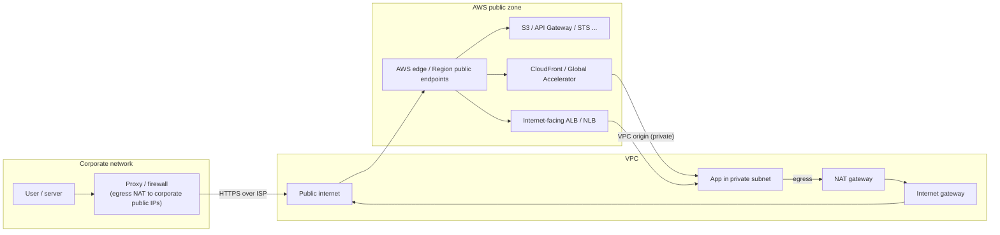
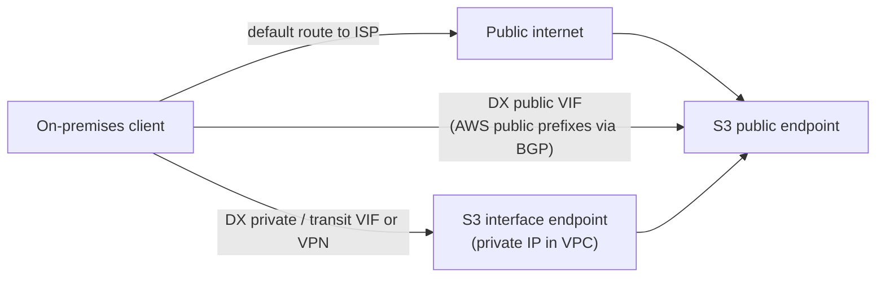

# The internet as the path

This page covers using the public internet (or the public side of AWS) as the path between a corporate network and AWS: reaching public AWS service endpoints such as Amazon S3 and Amazon API Gateway from the office through the corporate internet egress or proxy, source IP allowlisting and why `aws:SourceIp` stops working through VPC endpoints, exposing workloads with security groups, load balancers, Amazon CloudFront (including VPC origins) and AWS Global Accelerator, the published AWS IP ranges, how traffic to public AWS endpoints is actually routed (including over a Direct Connect public VIF), egress from a VPC through NAT gateways, encryption, and the AWS whitepaper guidance on when the internet is an acceptable path. Every number was checked against AWS documentation, What's New posts, the AWS Price List API and AWS blogs, verified as of 2026-10-10. Where something could not be verified, the page says so.

## At a glance

| Item | Value |
| --- | --- |
| Public AWS endpoints | S3, API Gateway, STS, SSM and most service APIs resolve to public IPs listed in `ip-ranges.json` and accept HTTPS from anywhere |
| Minimum TLS on AWS API endpoints | TLS 1.2 everywhere since 2024-02-27 (TLS 1.0/1.1 removed) |
| Source IP allowlisting | `aws:SourceIp` matches public IPs only, and is absent from the request context when the call comes through a VPC endpoint |
| Through VPC endpoints use | `aws:SourceVpce`, `aws:SourceVpc`, `aws:VpcSourceIp` (always together with a VPC or endpoint key) |
| Traffic between AWS public IPs | Stays on the AWS global network (except to/from China Regions and the European Sovereign Cloud) |
| Direct Connect public VIF | Reaches all AWS public prefixes in all commercial Regions without touching the internet, but it is not encrypted by default |
| Data transfer in from the internet | Free; out to the internet USD 0.09/GB first 10 TB in US East (example on VPC pricing), USD 0.114/GB in Tokyo |
| NAT gateway (Tokyo) | USD 0.062 per hour plus USD 0.062 per GB processed (US East (Ohio) example: USD 0.045 and USD 0.045) |
| Public IPv4 address | USD 0.005 per hour, in use or idle |
| Global Accelerator | USD 0.025 per accelerator-hour plus DT-Premium per GB; 2 static anycast IPv4 addresses (4 with dual-stack) |
| CloudFront VPC origins | Since 2024-11-20; cross-account since 2025-11-06; no additional charge |

## Reaching public AWS endpoints from the office

Most AWS service APIs and data planes (S3, DynamoDB, SQS, API Gateway Regional and edge-optimized APIs, STS, KMS, Systems Manager) have public endpoints that any internet-connected client can reach over HTTPS; authentication is SigV4 or the service's own auth, not network position.

From a corporate network the usual path is: client, corporate proxy or firewall, corporate internet egress (the source IP AWS sees is the corporate NAT/proxy public IP), ISP, AWS edge, service endpoint.

Firewall and proxy allowlists for AWS should be built from `ip-ranges.json` (filter by `service` and `region`) or, better, from FQDNs, because service IPs change.

The SDKs and CLI honor `HTTPS_PROXY`, so they work through an explicit corporate proxy; TLS-inspecting proxies must trust the AWS endpoints' certificates and must not break SigV4 (they must not alter signed headers or the body).

WorkSpaces is the notable exception: its streaming port (TCP/UDP 4195 or 4172) cannot go through an HTTP proxy.

## Source IP allowlisting

### aws:SourceIp

`aws:SourceIp` compares the requester's public IP with the policy; it can only be used for public IP ranges, and it is included in the request context except when the requester uses a VPC endpoint.

Typical use: an S3 bucket policy or IAM policy that denies requests not coming from the corporate egress IPs, or an API Gateway resource policy that denies `execute-api:Invoke` outside a `NotIpAddress` list.

### Why aws:SourceIp fails through VPC endpoints

When the same office traffic is moved to an interface or gateway VPC endpoint (for example on-premises to S3 over Direct Connect to an S3 interface endpoint), the request no longer carries `aws:SourceIp`; a policy that only allows the corporate public IPs then denies everything.

Through endpoints use `aws:SourceVpce` (endpoint ID), `aws:SourceVpc` (VPC ID) or `aws:VpcSourceIp` (the private client IP as seen by the endpoint), and always combine `aws:VpcSourceIp` with `aws:SourceVpc`, `aws:SourceVpce` or `aws:SourceVpcArn` because private CIDRs overlap across unrelated VPCs.

A policy that must work both from the internet and through an endpoint needs an `OR`: one statement for `aws:SourceIp` and one for `aws:SourceVpce`.

`Deny` statements on these keys can block AWS services acting on your behalf (forward access sessions); add `aws:ViaAWSService` or `aws:PrincipalIsAWSService` exceptions.

For private REST APIs in API Gateway, a resource policy is mandatory and must allow `aws:SourceVpc` or `aws:SourceVpce`; private APIs are dual-stack only, so IP-based conditions must include both IPv4 and IPv6 ranges.

| Request path | `aws:SourceIp` | `aws:SourceVpce` / `aws:SourceVpc` | `aws:VpcSourceIp` |
| --- | --- | --- | --- |
| Office over internet to public endpoint | Corporate public egress IP | Absent | Absent |
| EC2 via NAT gateway to public endpoint | NAT gateway public IP | Absent | Absent |
| EC2 or on-premises via VPC endpoint | Absent | Endpoint ID / VPC ID | Private client IP |
| On-premises via DX public VIF to public endpoint | Customer's public prefix advertised on the VIF | Absent | Absent |

### Security groups for office CIDRs

For internet-facing EC2, ALB or NLB, inbound security group rules can allow the corporate egress CIDRs; customer-managed prefix lists keep those CIDRs in one place.

The default quota is 60 inbound rules per security group, and an AWS-managed prefix list counts by its weight: the CloudFront origin-facing list weighs 55, leaving room for only 5 other rules.

## Exposing workloads to the office over the internet

| Front door | What it gives you | Origin can be private? | Notes |
| --- | --- | --- | --- |
| Internet-facing ALB / NLB | Regional public entry, SGs, TLS termination, WAF on ALB | Targets yes, LB no | NLB supports security groups (required for NLB VPC origins) |
| Amazon CloudFront (classic origin) | Global edge, TLS, WAF, caching | No, origin must be public | Lock origin with the `com.amazonaws.global.cloudfront.origin-facing` prefix list plus a secret header |
| CloudFront VPC origins | CloudFront reaches ALB, NLB or EC2 in private subnets via a service-managed ENI | Yes | VPC needs an IGW attached (not used for routing); no gRPC, no Lambda@Edge origin triggers, NLB with TLS listener not supported; inbound NACLs not evaluated |
| AWS Global Accelerator | 2 static anycast IPv4 (4 with dual-stack) entering the AWS backbone at the nearest edge; endpoints ALB, NLB, EC2, EIP | Endpoints can be internal ALBs/EC2 | Useful when the corporate firewall needs fixed IPs to allowlist |
| API Gateway (Regional / edge-optimized) | Managed HTTPS API | n/a | Resource policy with `aws:SourceIp` for office-only access |
| Verified Access (HTTP) | Identity-aware public endpoint for internal apps | Yes | See the user access page |

For the corporate side, Global Accelerator's static IPs and CloudFront's managed prefix list solve opposite problems: GA gives the office fixed destination IPs to allowlist outbound, while the prefix list lets the origin accept only CloudFront.

Global Accelerator is billed USD 0.025 for every accelerator-hour (enabled or disabled) plus DT-Premium per GB in the dominant direction, on top of normal data transfer out and public IPv4 charges.

## AWS IP ranges

AWS publishes its public ranges at `https://ip-ranges.amazonaws.com/ip-ranges.json` with `syncToken`, `createDate` and `prefixes` / `ipv6_prefixes` entries tagged by `region`, `service` (for example `AMAZON`, `S3`, `EC2`, `CLOUDFRONT`, `EC2_INSTANCE_CONNECT`) and `network_border_group`.

Every change triggers a notification on SNS topic `arn:aws:sns:us-east-1:806199016981:AmazonIpSpaceChanged` (subscribe from us-east-1); notifications can arrive out of order, so check `create-time`.

BYOIP ranges are not in the file but are still advertised over Direct Connect public VIFs; BGP-advertised prefixes may be aggregated differently from the file.

## How traffic to AWS public endpoints is routed

Traffic between instances and AWS services using public IPs stays on the AWS private global network; packets that originate on the AWS network with a destination on the AWS network stay on it, except traffic to or from AWS China Regions and the AWS European Sovereign Cloud Region (VPC FAQ).

All traffic on the AWS global network between AWS facilities is encrypted at the physical layer before it leaves those facilities.

So EC2 to S3 through a NAT gateway or IGW does not cross the internet; it uses public IPs but never leaves AWS, though it still pays NAT processing (use an S3 gateway endpoint to avoid that).

### The Direct Connect public VIF misconception

A common belief is that on-premises traffic to S3 "goes over the internet" even with Direct Connect; with a public VIF that is false: AWS advertises all AWS public prefixes (all commercial Regions plus CloudFront and Route 53 PoPs) over BGP, and traffic to them enters AWS at the Direct Connect location without touching the internet.

The opposite trap is also real: a public VIF gives access to every AWS public IP, including other customers' EC2 public IPs and Amazon.com, not just your bucket; AWS recommends a firewall filter on the customer side.

Inbound, you must own the public prefixes you advertise (registered with an RIR), AWS filters by source, and AWS does not re-advertise your prefixes to the internet (`NO_EXPORT`); if the same prefix is advertised to both the internet and the VIF, advertise a more specific one over Direct Connect to steer return traffic.

Direct Connect is not encrypted by default; for encryption use TLS end to end (all S3 and API calls already use HTTPS), Site-to-Site VPN over a public or transit VIF, or MACsec on 10/100 Gbps dedicated connections.

Without a public VIF, the same on-premises client resolves `s3.<region>.amazonaws.com` to public IPs and goes out through the corporate internet egress; to keep it on a private VIF instead, use an S3 interface endpoint and endpoint-specific DNS names (or private DNS with a Route 53 Resolver inbound endpoint), because gateway endpoints do not carry traffic that enters the VPC from VPN, Direct Connect or a transit gateway.

## Egress from the VPC

Workloads in private subnets reach the internet (or public endpoints of other providers, or the corporate public IPs) through a NAT gateway in a public subnet with a route to an internet gateway.

| NAT gateway fact | Value |
| --- | --- |
| Bandwidth | 5 Gbps, scales automatically to 100 Gbps |
| Packets | 1 Mpps, scales to 10 Mpps; packets dropped beyond |
| Connections | 55,000 simultaneous per IPv4 address per unique destination; up to 8 IPs (440,000) |
| Protocols | TCP, UDP, ICMP; NAT64 with DNS64 |
| Price, US East (Ohio) example | USD 0.045 per hour plus USD 0.045 per GB |
| Price, Tokyo | USD 0.062 per hour plus USD 0.062 per GB |
| Regional mode (since 2025-11-19) | One NAT gateway that expands across AZs, no public subnet needed; billed per AZ-hour (USD 0.062 per AZ-hour in Tokyo) |

Data transfer out to the internet is billed on top of NAT processing (Tokyo: USD 0.114/GB first 10 TB, then 0.089, 0.086, 0.084).

Two egress designs exist in hybrid networks: local egress in AWS (NAT gateway per VPC or a centralized egress VPC behind a transit gateway) or backhaul to on-premises (a default route over Direct Connect/VPN so the corporate proxy and firewall inspect AWS-originated traffic); backhaul keeps one inspection point but adds latency and DX/VPN data transfer.

A private NAT gateway (no public IP) does source NAT toward on-premises or other VPCs through a transit gateway or virtual private gateway, which is the standard answer when on-premises only accepts a small approved range or when VPC CIDRs overlap with on-premises.

VPC Block Public Access (2024-11-19) can authoritatively block IGW and egress-only IGW traffic per Region (bidirectional or ingress-only, with per-VPC/subnet exclusions), overriding route tables and security groups.

## Encryption and TLS

AWS service API endpoints require TLS 1.2 or later since 2024-02-27; an old corporate proxy or appliance that only speaks TLS 1.0/1.1 cannot reach AWS APIs.

Enforce TLS on S3 with a bucket policy that denies `aws:SecureTransport = false`, and optionally deny `s3:TlsVersion` below 1.2.

Over the internet, encryption is per connection (HTTPS/TLS, or IPsec with Site-to-Site VPN); there is no network-level encryption of the internet segment itself.

Inside AWS, traffic between facilities is encrypted at the physical layer, and some instance types encrypt VPC traffic between each other automatically; the internet segment between the office and the AWS edge is protected only by TLS or IPsec.

## When AWS says the internet is acceptable

The AWS Hybrid Connectivity whitepaper (July 6, 2023) splits the decision into connectivity type (internet-based VPN vs Direct Connect) driven by time to deploy, security, SLA, performance and cost.

| Consideration | Internet-based | Direct Connect |
| --- | --- | --- |
| Time to deploy | Hours to days, using the existing connection | Hosted connection hours to weeks; new dedicated connection several weeks to months |
| Security | Allowed if policy permits the internet; encrypt with Site-to-Site VPN or TLS | Private connection; encryption requires VPN over DX or MACsec |
| SLA | No end-to-end SLA across ISPs | Connection SLA that scales with redundancy |
| Performance | Variable latency, jitter and loss; VPN tunnel overhead and MTU limits | Consistent, provisioned bandwidth |
| Cost | Uses the existing internet line; data transfer out at internet rates | Port-hours plus lower DX data transfer rates |

The Well-Architected Performance pillar summarizes it: use a VPN over the internet when only a temporary connection is required, when cost is a factor, or as a contingency while Direct Connect is being established; and do not load balance across Direct Connect and VPN because of their latency and bandwidth differences.

For SaaS-style or public services (CloudFront, API Gateway, WorkSpaces), the internet is the intended path, with access controlled by resource policies, security groups, WAF and TLS.

## Launches 2024–2026

| Date | Launch |
| --- | --- |
| 2024-02-01 | Public IPv4 addresses charged at USD 0.005 per hour |
| 2024-02-27 | TLS 1.0/1.1 removed from all AWS API endpoints (TLS 1.2 minimum) |
| 2024-11-19 | VPC Block Public Access |
| 2024-11-20 | CloudFront VPC origins (ALB, NLB, EC2 in private subnets) |
| 2025-11-06 | CloudFront cross-account VPC origins (via AWS RAM) |
| 2025-11-19 | Regional NAT gateway (regional availability mode) |

## Common traps

- An S3 bucket policy that allows only the office `aws:SourceIp` breaks the moment traffic is moved to a VPC endpoint; add an `aws:SourceVpce` branch.
- `aws:SourceIp` with private (RFC 1918) addresses never matches; use `aws:VpcSourceIp` with an endpoint or VPC key.
- The source IP AWS sees from the office is the corporate proxy or NAT egress IP, which can change when the network team switches ISPs or adds proxies.
- "S3 over Direct Connect goes through the internet" is false with a public VIF, but a public VIF exposes all AWS public prefixes and still needs TLS or VPN for encryption.
- S3 gateway endpoints do not carry on-premises traffic; on-premises needs an interface endpoint.
- EC2 to S3 via NAT gateway stays on AWS but pays NAT processing per GB; a free S3 gateway endpoint avoids it.
- The CloudFront managed prefix list consumes 55 security group rules; HTTP and HTTPS rules together consume 110 and exceed the default 60.
- CloudFront VPC origins still require an internet gateway attached to the VPC, even though it is not used for routing.
- Global Accelerator charges its fixed fee for disabled accelerators too, and deleting an accelerator loses its static IPs.
- An IP allowlist built from a one-time copy of `ip-ranges.json` drifts; subscribe to `AmazonIpSpaceChanged` or use AWS-managed prefix lists.
- TLS-inspecting corporate proxies that alter headers break SigV4, and appliances limited to TLS 1.0/1.1 cannot reach AWS APIs at all.

## Sources

- <https://docs.aws.amazon.com/IAM/latest/UserGuide/reference_policies_condition-keys.html>
- <https://repost.aws/knowledge-center/iam-restrict-access-policy>
- <https://repost.aws/knowledge-center/api-gateway-resource-policy-access>
- <https://docs.aws.amazon.com/whitepapers/latest/best-practices-api-gateway-private-apis-integration/rest-api.html>
- <https://aws.amazon.com/blogs/security/how-to-use-policies-to-restrict-where-ec2-instance-credentials-can-be-used-from/>
- <https://aws.amazon.com/vpc/faqs/>
- <https://aws.amazon.com/blogs/architecture/new-zealand-internet-connectivity-to-aws/>
- <https://docs.aws.amazon.com/directconnect/latest/UserGuide/WorkingWithVirtualInterfaces.html>
- <https://docs.aws.amazon.com/directconnect/latest/UserGuide/routing-and-bgp.html>
- <https://docs.aws.amazon.com/directconnect/latest/UserGuide/encryption-in-transit.html>
- <https://repost.aws/knowledge-center/public-private-interface-dx>
- <https://aws.amazon.com/blogs/networking-and-content-delivery/optimizing-amazon-s3-data-transfers-over-direct-connect/>
- <https://docs.aws.amazon.com/AmazonS3/latest/userguide/privatelink-interface-endpoints.html>
- <https://aws.amazon.com/blogs/storage/introducing-private-dns-support-for-amazon-s3-with-aws-privatelink/>
- <https://docs.aws.amazon.com/fsx/latest/ONTAPGuide/configuring-network-access-for-s3-access-points.html>
- <https://docs.aws.amazon.com/vpc/latest/userguide/subscribe-notifications.html>
- <https://aws.amazon.com/blogs/aws/subscribe-to-aws-public-ip-address-changes-via-amazon-sns/>
- <https://docs.aws.amazon.com/vpc/latest/userguide/working-with-aws-managed-prefix-lists.html>
- <https://docs.aws.amazon.com/AmazonCloudFront/latest/DeveloperGuide/LocationsOfEdgeServers.html>
- <https://aws.amazon.com/blogs/networking-and-content-delivery/limit-access-to-your-origins-using-the-aws-managed-prefix-list-for-amazon-cloudfront/>
- <https://repost.aws/knowledge-center/waf-ipset-rules-alb-cloudfront>
- <https://docs.aws.amazon.com/AmazonCloudFront/latest/DeveloperGuide/private-content-vpc-origins.html>
- <https://aws.amazon.com/about-aws/whats-new/2024/11/amazon-cloudfront-vpc-origins/>
- <https://aws.amazon.com/about-aws/whats-new/2025/11/amazon-cloudfront-cross-account-vpc-origins/>
- <https://aws.amazon.com/blogs/compute/accessing-private-amazon-api-gateway-endpoints-through-custom-amazon-cloudfront-distribution-using-vpc-origins/>
- <https://docs.aws.amazon.com/global-accelerator/latest/dg/introduction-components.html>
- <https://docs.aws.amazon.com/global-accelerator/latest/dg/introduction-pricing.html>
- <https://aws.amazon.com/global-accelerator/features/>
- <https://aws.amazon.com/global-accelerator/pricing/>
- <https://pricing.us-east-1.amazonaws.com/offers/v1.0/aws/AWSGlobalAccelerator/current/index.json>
- <https://docs.aws.amazon.com/vpc/latest/userguide/nat-gateway-basics.html>
- <https://docs.aws.amazon.com/whitepapers/latest/building-scalable-secure-multi-vpc-network-infrastructure/using-nat-gateway-for-centralized-egress.html>
- <https://docs.aws.amazon.com/whitepapers/latest/building-scalable-secure-multi-vpc-network-infrastructure/private-nat-gateway.html>
- <https://aws.amazon.com/about-aws/whats-new/2025/11/aws-nat-gateway-regional-availability/>
- <https://aws.amazon.com/vpc/pricing/>
- <https://pricing.us-east-1.amazonaws.com/offers/v1.0/aws/AmazonEC2/current/ap-northeast-1/index.csv>
- <https://pricing.us-east-1.amazonaws.com/offers/v1.0/aws/AWSDataTransfer/current/index.csv>
- <https://aws.amazon.com/about-aws/whats-new/2024/11/block-public-access-amazon-virtual-private-cloud/>
- <https://aws.amazon.com/blogs/networking-and-content-delivery/enhanced-security-with-dmz-architecture-using-amazon-vpc-block-public-access/>
- <https://aws.amazon.com/blogs/security/tls-1-2-required-for-aws-endpoints/>
- <https://aws.amazon.com/blogs/storage/enforcing-encryption-in-transit-with-tls1-2-or-higher-with-amazon-s3/>
- <https://docs.aws.amazon.com/systems-manager/latest/userguide/data-protection.html>
- <https://docs.aws.amazon.com/whitepapers/latest/hybrid-connectivity/hybrid-connectivity.html>
- <https://docs.aws.amazon.com/whitepapers/latest/hybrid-connectivity/hybrid-connectivity-type-and-design-considerations.html>
- <https://docs.aws.amazon.com/whitepapers/latest/hybrid-connectivity/time-to-deploy.html>
- <https://docs.aws.amazon.com/whitepapers/latest/hybrid-connectivity/security.html>
- <https://docs.aws.amazon.com/whitepapers/latest/hybrid-connectivity/performance.html>
- <https://docs.aws.amazon.com/wellarchitected/2025-02-25/framework/perf_networking_choose_appropriate_dedicated_connectivity_or_vpn.html>
- <https://aws.amazon.com/blogs/publicsector/resilient-public-safety-connectivity-models-in-aws/>
- <https://docs.aws.amazon.com/workspaces/latest/adminguide/workspaces-port-requirements.html>
