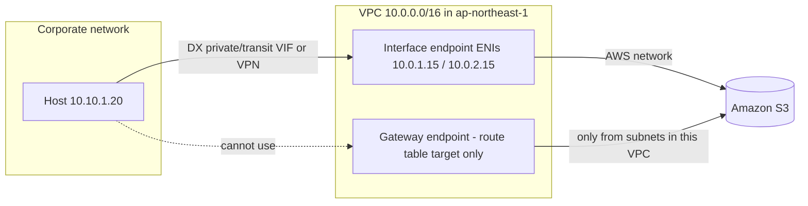
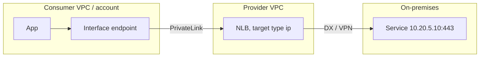

# 09. Private access to AWS services and SaaS from on-premises

This page covers how a corporate network (data center, office, branch) reaches AWS *service APIs* (S3, DynamoDB, KMS, ECR, STS, ...) and third-party SaaS without the public internet, and the reverse: how AWS workloads reach on-premises services privately. It assumes you already have a Direct Connect (DX) or Site-to-Site VPN path into a VPC (see the earlier pages); here the question is what sits at the AWS end of that path and how the names resolve to it. Verified as of 2026-10-10 against AWS documentation, What's New posts, the AWS Price List API and AWS blogs. Prices are USD for Asia Pacific (Tokyo, `ap-northeast-1`) unless stated.

## The one rule that explains everything

A VPC does not provide transitive routing for gateway-type constructs: traffic that enters a VPC from a VPN, DX, peering or Transit Gateway attachment cannot leave through that VPC's internet gateway, NAT gateway or *gateway endpoint*. Anything that must be reachable from outside the VPC has to be an IP address that lives *in* the VPC, which is what an interface endpoint (an ENI with a private IP) is.

That is why the S3 and DynamoDB documentation both state that gateway endpoints "do not allow access from on-premises networks, from peered VPCs in other AWS Regions, or through a transit gateway", while interface endpoints "allow access from on premises".

## Four ways to reach AWS service APIs from on-premises

| Option | What on-prem talks to | Addresses | DNS work needed | AWS charge (Tokyo) | Notes |
| --- | --- | --- | --- | --- | --- |
| Internet | Public service endpoint | AWS public IPs | None | Internet egress on the AWS side only | Not private |
| DX public VIF | Public service endpoint over DX | AWS public IPs and public IPs you own | None | DX port-hours + DTO | Private *path*, public *addresses*; AWS advertises Amazon prefixes by BGP |
| Interface VPC endpoint (PrivateLink) over DX private/transit VIF or VPN | ENIs in your VPC | Your private IPs | Inbound Resolver endpoint + forwarders, or endpoint-specific names | $0.014 per endpoint per AZ-hour + $0.01/GB | The standard answer for "private" |
| Gateway endpoint (S3, DynamoDB) | Not reachable | n/a | n/a | Free | VPC-internal only; proxies are the only workaround |

### Public VIF in one paragraph

A public VIF gives you a BGP session over which AWS advertises its public prefixes; you must advertise public prefixes you own (or use AWS-provided ones), and traffic must be destined to Amazon public prefixes ("transitive routing between connections is not supported"). AWS tags its advertised routes with `7224:8100` (same Region as the DX location), `7224:8200` (same continent) or no tag (other continents), and you can scope your own advertisements with `7224:9100` (local Region), `7224:9200` (continent) or `7224:9300` (global, the default). Every route AWS sends you carries `NO_EXPORT`. Use it when you want DX bandwidth to *all* public AWS services and don't need private IPs; you cannot attach endpoint policies or security groups to it.

## Interface endpoints (AWS PrivateLink) in detail

An interface endpoint is one ENI per selected subnet (one subnet per AZ), each with a private IP, fronting an AWS service, an endpoint service (NLB/GWLB) or a Marketplace SaaS. From on-prem it is just another private IP in the VPC, reachable over a private/transit VIF or VPN.

| Property | Value | Source |
| --- | --- | --- |
| Interface + GWLB endpoints per VPC | 50 (adjustable) | PrivateLink quotas |
| Gateway endpoints per Region | 20 (adjustable); up to 255 per VPC | PrivateLink quotas |
| Resource endpoints per VPC | 200 (adjustable) | PrivateLink quotas |
| Service network endpoints per VPC | 50 (adjustable) | PrivateLink quotas |
| Endpoint policy size | 20,480 characters, not adjustable | PrivateLink quotas |
| Bandwidth | 10 Gbps per AZ by default, auto-scales to 100 Gbps per AZ; max = AZs x 100 Gbps | PrivateLink quotas |
| MTU | 8,500 bytes; larger packets dropped; PMTUD not supported; MSS clamped | PrivateLink quotas |
| DynamoDB interface endpoint | Up to 50,000 requests/s per endpoint | DynamoDB PrivateLink doc |

### DNS names an interface endpoint gets

Every interface endpoint gets endpoint-specific *Regional* and *Zonal* names, for example `vpce-0abc-1234.s3.ap-northeast-1.vpce.amazonaws.com` and `vpce-0abc-1234-ap-northeast-1a.s3.ap-northeast-1.vpce.amazonaws.com`. These are in public DNS but answer with the endpoint's private IPs, so an on-prem host can use them with no hybrid DNS at all, as long as it can route to the VPC. The catch: the application must be configured with that custom endpoint URL.

With **private DNS** enabled (the default for AWS services; requires the VPC attributes `enableDnsSupport` and `enableDnsHostnames`), AWS attaches a hidden, AWS-managed private hosted zone to the VPC so the *default* service name, such as `kms.ap-northeast-1.amazonaws.com`, resolves to the endpoint IPs, but only for queries answered by that VPC's Resolver. The records are private and "not publicly resolvable". An on-prem host therefore only sees the private answer if its DNS query is forwarded into the VPC through a Route 53 Resolver inbound endpoint (see [10-hybrid-dns.md](10-hybrid-dns.md)).

### S3: interface endpoint and "private DNS only for inbound endpoint"

Since March 2023 S3 interface endpoints support private DNS, with a twist designed exactly for hybrid networks. When you enable private DNS on an S3 interface endpoint, the console also ticks **Enable private DNS only for inbound endpoint** (`PrivateDnsOnlyForInboundResolverEndpoint=true`) by default.

| Query source | `s3.ap-northeast-1.amazonaws.com` resolves to | Path | Cost |
| --- | --- | --- | --- |
| On-prem host via inbound Resolver endpoint | Interface endpoint private IPs | DX/VPN -> interface endpoint -> S3 | Endpoint hours + $0.01/GB |
| EC2 in the same VPC | S3 public IPs | Gateway endpoint (route table prefix list) | Free |

Requirements and gotchas, all from the S3 user guide and launch blog:

- A gateway endpoint for S3 **must** exist in the VPC, otherwise the API returns "To set PrivateDnsOnlyForInboundResolverEndpoint to true, the VPC ... must have a gateway endpoint for the service."
- You must clear the option before you can delete the gateway endpoint.
- Names covered: Regional bucket endpoints (`s3.<region>.amazonaws.com` and `*.s3.<region>.amazonaws.com`), `s3-control`, `s3-accesspoint`, and their FIPS variants; dual-stack FIPS names too if the endpoint is dual-stack.
- If you clear the option, in-VPC traffic also goes through the interface endpoint and pays per-GB processing.
- S3 on Outposts does not support private DNS.

### DynamoDB: interface endpoints exist, private DNS does not

DynamoDB got interface endpoints on 2024-03-19 (gateway endpoints remain free and VPC-only). The DynamoDB guide states that PrivateLink for DynamoDB does not support "Private and Hybrid Domain Name System (DNS) services" and explicitly warns: do not create private hosted zones overriding `dynamodb.<region>.amazonaws.com`, because DynamoDB DNS may change and requests can silently fall back to public IPs. Clients must use the endpoint URL, for example `https://vpce-1a2b3c4d-5e6f.dynamodb.ap-northeast-1.vpce.amazonaws.com` via `--endpoint-url` or the SDK `endpoint_url`. DynamoDB Streams added PrivateLink in March 2025 and DAX management APIs in October 2025.

### Endpoint policies

An endpoint policy is a resource policy on the endpoint that limits which principals, actions and resources may be used *through* it; it does not grant anything by itself, and IAM plus resource policies still apply. Maximum size is 20,480 characters. The mirror control is on the resource side: an S3 bucket policy with `aws:SourceVpce` (or `aws:SourceVpc`) denies requests that did not come through your endpoint, which also blocks console access that does not traverse it. Not every AWS service supports endpoint policies; check the service's PrivateLink page.

### Cross-Region PrivateLink

| Launch | Date | What |
| --- | --- | --- |
| Cross-Region for endpoint services (NLB-based) | 2024-11-26 | Consumer creates an interface endpoint in its Region to a provider's service in another Region; launch Regions included Tokyo |
| 14 more Regions | 2024-12-19 | Added Osaka, Seoul, Mumbai, Hong Kong and others |
| Cross-Region for AWS services | 2025-11-19 | Interface endpoint to S3, IAM, ECR, KMS, ECS, Lambda, Data Firehose, Managed Service for Apache Flink, Route 53 in another Region |

Considerations from the PrivateLink guide and blogs: interface endpoints only (not gateway, GWLB or resource endpoints); Regional DNS only, no zonal names; no AZ alignment needed; requires the permission-only IAM action `vpce:AllowMultiRegion`; condition keys `ec2:VpceSupportedRegion` and `ec2:VpceServiceRegion`; not supported in AZs `use1-az3`, `usw1-az2`, `apne1-az3`, `apne2-az2`, `apne2-az4`. Pricing: the consumer pays normal endpoint hours and GB plus EC2 inter-Region data transfer in both directions; the provider pays $0.05 per hour per active remote Region (Tokyo price list row `APN1-VpcEndpoint-Service-Hours`). For on-prem this means a Tokyo DX can reach, for example, S3 in `us-east-1` through a Tokyo VPC endpoint without a VPC in the US.

## Publishing on-premises services through PrivateLink

You can make an on-prem service consumable by other VPCs and accounts (or by your own spokes) as an endpoint service.

NLB targets outside the VPC must use target type `ip` and the IPs must be in 10.0.0.0/8, 172.16.0.0/12, 192.168.0.0/16 (RFC 1918) or 100.64.0.0/10 (RFC 6598). The consumer sees only its own endpoint IPs, so overlapping CIDRs between consumer and on-prem do not matter. Consumers in other Regions can use cross-Region PrivateLink (2024-11) instead of peering.

## VPC Lattice and PrivateLink "VPC resources" (December 2024)

On 2024-12-01 AWS launched three linked constructs that let you share *any* IP- or DNS-addressed resource without an NLB, explicitly including resources "in your VPC or on-premises network" (21 Regions at launch, Tokyo included).

| Construct | What it is |
| --- | --- |
| Resource gateway | Ingress point into the provider VPC (ENIs in that VPC); no load balancing |
| Resource configuration | A resource behind the gateway: IP address, publicly resolvable DNS name, or ARN (e.g. RDS); types SINGLE, GROUP, CHILD, ARN, and since 2026-09 CIDR |
| Resource VPC endpoint | Consumer endpoint to one resource configuration, shared via AWS RAM |
| Service network VPC endpoint | Consumer endpoint to a whole Lattice service network (all its services and resource configurations) |
| Service network VPC association | The older way: one service network per VPC, reachable only from inside that VPC |

Why the endpoint matters for on-prem: Lattice services reached via a VPC *association* resolve to link-local `169.254.171.0/24` and `fd00:ec2:80::/64`, which are not routable from on-prem. A service network *endpoint* instead consumes real VPC IPs (multiple /28 IPv4 and /80 IPv6 per subnet), so on-prem clients reaching that VPC over DX/VPN can use it. The DNS names AWS creates for each associated service/resource are public and return the endpoint's private IPs, so on-prem can resolve them without forwarding; custom domain names need private hosted zones and therefore hybrid DNS. At least one AZ of the endpoint and the resource gateway must overlap.

Reverse direction: a resource configuration can point at an on-prem IP; the resource gateway VPC routes to it over DX/VPN, so AWS consumers in other accounts reach an on-prem database through their own endpoint without any route to on-prem.

PrivateLink **tunnel endpoints** (2026-09-18, 28 Regions incl. Tokyo and Osaka) take this further: a CIDR-type resource configuration shared over RAM lets a consumer reach a whole address range via GENEVE encapsulation, priced at $0.028 per hour plus tiered per-GB in Tokyo.

## Reverse direction: AWS workloads reaching on-prem services

| Pattern | How | DNS |
| --- | --- | --- |
| Plain routing | VPC route table to VGW/TGW, BGP over VPN/DX | Outbound Resolver endpoint + forwarding rule for `corp.example.com` |
| NLB in front of on-prem IPs | NLB IP targets in RFC 1918/6598 ranges | PHZ alias or record for the NLB |
| PrivateLink endpoint service | NLB IP targets + endpoint service shared to other accounts | Endpoint-specific name or private DNS name on the endpoint service |
| Lattice resource configuration | Resource gateway + resource config with on-prem IP/DNS | Lattice-generated or custom domain |
| Tunnel endpoint (2026-09) | CIDR resource config | Resource gateway DNS resolution set to `IN_VPC` |

## Pricing (Tokyo, from AWS Price List API, AmazonVPC offer published 2026-09-17)

| Item | Price |
| --- | --- |
| Interface endpoint, per endpoint per AZ | $0.014/hour (us-east-1: $0.01) |
| Interface endpoint data processed | $0.01/GB first 1 PB, $0.006/GB next 4 PB, $0.004/GB over 5 PB (Regional monthly total) |
| Gateway endpoint (S3, DynamoDB) | Free |
| GWLB endpoint | $0.014/hour + $0.0035/GB |
| Resource endpoint | $0.028 per resource per hour + $0.01/GB tiered |
| Tunnel endpoint | $0.028/hour + $0.01/GB tiered |
| Cross-Region endpoint service (provider) | $0.05 per active remote Region per hour |
| VPC Lattice service | $0.0325/hour + $0.0325/GB + $0.13 per 1M requests after the first 300,000 requests per hour (us-east-1: $0.025, $0.025, $0.10) |
| VPC resource in a service network | $0.14 per resource per hour (us-east-1: $0.10) + consumer $0.01/GB tiered; provider $0.006/GB |
| Service network endpoint / VPC association | No charge |

Worked example: an S3 interface endpoint in 2 AZs in Tokyo with 5 TB/month from on-prem costs 2 x 730 x $0.014 = $20.44 plus 5,120 GB x $0.01 = $51.20, so $71.64/month, before DX data transfer out.

## Common traps

- **Gateway endpoint from on-prem**: it is a route table target, not an IP, so on-prem traffic to S3 over DX private VIF simply has no path. Use an interface endpoint or a public VIF.
- **Private DNS works in the VPC but not on-prem**: on-prem resolvers ask public DNS, which returns public IPs, and traffic then goes over the internet or is blocked. Forward the service names to an inbound Resolver endpoint, or use the `vpce-` names.
- **Forwarding all of `amazonaws.com` to AWS**: works, but every AWS name on-prem becomes dependent on the inbound endpoint and its 10,000 QPS per ENI; forward only the service names you have endpoints for (for example `s3.ap-northeast-1.amazonaws.com`).
- **DynamoDB private hosted zone override**: explicitly unsupported; use the endpoint URL.
- **S3 "inbound only" without a gateway endpoint**: the API refuses it; without the gateway endpoint in-VPC traffic would otherwise pay endpoint processing.
- **Centralized endpoints in a hub VPC**: spokes and on-prem reach them via TGW, but private DNS PHZs only apply to the hub VPC; share them with Route 53 Profiles (interface endpoint association since 2025-04-28) or self-managed PHZs.
- **Lattice association vs endpoint**: a VPC association uses link-local addresses that on-prem can never reach; use a service network endpoint.
- **Cross-Region endpoint in `apne1-az3`**: not supported in that AZ ID.
- **MTU**: endpoints drop packets over 8,500 bytes and do not send ICMP fragmentation-needed; over VPN with lower MTU rely on MSS clamping.
- **Bucket policy lockout**: an `aws:SourceVpce` deny also blocks the console and anyone not using that endpoint.

## Sources

- <https://docs.aws.amazon.com/vpc/latest/privatelink/gateway-endpoints.html>
- <https://docs.aws.amazon.com/vpc/latest/privatelink/vpc-endpoints-s3.html>
- <https://docs.aws.amazon.com/vpc/latest/privatelink/vpc-limits-endpoints.html>
- <https://docs.aws.amazon.com/vpc/latest/privatelink/interface-endpoints.html>
- <https://docs.aws.amazon.com/AmazonS3/latest/userguide/privatelink-interface-endpoints.html>
- <https://aws.amazon.com/blogs/storage/introducing-private-dns-support-for-amazon-s3-with-aws-privatelink/>
- <https://aws.amazon.com/about-aws/whats-new/2023/03/amazon-s3-private-connectivity-on-premises-networks/>
- <https://docs.aws.amazon.com/amazondynamodb/latest/developerguide/privatelink-interface-endpoints.html>
- <https://aws.amazon.com/about-aws/whats-new/2024/03/amazon-dynamodb-aws-privatelink/>
- <https://aws.amazon.com/blogs/database/simplify-private-connectivity-to-amazon-dynamodb-with-aws-privatelink/>
- <https://aws.amazon.com/about-aws/whats-new/2025/03/amazon-dynamodb-streams-apis-aws-privatelink/>
- <https://aws.amazon.com/about-aws/whats-new/2025/10/amazon-dynamodb-accelerator-privatelink/>
- <https://docs.aws.amazon.com/directconnect/latest/UserGuide/routing-and-bgp.html>
- <https://aws.amazon.com/about-aws/whats-new/2024/11/aws-privatelink-across-region-connectivity/>
- <https://aws.amazon.com/about-aws/whats-new/2024/12/aws-private-link-cross-region-connectivity-additional-regions/>
- <https://aws.amazon.com/about-aws/whats-new/2025/11/aws-privatelink-cross-region-connectivity-aws-services/>
- <https://aws.amazon.com/blogs/networking-and-content-delivery/aws-privatelink-extends-cross-region-connectivity-to-aws-services/>
- <https://aws.amazon.com/blogs/networking-and-content-delivery/introducing-cross-region-connectivity-for-aws-privatelink/>
- <https://docs.aws.amazon.com/vpc/latest/privatelink/aws-services-cross-region-privatelink-support.html>
- <https://docs.aws.amazon.com/vpc/latest/privatelink/privatelink-share-your-services.html>
- <https://docs.aws.amazon.com/elasticloadbalancing/latest/network/load-balancer-target-groups.html>
- <https://aws.amazon.com/about-aws/whats-new/2024/12/access-vpc-resources-aws-privatelink/>
- <https://aws.amazon.com/about-aws/whats-new/2024/12/vpc-lattice-tcp-vpc-resources/>
- <https://docs.aws.amazon.com/vpc/latest/privatelink/privatelink-access-service-networks.html>
- <https://docs.aws.amazon.com/vpc/latest/privatelink/privatelink-access-resources.html>
- <https://docs.aws.amazon.com/vpc/latest/privatelink/resource-configuration.html>
- <https://aws.amazon.com/blogs/networking-and-content-delivery/managing-dns-resolution-with-amazon-vpc-lattice-and-vpc-resources/>
- <https://aws.amazon.com/blogs/networking-and-content-delivery/extend-saas-capabilities-across-aws-accounts-using-aws-privatelink-support-for-vpc-resources/>
- <https://aws.amazon.com/blogs/networking-and-content-delivery/external-connectivity-to-amazon-vpc-lattice/>
- <https://aws.amazon.com/about-aws/whats-new/2026/9/privatelink-tunnel-endpoint/>
- <https://aws.amazon.com/privatelink/pricing/>
- <https://aws.amazon.com/vpc/lattice/pricing/>
- <https://pricing.us-east-1.amazonaws.com/offers/v1.0/aws/AmazonVPC/current/ap-northeast-1/index.csv>
- <https://aws.amazon.com/about-aws/whats-new/2025/04/amazon-route-53-profiles-vpc-endpoints/>
