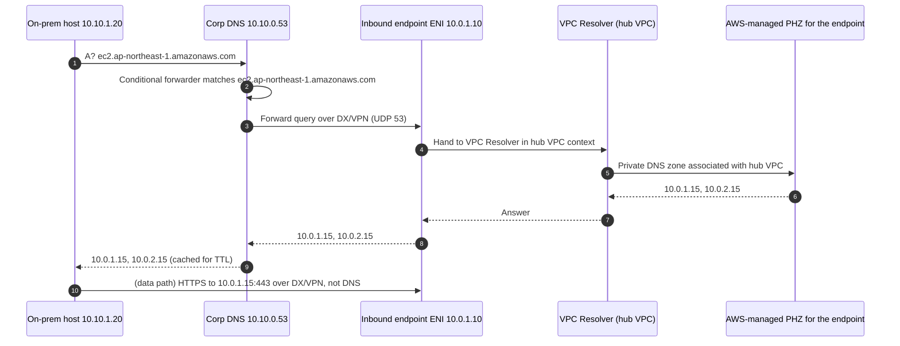
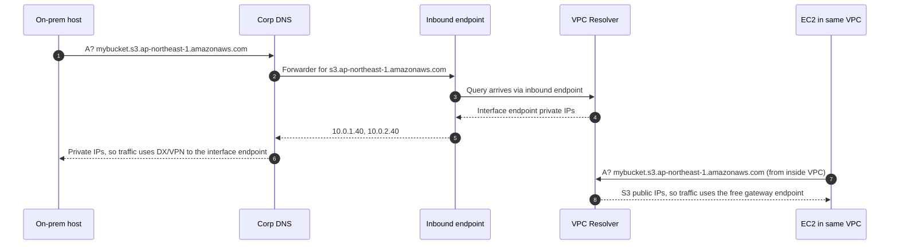
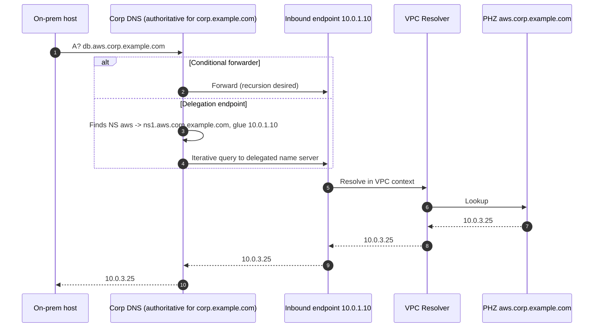
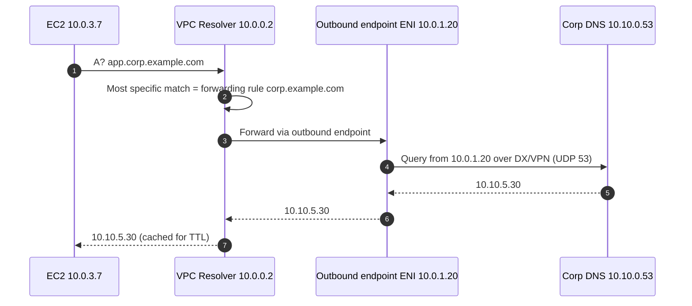

# Hybrid DNS: Route 53 VPC Resolver, endpoints, rules and Profiles

A private path is useless if the name resolves to the wrong address: an on-prem host that resolves `s3.ap-northeast-1.amazonaws.com` to a public IP will ignore your interface endpoint, and an EC2 instance that cannot resolve `corp.example.com` will never use your Direct Connect. This page covers Route 53 VPC Resolver (renamed from "Route 53 Resolver" in November 2025), inbound and outbound Resolver endpoints, forwarding/system/delegation rules, sharing via AWS RAM and Route 53 Profiles, private hosted zones, DNS Firewall, query logging, Resolver on Outposts, DNS over HTTPS, and the newer Global Resolver. Verified as of 2026-10-10 against Route 53 documentation, What's New posts, AWS blogs and the AWS Price List API. Prices are USD for Asia Pacific (Tokyo) unless stated.

## The building blocks

| Component | Lives where | Purpose |
| --- | --- | --- |
| VPC Resolver (AmazonProvidedDNS) | VPC CIDR base + 2 (e.g. 10.0.0.2) and 169.254.169.253 | Answers EC2/VPC names, private hosted zones, and recursion for public names; per AZ |
| Private hosted zone (PHZ) | Associated with VPCs | Authoritative private records, e.g. `aws.corp.example.com` |
| Inbound endpoint | 2-6 ENIs (default quota) in a VPC | On-prem resolvers send queries here; answered as if asked from inside that VPC |
| Outbound endpoint | 2-6 ENIs in a VPC | VPC Resolver sends matching queries out from here to on-prem resolvers |
| Forwarding rule | Associated with VPCs (shareable via RAM) | "Send `corp.example.com` to 10.20.0.53, 10.20.1.53 via outbound endpoint X" |
| System rule | Associated with VPCs | "Resolve this subdomain locally", overriding a broader forward rule |
| Delegation rule | Associated with VPCs (2025-06) | Follow NS delegation from a PHZ to on-prem name servers |
| Route 53 Profile | One per VPC | Bundle of PHZs, rules, DNS Firewall rule groups, interface endpoints and query-log configs applied to many VPCs/accounts |

The base+2 resolver is the trap behind most hybrid DNS failures: the Hybrid Connectivity whitepaper says it "is not reachable from on-premises networks using VPN or Direct Connect", and the Route 53 guide says forwarding private queries to any VPC CIDR+2 address from on-prem or other VPC DNS servers "is not supported, and can cause unstable results". Inbound endpoints exist to solve exactly that.

## Inbound endpoints (on-prem -> AWS names)

An inbound endpoint is a set of ENIs with fixed private IPs (they "will not change through the course of an endpoint's life") that accept DNS on UDP/TCP 53 (and TCP 443 for DoH). Queries are answered by VPC Resolver in the context of the endpoint's VPC, so they see every PHZ, every interface-endpoint private DNS zone and every Profile associated with that VPC.

| Setting | Values |
| --- | --- |
| Endpoint category | Default (forward to IPs) or Delegation (2025-06, parent zone NS-delegates a subdomain to the endpoint) |
| Endpoint type | IPv4, IPv6 or dual-stack; IPv6 from the public internet is denied |
| Protocols (default inbound) | Do53, DoH, DoH-FIPS; combinations Do53+DoH or Do53+DoH-FIPS; delegation inbound: Do53 only |
| IP addresses | Minimum 2, use at least 2 AZs; 6 per endpoint by default |
| Security group | Inbound TCP+UDP 53 from on-prem resolvers (plus 443 for DoH); cannot be changed after creation |
| DNS64 | Supported on inbound endpoints since 2026-05-07, for IPv6-only on-prem clients |

You cannot switch an inbound endpoint directly from Do53-only to DoH-only; enable both, confirm with query logs that clients moved, then remove Do53.

## Outbound endpoints and rules (AWS -> on-prem names)

An outbound endpoint is the source of queries VPC Resolver forwards out. A forwarding rule names a domain, up to 6 target IPs (and ports), and the outbound endpoint to use; you associate the rule with VPCs. Rule matching is most-specific-domain wins (`acme.example.com` beats `example.com`). Where a forwarding rule and a PHZ overlap on the same name, the Resolver rule takes precedence (AWS Knowledge Center). Resolver also creates autodefined system rules for PHZs, EC2 names and reverse zones; AWS recommends that if you forward `.` or `com` you add a system rule for `amazonaws.com` to keep AWS service names local.

Outbound endpoints support Do53 and DoH (DoH targets must present a publicly trusted certificate; SNI validation hostname configurable since 2024-10). Since 2026-05-07 outbound endpoints can forward to public IPv6 name servers through the internet gateway. Resolver sends redundant outbound queries for each request, so per-ENI outbound QPS does not match the query count VPC Resolver receives.

One outbound endpoint can serve many VPCs: share the *rules* (not the endpoint) through AWS RAM to other accounts in the same Region, and associate them with their VPCs at no extra endpoint cost. The VPCs using a shared rule do not need to be connected to the endpoint VPC for DNS to work, but the on-prem answer is only useful if the data path exists.

## Delegation (June 2025)

Before 2025-06-24, Resolver endpoints did not follow NS delegations for private domains, and a PHZ containing an NS record for a subdomain returned SERVFAIL; hybrid setups needed a conditional forwarder per subdomain. Now:

- **Inbound delegation**: create an inbound endpoint of category Delegation; on-prem, in the parent zone `corp.example.com`, add `aws NS ns1.aws.corp.example.com` and glue `A` records for `ns1.aws` pointing to the endpoint IPs. On-prem resolvers then iterate into the PHZ `aws.corp.example.com`.
- **Outbound delegation**: put an NS record for the on-prem subdomain in the PHZ, create a delegation rule for the parent domain, and make the name server resolvable (glue A record if in-zone, or a forwarding rule for an out-of-zone NS name).
- No extra charge beyond endpoint hours and queries; commercial Regions at launch, GovCloud added 2026-04.

## Route 53 Profiles and sharing at scale

Profiles (2024-04-22) let one account define DNS configuration once and apply it to up to thousands of VPCs across accounts in the same Region via RAM. Associable resources: PHZs, forwarding and system rules, DNS Firewall rule groups, interface VPC endpoints (since 2025-04-28) and Resolver query logging configurations (since 2025-11). Profile-level settings: DNSSEC validation, reverse DNS lookup for rules, DNS Firewall failure mode. Limits: one Profile per VPC; Profiles are Regional and cannot be shared across Regions; the FAQ says up to 5,000 VPCs per Profile while the AssociateProfile API reference says 1,000 (adjustable) — treat 1,000 as the default quota. Granular IAM for Profile associations arrived 2026-03.

Profiles plus interface endpoints is now the clean answer to "centralized endpoints in a hub VPC": keep private DNS enabled on the hub endpoints, associate them to the Profile, and every spoke VPC (and the inbound endpoint's VPC) resolves the service names to the hub IPs.

## Worked flow A1: on-prem host resolves `ec2.ap-northeast-1.amazonaws.com` to an interface endpoint

Setup: interface endpoint for `com.amazonaws.ap-northeast-1.ec2` with private DNS in the hub VPC (10.0.0.0/16); inbound endpoint 10.0.1.10 and 10.0.2.10 in the same VPC; on-prem DNS has a conditional forwarder for `ec2.ap-northeast-1.amazonaws.com` to those IPs.

The last arrow is the data path to the endpoint ENI, not to the Resolver; it is shown to emphasise that DNS picked the path. Without the forwarder, step 3 goes to the internet, public DNS returns EC2's public IPs, and traffic leaves via the internet or a public VIF.

## Worked flow A2: on-prem host resolves an S3 name with "private DNS only for inbound endpoint"

The same name gets two different answers depending on whether the query came through an inbound endpoint; that is the whole feature, and it requires a gateway endpoint in the VPC.

## Worked flow A3: on-prem host resolves a PHZ name `db.aws.corp.example.com`

Option 1 (classic): on-prem conditional forwarder for `aws.corp.example.com` to the inbound endpoint IPs; PHZ `aws.corp.example.com` associated with the inbound endpoint's VPC (directly or via Profile). Option 2 (2025+): delegation inbound endpoint plus NS and glue records in the on-prem `corp.example.com` zone, so the corp resolver iterates instead of forwarding.

## Worked flow B: EC2 resolves `app.corp.example.com`

Setup: outbound endpoint 10.0.1.20 / 10.0.2.20; forwarding rule `corp.example.com` -> 10.10.0.53, 10.10.1.53 associated with the VPC (or shared via RAM / Profile).

On-prem firewalls must allow DNS from the outbound endpoint ENI IPs, not from the EC2 instance; the corp DNS server never sees the instance's address.

## Quotas and limits

| Item | Value | Source |
| --- | --- | --- |
| Resolver endpoints per Region | 4 per account (adjustable) | Route 53 quotas |
| IP addresses (ENIs) per endpoint | 6 (adjustable) | Route 53 quotas |
| Target IPs per rule | 6 | Route 53 quotas |
| Rules per Region | 1,000 per account (adjustable) | Route 53 quotas |
| Rule-to-VPC associations per Region | 2,000 per account (adjustable) | Route 53 quotas |
| UDP QPS per endpoint IP | Up to 10,000; add ENIs above 50% utilisation | Route 53 quotas |
| QPS per inbound IP with connection tracking or via NLB | Can drop to about 1,500 | Route 53 quotas |
| Packets to base+2 / 169.254.169.253 per EC2 ENI | 1,024 pps, not adjustable | VPC quotas |
| Profiles per VPC | 1 | Route 53 Profiles docs |

The 1,500 figure matters: security group rules that are not "allow all" cause connection tracking, so use broad rules (for example `0.0.0.0/0` UDP/TCP 53 in and out, scoped by NACLs) to stay untracked if you need full throughput.

## DNS Firewall, query logging and Global Resolver

**DNS Firewall** filters queries leaving through VPC Resolver by domain (allow, block, alert), with AWS managed and custom domain lists; it only filters names, not IPs or other protocols. DNS Firewall Advanced (2024-11-15) adds DNS tunneling and DGA detection. AWS's hybrid-security blog extends protection to on-prem clients by having on-prem DNS forward to an inbound endpoint in a VPC that has the rule group associated.

**Query logging** captures queries originating in chosen VPCs, queries from on-prem through inbound endpoints, queries forwarded through outbound endpoints, and DNS Firewall actions; only uncached queries are logged. Destinations: CloudWatch Logs, S3 or Data Firehose in the same Region. Route 53 itself does not charge for Resolver query logs.

**Resolver on Outposts**: first-generation racks since 2023-07-21 (needs Outpost EC2 capacity, local resolver free, endpoints billed per ENI); second-generation racks GA 2026-09-22, enabled by default on multi-rack, free trial until 2026-12-21 then $0.65 per Outpost rack per hour. DNS Firewall is not available on Outposts and Outposts endpoints are IPv4 only; DoH is not available on Outposts rack.

**Global Resolver** (preview 2025-11-30, GA 2026-03-09 in 30 Regions) is a different product: an internet-facing anycast resolver for authorized clients anywhere (Do53 with IP allowlists, DoT and DoH with access tokens) that can resolve PHZs and apply DNS Firewall. It is an option for branches without DX/VPN, not a replacement for inbound endpoints on private links.

**Private API access**: the Route 53 Resolver API (2025-10-31), Profiles API (2025-10) and Route 53 DNS API (2025-11-19, cross-Region endpoints since the API lives in `us-east-1`) can be called through interface endpoints.

## Pricing (Tokyo, AWS Price List API, AmazonRoute53 offer published 2026-09-11)

| Item | Price |
| --- | --- |
| Resolver endpoint ENI (inbound or outbound, Do53 or DoH) | $0.125 per ENI-hour |
| Queries through endpoints | $0.40 per million (first 1 billion/month), $0.20 per million after |
| Queries resolved locally by VPC Resolver | Free |
| DNS Firewall queries | $0.60 per million (first 1 billion), $0.40 after |
| DNS Firewall custom domain list entries | $0.0005 per domain per month |
| DNS Firewall Advanced | $0.16 per hour per rule group-VPC association |
| Route 53 Profiles | $0.75 per hour per account for up to 100 Profile-VPC associations, then $0.0014 per association-hour |
| Resolver on Outposts (2nd gen) | $0.65 per hour per rack; ENIs $0.125/hour |
| Delegation, DoH, DNS64 | No additional charge |
| Global Resolver (page price, Region not stated) | $5.00/hour for the first two Regions with filtering ($4.50 without), $1.50/hour per extra Region ($0.75 without), $1.50 per million queries beyond 1 billion per month |

Worked example: one inbound and one outbound endpoint, 2 ENIs each, is 4 x 730 x $0.125 = $365/month before queries; 100 million queries a month through them adds $40.

## Common traps

- **Forwarding to base+2 from on-prem**: unsupported; unreachable over VPN/DX. Use inbound endpoint IPs.
- **Forwarder points at an inbound endpoint in the wrong VPC**: answers reflect only PHZs and endpoint zones associated with *that* VPC; associate the PHZ (or Profile) with the inbound endpoint's VPC.
- **Split-horizon on the same name**: a PHZ `example.com` shadows the public `example.com` for associated VPCs; anything missing from the PHZ returns NXDOMAIN, not the public answer.
- **Forwarding loops**: on-prem forwards `aws.corp.example.com` to the inbound endpoint while a VPC rule forwards `corp.example.com` (or `.`) to on-prem without a more specific system rule for `aws.corp.example.com`, so queries bounce until timeout. Add a system rule for the AWS-hosted subdomain.
- **Rule beats PHZ**: a forwarding rule for the same domain as a PHZ wins, silently sending the query on-prem.
- **Forwarding `.` or `com` to on-prem**: add a system rule for `amazonaws.com`, or EC2/S3 names resolve on-prem (slower, costs per query, and may return public IPs).
- **Private DNS for endpoints not visible on-prem**: forward the specific service names (`sts.ap-northeast-1.amazonaws.com`, `s3.ap-northeast-1.amazonaws.com`) to the inbound endpoint, or use `vpce-` names; DynamoDB does not support private DNS at all.
- **Windows AD conditional forwarders**: create them per domain (for example `ec2.ap-northeast-1.amazonaws.com`, not `amazonaws.com`, unless you intend everything), list both inbound IPs, and store them in AD with the replication scope you need so every DC forwards consistently. Do not set the inbound endpoint as the DC's general forwarder unless you want all internet resolution to go via AWS.
- **Firewall on the on-prem side**: queries from AWS arrive from outbound endpoint ENI IPs; replies to inbound endpoints go to ephemeral ports 1024-65535 that NACLs must allow.
- **Connection tracking**: restrictive security groups on inbound endpoints cut capacity to about 1,500 QPS per IP.
- **EC2 pps limit**: heavy DNS clients on one ENI hit 1,024 pps to base+2; cache locally.
- **PHZ NS delegation without delegation rules**: still SERVFAIL; you need the 2025 delegation rule/endpoint.

## Sources

- <https://docs.aws.amazon.com/Route53/latest/DeveloperGuide/resolver.html>
- <https://docs.aws.amazon.com/Route53/latest/DeveloperGuide/resolver-overview-DSN-queries-to-vpc.html>
- <https://docs.aws.amazon.com/Route53/latest/DeveloperGuide/DNSLimitations.html>
- <https://docs.aws.amazon.com/Route53/latest/DeveloperGuide/resolver-forwarding-inbound-queries-values.html>
- <https://docs.aws.amazon.com/Route53/latest/DeveloperGuide/resolver-overview-forward-vpc-to-network-autodefined-rules.html>
- <https://docs.aws.amazon.com/Route53/latest/DeveloperGuide/outbound-delegation-tutorial.html>
- <https://docs.aws.amazon.com/Route53/latest/DeveloperGuide/profiles.html>
- <https://docs.aws.amazon.com/Route53/latest/APIReference/API_route53profiles_AssociateProfile.html>
- <https://docs.aws.amazon.com/Route53/latest/DeveloperGuide/resolver-dns-firewall-overview.html>
- <https://docs.aws.amazon.com/Route53/latest/DeveloperGuide/resolver-query-logs.html>
- <https://docs.aws.amazon.com/Route53/latest/DeveloperGuide/gr-concepts-terminology.html>
- <https://docs.aws.amazon.com/Route53/latest/DeveloperGuide/gr-managing-access-tokens.html>
- <https://docs.aws.amazon.com/vpc/latest/userguide/amazon-vpc-limits.html>
- <https://docs.aws.amazon.com/whitepapers/latest/building-scalable-secure-multi-vpc-network-infrastructure/dns.html>
- <https://docs.aws.amazon.com/cdk/api/v2/docs/aws-cdk-lib.aws_route53resolver.CfnResolverEndpointProps.html>
- <https://repost.aws/knowledge-center/route-53-resolver-rules-vpc>
- <https://repost.aws/knowledge-center/route-53-fix-dns-issues-rules-endpoints>
- <https://repost.aws/knowledge-center/route53-resolve-with-inbound-endpoint>
- <https://repost.aws/knowledge-center/route-53-fix-dns-resolution-private-zone>
- <https://aws.amazon.com/blogs/security/simplify-dns-management-in-a-multiaccount-environment-with-route-53-resolver/>
- <https://aws.amazon.com/blogs/networking-and-content-delivery/streamline-hybrid-dns-management-using-amazon-route-53-resolver-endpoints-delegation/>
- <https://aws.amazon.com/blogs/networking-and-content-delivery/encrypt-dns-queries-using-dns-over-https-doh-with-amazon-route-53-resolver-endpoints/>
- <https://aws.amazon.com/blogs/networking-and-content-delivery/securing-hybrid-workloads-using-amazon-route-53-resolver-dns-firewall/>
- <https://aws.amazon.com/blogs/networking-and-content-delivery/streamlining-multi-vpc-dns-management-with-amazon-route-53-profiles-and-interface-vpc-endpoint-integration/>
- <https://aws.amazon.com/about-aws/whats-new/2023/12/amazon-route-53-resolver-endpoints-doh/>
- <https://aws.amazon.com/about-aws/whats-new/2024/10/amazon-route-53-resolver-endpoints-doh-sni-validation/>
- <https://aws.amazon.com/about-aws/whats-new/2024/04/amazon-route-53-profiles/>
- <https://aws.amazon.com/about-aws/whats-new/2024/11/amazon-route-53-resolver-dns-firewall-advanced/>
- <https://aws.amazon.com/about-aws/whats-new/2025/04/amazon-route-53-profiles-vpc-endpoints/>
- <https://aws.amazon.com/about-aws/whats-new/2025/06/amazon-route-53-resolver-endpoints-dns-delegation-private-hosted-zones/>
- <https://aws.amazon.com/about-aws/whats-new/2025/10/amazon-route53-resolver-supports-aws-privatelink/>
- <https://aws.amazon.com/about-aws/whats-new/2025/10/amazon-route-53-profiles-supports-aws-privatelink/>
- <https://aws.amazon.com/about-aws/whats-new/2025/11/amazon-route-53-profiles-resolver-query-logging-configurations/>
- <https://aws.amazon.com/about-aws/whats-new/2025/11/amazon-route-53-dns-service-aws-privatelink/>
- <https://aws.amazon.com/about-aws/whats-new/2025/11/amazon-route-53-global-resolver-secure-anycast-dns-resolution-preview/>
- <https://aws.amazon.com/about-aws/whats-new/2026/03/amazon-route-53-global-resolver/>
- <https://aws.amazon.com/about-aws/whats-new/2026/03/amazon-route-53-profiles-granular-iam/>
- <https://aws.amazon.com/about-aws/whats-new/2026/04/route-53-resolver-endpoints/>
- <https://aws.amazon.com/about-aws/whats-new/2026/05/amazon-route-53-resolver-ipv6/>
- <https://aws.amazon.com/about-aws/whats-new/2023/07/amazon-route-53-resolver-aws-outposts-rack/>
- <https://aws.amazon.com/about-aws/whats-new/2026/09/route-53-resolver-gen2-outposts/>
- <https://aws.amazon.com/route53/pricing/>
- <https://aws.amazon.com/route53/faqs/>
- <https://pricing.us-east-1.amazonaws.com/offers/v1.0/aws/AmazonRoute53/current/ap-northeast-1/index.csv>
