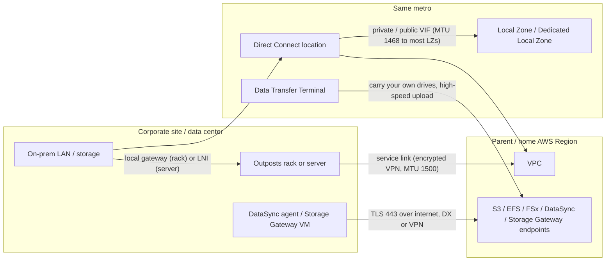
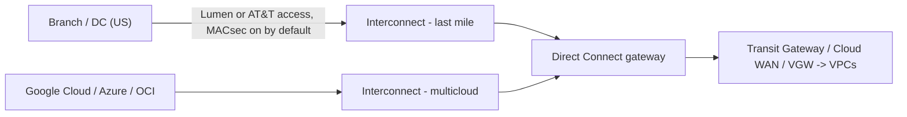

# Edge and data-movement paths

This page covers the on-premises-to-AWS paths that are not "a link from your router to a Region": AWS hardware inside your building (Outposts), AWS infrastructure in your metro (Local Zones, Dedicated Local Zones, Wavelength), the bulk-data services whose whole job is moving bytes between on-premises storage and AWS (DataSync, Storage Gateway, Transfer Family, Snowball, Data Transfer Terminal), and the 2025–2026 "AWS Interconnect" family (multicloud and last mile). Everything here was checked against AWS documentation, What's New posts, blogs and the AWS Price List API, verified as of 2026-10-10.

The single biggest change since most training material was written: **AWS Snowball Edge is no longer available to new customers (since 2025-11-07)**, and **AWS Interconnect - last mile / multicloud** became generally available in April 2026, so the offline path and the "last mile" picture both look different from older diagrams.

## Map of the paths on this page

## AWS Outposts

Outposts puts AWS-managed hardware in your facility; it is an extension of a VPC in its home Region, not an independent cloud. Two separate network relationships exist and are often confused.

| Relationship | Rack (1st gen / 2nd gen) | Server (1U / 2U) |
| --- | --- | --- |
| To the home Region | Service link: AWS-managed encrypted VPN tunnels, carries control plane **and** intra-VPC data plane | Same service link concept |
| To your on-prem LAN | Local gateway (LGW) with BGP to your upstream devices | Local network interface (LNI) — the instance gets a second NIC directly on your LAN, no gateway |
| Local routing modes | Direct VPC routing (default) **or** customer-owned IP (CoIP) pool — mutually exclusive per LGW route table | Not applicable (LNI is L2 on your LAN; IP via DHCP or static) |
| IPv6 on local path | LGW is IPv4 only | Not stated for LNI |
| MTU | Service link must support 1500 end to end; LGW path 1500 | Service link 1500 |

Sources for the table: Outposts user guide "How Outposts works", Local gateway docs, Outposts server LNI docs, Prescriptive Guidance "Networking at the edge" (see Sources).

### Service link

The service link is a set of encrypted VPN connections from each Outpost host to the home Region; it carries management traffic and all traffic between the Outpost and the rest of the VPC. It needs UDP 443 and TCP 443 outbound from the service link /26 to either the Region's public ranges or (with private connectivity) your anchor VPC CIDR.

Transport options: public internet, Direct Connect public VIF, or **private connectivity** over a Direct Connect private or transit VIF to service-link endpoints placed as ENIs in a VPC you own. Private connectivity is chosen when you create the Outpost.

AWS recommends redundant service link connectivity of at least 500 Mbps (1 Gbps is better). The network between the Outpost and the service link endpoints must support a 1500-byte MTU.

Per the Snowball-alternatives page (2025), both Outposts form factors "can operate without AWS connectivity for up to 7 days" in disconnected (DDIL) environments; treat this as AWS's stated design point, not a guarantee that every control-plane action works while disconnected.

### Local gateway: direct VPC routing vs CoIP

| Mode | What on-prem sees | NAT | Use when |
| --- | --- | --- | --- |
| Direct VPC routing (default) | The private IPs of Outpost subnets, advertised over BGP | None | VPC CIDR is routable and unique in your corporate network |
| Customer-owned IP (CoIP) | Addresses from a pool you supply; instances get an Elastic IP from the CoIP pool | LGW does 1:1 NAT to CoIP | VPC CIDR overlaps or must not leak; you want on-prem-owned addressing |

Second-generation racks require four LGW VIFs per VIF group. With private connectivity, CoIP pools or direct-VPC-routing subnet ranges must not overlap the service link VIF ranges or the private-connectivity VPC CIDR, or BGP conflicts can take the service link down.

### Outposts generations and launches

| Item | Fact | Date |
| --- | --- | --- |
| Second-generation Outposts racks GA | C7i/M7i/R7i, simplified network scaling, accelerated-networking instances (Bmn-sf2e etc.) | 2025-04 |
| 2nd-gen racks homed to ap-northeast-1 (Tokyo) | Supported | 2025-11 |
| 2nd-gen racks shippable to Japan | Listed among 52 additional countries | 2025-09 |
| C8i/M8i/R8i on 2nd-gen racks | Announced | 2026-02 |
| Outposts VIF CloudWatch metrics (VifConnectionStatus, VifBgpSessionState) in GovCloud | Announced (already in commercial Regions) | 2026-02 |
| Second-generation **single-rack** Outposts | Self-contained 42U, up to 2,688 vCPU and 100 TB EBS, networking integrated in the rack, up to 100 Gbps LGW bandwidth, uplinks 10/40/100 Gbps | 2026-09 |

Outposts server LNI facts: VPC security groups do not apply to the LNI, Outposts servers do not tag VLANs (the guest OS must), and LNI throughput depends on instance size with a maximum of 10 Gbps (AWS Compute Blog).

## Local Zones and Dedicated Local Zones

A Local Zone is an extension of a parent Region in a metro; you opt in and create subnets in it. A Dedicated Local Zone is the same construct built for exclusive use by one customer or community, with extra access and operations controls.

How on-prem reaches a Local Zone:

| Path | Behavior |
| --- | --- |
| Direct Connect (private VIF via VGW/DX gateway) | Traffic takes the shortest path to the Local Zone and does **not** go through the parent Region |
| Direct Connect via Transit Gateway | Transit Gateway cannot attach Local Zone subnets; traffic hairpins through the parent Region |
| Site-to-Site VPN | Terminates in the parent Region (VGW/TGW), so it also hairpins; self-managed VPN on EC2 in the Local Zone is the workaround |
| Internet | Outbound internet traffic leaves from the Local Zone itself |

Direct Connect to Local Zones (DX FAQ): maximum MTU **1468** bytes (vs 9001 in the Region), single-flow (5-tuple) limit about **2.5 Gbps** at max MTU (vs 5 Gbps in the Region), ingress routing destinations do not route directly to the Local Zone. These MTU and single-flow limits do not apply to the Los Angeles Local Zone. Path MTU discovery is supported and recommended.

IPv6 and VGW edge association are only supported in a listed subset of Local Zones (all US zones at the time of checking: atl-2a, chi-2a, dfw-2a, iah-2a, mia-2a, nyc-2a, lax-1a, lax-1b, phx-2a).

New Local Zones in 2026 include Istanbul (2026-05), Hanoi (2026-06), Athens (2026-07) and Las Vegas (2026-08); Local Zones appear in the console Region selector since 2026-05.

## Wavelength (briefly)

Wavelength Zones sit inside a carrier's 5G network; the carrier gateway NATs instance IPs to carrier IPs and generally allows no inbound internet. It is a path for mobile devices, not for a corporate LAN. MTU: 9001 inside a Wavelength Zone, 1500 between carrier gateway and the zone, 1500 to the Region over public IPs, **1300** to the Region over private IPs.

## Bulk data paths

These services ride on top of whichever network path you have (internet, VPN, DX). They matter for this site because they choose endpoints, ports and pricing differently from plain IP routing.

### AWS DataSync

| Aspect | Fact |
| --- | --- |
| Agent | VM (or EC2) near the source storage; speaks NFS, SMB, HDFS, S3 API to your storage |
| Service endpoint types | Public, FIPS, VPC (interface endpoint over PrivateLink), FIPS VPC; one agent uses exactly one type |
| Ports with VPC endpoint | Agent → endpoint TCP 1024–1064 (control), agent → task ENIs TCP 443 (data), TCP 22 support channel (Basic-mode agents only), browser → agent TCP 80 for activation only |
| Path mapping | Public endpoint: internet or DX public VIF; VPC endpoint: DX private/transit VIF or VPN |
| Performance | A single task can fully utilize 10 Gbps |
| Modes | Basic (sequential, file-count quotas) and Enhanced (parallel, virtually unlimited object counts) |
| PrivateLink charges | Only control traffic through the interface endpoint is billed; transferred data is not |
| Tokyo price (Price List API, 2026-09) | Basic $0.0125/GB; Enhanced $0.015/GB + $0.55 per task execution |

Enhanced mode timeline: S3↔S3 at launch, cross-cloud object storage (2025-05), on-prem NFS/SMB↔S3 (2025-12), HDFS, Azure Blob, self-managed object storage and Hyper-V agents (2026-07).

Copying **from** AWS to on-prem also incurs data transfer out from the source Region (DX or internet rate, see [12-security-and-operations.md](12-security-and-operations.md)).

### AWS Storage Gateway

Gateway types today: S3 File Gateway, Volume Gateway, Tape Gateway. **Amazon FSx File Gateway is no longer available to new customers since 2024-10-28** (existing customers continue).

Activation over a VPC endpoint (`com.amazonaws.<region>.storagegateway`) needs TCP 443, 1026, 1027, 1028, 1031 and 2222 from the gateway to the endpoint, and "Enable Private DNS Name" must be left off. This is the usual way to keep gateway traffic on DX private VIF or VPN.

### AWS Transfer Family

| Endpoint type | Protocols | Reachable from | Static IP |
| --- | --- | --- | --- |
| Public | SFTP | Internet only | No (AWS IPs change) |
| VPC, internet-facing | SFTP, FTPS, AS2 | Internet and VPC-connected networks (DX/VPN) | Elastic IPs (AWS or BYOIP) |
| VPC, internal | SFTP, FTP, FTPS, AS2 | VPC and VPC-connected networks (DX/VPN) | Private IPs fixed |
| VPC_ENDPOINT | SFTP | — | Discontinued for new accounts since 2021-05-19 |

Tokyo price (Price List API): $0.30 per protocol-hour (SFTP, FTPS, FTP, AS2 each), $0.04/GB uploaded or downloaded, SFTP connectors $0.40/GB, web apps $0.50 per unit-hour. Stopped servers are still billed.

### Offline transfer: Snowball and Data Transfer Terminal

| Date | Change |
| --- | --- |
| 2024-11-12 | Previous-gen Snowball Edge models (Storage Optimized 80 TB, Compute Optimized 52 vCPU, Compute Optimized GPU) discontinued; Snowcone discontinued |
| 2025-11-07 | Snowball Edge Storage Optimized and Compute Optimized moved to maintenance: **no new customers**; AWS "will no longer offer any AWS Snow Family devices for new customers to order" |
| 2025-07 | Data Transfer Terminal opens in Munich (first outside the US) |
| 2026-02 | Data Transfer Terminal adds Seattle, Phoenix, London, Paris, Sydney and **Tokyo** |

AWS's stated replacements for new customers: DataSync (online, optionally over a temporary hosted DX connection), Data Transfer Terminal (bring your own drives to an AWS facility and upload over a high-throughput link), or Marketplace partners (Seagate, Tsecond named). For edge compute, Outposts.

## AWS Interconnect (2025–2026)

AWS Interconnect is a managed-connectivity product family built on Direct Connect gateways, with an open API specification that other providers adopt. It is billed as a single hourly fee by bandwidth and geographic tier with **no separate per-GB charge**.

### Interconnect - multicloud

| Date | Milestone |
| --- | --- |
| 2025-11 | Preview with Google Cloud |
| 2026-04 | GA (Google Cloud), five Regions at GA, new single-fee pricing |
| 2026-05 | Free tier: one local (Tier 1) 500 Mbps interconnect per Region per GA CSP; includes a Network Synthetic Monitor; "approximately 160 TB per month" |
| 2026-04/05 | OCI preview (us-east-1) |
| 2026-07 | OCI GA (us-east-1) |
| 2026-08 | Microsoft Azure preview (us-east-1, us-west-1, eu-central-1, ap-southeast-2) |

Google Cloud Region pairs at time of checking: us-east-1, us-west-1, us-west-2, eu-west-2, eu-central-1, eu-north-1, ap-southeast-1, ap-southeast-2. **No ap-northeast-1 (Tokyo) pairing is listed.**

Price example (us-east-1, Price List API): 1 Gbps Tier 1 $1.37/h, Tier 5 $9.59/h; 10 Gbps Tier 1 $12.33/h; 100 Gbps Tier 1 $116.44/h; 500 Mbps Tier 1 $0.00/h. The other cloud bills its own side separately.

### Interconnect - last mile

| Date | Milestone |
| --- | --- |
| 2025-11 | Gated preview with Lumen (US) |
| 2026-04 | GA with Lumen |
| 2026-06-30 | AT&T added as gated preview (US) |

You pick Region, bandwidth (1–100 Gbps, scalable in the console), Direct Connect gateway and partner subscriber ID; AWS returns an activation key and the partner side is pre-provisioned with BGP, VLAN and ASN automated. MACsec is enabled by default between the DX and partner devices. Availability: Lumen in us-east-1 (New Jersey sites), reachable from anywhere in the continental US via the Lumen fabric, able to reach any AWS Region. **Not available in Japan as of 2026-10-10.**

### Classic partner last mile

Outside the Interconnect product, the "last mile" is still a Direct Connect Delivery Partner: hosted connections (the Tokyo price list shows 50 Mbps, 100–500 Mbps, 1, 2, 5 and 10 Gbps) or a carrier circuit to a dedicated port in a DX location. Since 2025-07, MACsec is supported on partner-owned interconnects (10 and 100 Gbps, 100+ PoPs), which encrypts the AWS-to-partner link but not your circuit to the partner.

## Common traps

- **"Outposts traffic to the Region is private because it's in my DC."** The service link is a VPN that rides whatever transport you give it; with the public option it needs outbound access to AWS public ranges. Choose private connectivity at Outpost creation if you need DX-only.
- **Service link MTU.** Anything in the path below 1500 (PPPoE, GRE, IPsec overlay) breaks the service link; Outposts needs a clean 1500.
- **CoIP vs direct VPC routing is per LGW route table and mutually exclusive.** Moving later means re-addressing what on-prem talks to.
- **Transit Gateway cannot attach Local Zone subnets.** On-prem → DX → TGW → Local Zone hairpins through the parent Region and loses the latency benefit; use a private VIF to a VGW (or DX gateway + VGW) for Local Zone prefixes.
- **DX to Local Zones caps MTU at 1468** (except Los Angeles). A 9001 private VIF does not mean 9001 to a Local Zone instance.
- **Snowball in new designs.** New AWS accounts cannot order Snowball Edge; plan DataSync over DX/VPN or Data Transfer Terminal.
- **FSx File Gateway in new designs.** Not orderable by new customers since 2024-10-28.
- **DataSync VPC endpoint ≠ free data plane.** Only control traffic is billed by PrivateLink, but DX/internet DTO still applies when copying out of AWS, and the agent still needs TCP 1024–1064 and 443 to the right IPs.
- **Storage Gateway endpoint with Private DNS enabled.** Activation guidance says to leave it disabled; enabling it is a common activation failure.
- **Interconnect free tier is not a Tokyo option today.** The free 500 Mbps multicloud tier exists only where a CSP pairing exists; none is listed for ap-northeast-1.
- **"Interconnect - last mile is just a hosted connection."** It is a separate product with its own hourly pricing and no per-GB charge, sold only via participating partners (US only so far).

## Sources

- <https://docs.aws.amazon.com/prescriptive-guidance/latest/hybrid-cloud-best-practices/networking.html>
- <https://docs.aws.amazon.com/prescriptive-guidance/latest/hybrid-cloud-best-practices/security.html>
- <https://docs.aws.amazon.com/outposts/latest/userguide/how-outposts-works.html>
- <https://docs.aws.amazon.com/outposts/latest/userguide/routing.html>
- <https://docs.aws.amazon.com/outposts/latest/userguide/private-connectivity.html>
- <https://docs.aws.amazon.com/outposts/latest/userguide/outposts-requirements.html>
- <https://docs.aws.amazon.com/outposts/latest/network-userguide/outposts-local-gateways.html>
- <https://docs.aws.amazon.com/outposts/latest/network-userguide/outposts-rack2ndgen-requirements-single-rack.html>
- <https://docs.aws.amazon.com/outposts/latest/server-userguide/service-links.html>
- <https://docs.aws.amazon.com/outposts/latest/server-userguide/local-network-interface.html>
- <https://docs.aws.amazon.com/outposts/latest/server-userguide/local-server.html>
- <https://aws.amazon.com/outposts/rack/features/>
- <https://aws.amazon.com/blogs/compute/how-to-choose-between-coip-and-direct-vpc-routing-modes-on-aws-outposts-rack/>
- <https://aws.amazon.com/blogs/compute/architecting-for-seamless-on-premises-connectivity-with-aws-outposts-servers/>
- <https://aws.amazon.com/blogs/networking-and-content-delivery/introducing-aws-outposts-private-connectivity/>
- <https://aws.amazon.com/about-aws/whats-new/2025/04/second-generation-aws-outposts-racks/>
- <https://aws.amazon.com/about-aws/whats-new/2025/09/second-generation-aws-outposts-racks-more-countries/>
- <https://aws.amazon.com/about-aws/whats-new/2025/11/second-generation-aws-outposts-racks-asia-pacific-tokyo-region/>
- <https://aws.amazon.com/about-aws/whats-new/2026/02/amazon-ec2-c8i-m8i-and-r8i-instances-on-aws-outposts/>
- <https://aws.amazon.com/about-aws/whats-new/2026/02/aws-outposts-racks-cloudwatch-metrics-govcloud-regions/>
- <https://aws.amazon.com/about-aws/whats-new/2026/09/single-rack-aws-outposts/>
- <https://docs.aws.amazon.com/local-zones/latest/ug/how-local-zones-work.html>
- <https://docs.aws.amazon.com/local-zones/latest/ug/local-zones-connectivity-direct-connect.html>
- <https://docs.aws.amazon.com/local-zones/latest/ug/local-zones-connectivity-transit-gateway-lzs.html>
- <https://docs.aws.amazon.com/reference-architecture-diagrams/latest/direct-connect-local-zone/direct-connect-local-zone.html>
- <https://aws.amazon.com/directconnect/faqs/>
- <https://aws.amazon.com/dedicatedlocalzones/faqs/>
- <https://aws.amazon.com/about-aws/whats-new/2026/05/aws-local-zones-istanbul-turkiye/>
- <https://aws.amazon.com/about-aws/whats-new/2026/06/aws-local-zones-hanoi-vietnam/>
- <https://aws.amazon.com/about-aws/whats-new/2026/07/aws-local-zone-athens-greece/>
- <https://aws.amazon.com/about-aws/whats-new/2026/08/aws-local-zones-las-vegas-nevada/>
- <https://aws.amazon.com/about-aws/whats-new/2026/05/aws-local-zones-region-selector/>
- <https://docs.aws.amazon.com/wavelength/latest/developerguide/how-wavelengths-work.html>
- <https://docs.aws.amazon.com/wavelength/latest/developerguide/carrier-gateways.html>
- <https://docs.aws.amazon.com/datasync/latest/userguide/choose-service-endpoint.html>
- <https://docs.aws.amazon.com/datasync/latest/userguide/datasync-network.html>
- <https://aws.amazon.com/datasync/pricing/>
- <https://aws.amazon.com/about-aws/whats-new/2025/05/aws-datasync-accelerates-cross-cloud-data-transfers/>
- <https://aws.amazon.com/about-aws/whats-new/2025/12/aws-datasync-scalability-performance-on-premises-file-transfers/>
- <https://aws.amazon.com/about-aws/whats-new/2026/07/aws-datasync-hdfs-azure-blob-hyper-v/>
- <https://docs.aws.amazon.com/storagegateway/latest/tgw/gateway-private-link.html>
- <https://docs.aws.amazon.com/filegateway/latest/files3/troubleshooting-gateway-activation.html>
- <https://docs.aws.amazon.com/filegateway/latest/filefsxw/DocumentHistory.html>
- <https://docs.aws.amazon.com/transfer/latest/userguide/sftp-for-transfer-family.html>
- <https://docs.aws.amazon.com/transfer/latest/userguide/create-server-in-vpc.html>
- <https://aws.amazon.com/aws-transfer-family/faqs/>
- <https://aws.amazon.com/blogs/storage/aws-snow-device-updates/>
- <https://docs.aws.amazon.com/snowball/latest/developer-guide/snowball-edge-availability-change.html>
- <https://aws.amazon.com/about-aws/whats-new/2025/10/aws-service-availability/>
- <https://aws.amazon.com/about-aws/whats-new/2025/07/aws-data-transfer-terminal-munich/>
- <https://aws.amazon.com/about-aws/whats-new/2026/02/aws-data-transfer-terminal-6-new-locations/>
- <https://docs.aws.amazon.com/interconnect/latest/userguide/region-availability.html>
- <https://docs.aws.amazon.com/interconnect/latest/userguide/interconnect-pricing.html>
- <https://docs.aws.amazon.com/interconnect/latest/userguide/getting-started-multicloud.html>
- <https://aws.amazon.com/interconnect/multicloud/pricing/>
- <https://aws.amazon.com/about-aws/whats-new/2025/11/preview-aws-interconnect-multicloud/>
- <https://aws.amazon.com/about-aws/whats-new/2026/04/aws-announces-ga-AWS-interconnect-multicloud/>
- <https://aws.amazon.com/about-aws/whats-new/2026/05/aws-interconnect-multicloud-offers-free-500-mbps-tier/>
- <https://aws.amazon.com/about-aws/whats-new/2026/05/aws-announces-AWS-interconnect-multicloud-oci-preview/>
- <https://aws.amazon.com/about-aws/whats-new/2026/07/aws-announces-AWS-interconnect-multicloud-OCI-GA/>
- <https://aws.amazon.com/about-aws/whats-new/2026/08/aws-announces-AWS-interconnect-multicloud-microsoft-azure-preview/>
- <https://aws.amazon.com/about-aws/whats-new/2025/11/gated-preview-interconnect-last-mile/>
- <https://aws.amazon.com/about-aws/whats-new/2026/04/aws-announces-ga-AWS-interconnect-last-mile/>
- <https://aws.amazon.com/about-aws/whats-new/2026/06/aws-announces-AWS-interconnect-last-mile-ATT-gated-preview/>
- <https://aws.amazon.com/about-aws/whats-new/2025/07/aws-direct-connect-extends-macsec-support-partner-interconnects/>
- AWS Price List API (Tokyo offer files for AWSDataSync, AWSTransfer, AWSDirectConnect; us-east-1 AWSInterconnect), fetched 2026-10-10: <https://pricing.us-east-1.amazonaws.com/offers/v1.0/aws/index.json>
