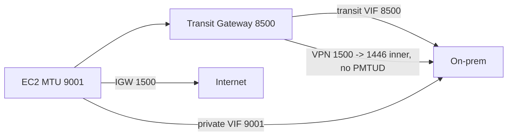

# 12. Security, operations and cost across all paths

This page cuts across every on-premises-to-AWS path in this repo and compares them on five axes: encryption, overlapping address space, IPv6, MTU/MSS, observability, and data-transfer cost (with ap-northeast-1 Tokyo prices and a worked 10 TB/month example). Behaviors come from AWS documentation, What's New posts and blogs; prices come from the AWS Price List API offer files for ap-northeast-1 published in September–October 2026. Verified as of 2026-10-10.

Prices are list on-demand USD, exclude tax, partner/carrier/colocation fees, and any private pricing. A month is 730 hours throughout, the convention AWS uses in its pricing examples.

## Encryption per path

| Path | Encrypted by AWS by default? | Options | Notes |
| --- | --- | --- | --- |
| Internet to public endpoints | No (transport is the internet) | TLS (HTTPS to AWS APIs, your own TLS) | Everything is up to the application layer |
| Site-to-Site VPN (internet) | Yes, IPsec | IKEv1/IKEv2, AES-128/256, GCM options | Tunnel options are covered on the VPN page of this repo |
| Accelerated VPN | Yes, IPsec | Same as VPN | Rides Global Accelerator edge |
| Client VPN | Yes, TLS (OpenVPN-based) | Mutual cert, AD, SAML | Per-user path |
| Direct Connect (any VIF) | **No** | MACsec (L2, hop by hop), IPsec VPN over DX, TLS | DX is private, not encrypted |
| DX + MACsec | Yes, between your device and the AWS DX device | 10, 100, 400 Gbps **dedicated** connections at selected PoPs; GCM-AES-256 or GCM-AES-XPN-256 on 10G, XPN-256 required on 100G/400G; 256-bit CAK only; SCI must be on; dot1q-in-clear not supported | Needs direct L2 adjacency, so a carrier circuit in between must be transparent or terminate MACsec itself |
| DX partner interconnect MACsec (2025-07) | Encrypts the AWS ↔ partner device link | 10 and 100 Gbps partner interconnects, 100+ PoPs | Does not encrypt your circuit to the partner |
| Public IPsec VPN over DX public VIF | Yes | Standard VPN to public tunnel IPs | Classic pattern before private IP VPN |
| Private IP VPN over DX | Yes, IPsec | Transit VIF + DX gateway + TGW; tunnel IPs from RFC 1918 or RFC 6598 | No public IPs; can carry encrypted and unencrypted traffic in parallel via different TGW route tables |
| Transit Gateway Connect (GRE) | **No** | Encrypt inside the SD-WAN overlay | GRE is plain encapsulation |
| Interconnect - last mile | MACsec on by default (DX ↔ partner device) | — | US only (see [11-edge-and-data-paths.md](11-edge-and-data-paths.md)) |
| Outposts service link | Yes (AWS-managed VPN tunnels) | Public or private connectivity | Local gateway traffic to your LAN is not encrypted by AWS |
| Inside AWS backbone | Physical-layer encryption of traffic leaving AWS secured facilities | VPC Encryption Controls to audit/enforce in-VPC | Per Prescriptive Guidance security page |

VPC Encryption Controls (launched 2025-11, paid from 2026-03-01, declarative org-wide policies 2026-07) audits (monitor mode) or enforces (enforce mode) encryption in transit inside and between VPCs. Internet gateway, NAT gateway, egress-only IGW and **virtual private gateway** can only stay in an enforce-mode VPC as explicit exclusions, because traffic through them leaves AWS and encryption becomes your responsibility. Tokyo price: $0.21 per non-empty VPC-hour.

## Overlapping CIDRs between on-prem and VPCs

| Technique | How it works | Direction | Cost driver (Tokyo) |
| --- | --- | --- | --- |
| Private NAT gateway + routable secondary CIDR | Workloads live in a non-routable range (often 100.64.0.0/10); a private NAT gateway in a routable subnet SNATs to its own IP; reach on-prem via TGW or VGW | Outbound from VPC | $0.062/h + $0.062/GB |
| Private NAT + ALB/NLB in the other network | SNAT on one side, load balancer as DNAT on the other | Both, per service | NAT + LB charges |
| PrivateLink (NLB endpoint service) | Consumers get an endpoint IP in their own CIDR; overlap is irrelevant | Consumer → service | Endpoint $0.014/h per AZ + $0.01/GB |
| PrivateLink tunnel endpoints (2026-09) | Share a resource configuration that represents a whole CIDR range via RAM; the consumer reaches it with GENEVE-encapsulated tunnel endpoint | Consumer → network segment | $0.028/h + $0.01/GB (first PB) |
| Outposts CoIP | LGW 1:1 NATs Outpost instances to an on-prem-owned pool | Both | Included in Outposts |
| NAT on the customer router / firewall | Translate on-prem side before it reaches AWS | Either | Your equipment |
| IPv6 | Global unique addressing removes the overlap problem | Both | — |

Transit Gateway and VPC peering cannot route between identical CIDRs; one side has to be translated or hidden behind an endpoint.

## IPv6 on each path

| Path | IPv6 support |
| --- | --- |
| Direct Connect (private, transit, public VIF) | Yes; one IPv4 and one IPv6 BGP session per VIF; AWS allocates a /125 for IPv6 peering; no multiprotocol BGP |
| Site-to-Site VPN on VGW | IPv4 outer and IPv4 inner only |
| Site-to-Site VPN on TGW / Cloud WAN | IPv6 inner traffic; IPv6 outer tunnel IPs (announced 2025; `OutsideIPAddressType=Ipv6`) |
| Client VPN | IPv6-only and dual-stack endpoints since 2025-08 |
| Transit Gateway, Cloud WAN | Dual stack |
| Outposts local gateway | IPv4 only |
| Local Zones | Only a listed subset (US zones at time of checking) |
| Wavelength carrier gateway | IPv4 |

## MTU and MSS across all paths

| Path or component | Max MTU (bytes) | PMTUD / MSS behavior | Source |
| --- | --- | --- | --- |
| EC2 instance inside a VPC (current gen) | 9001 | — | EC2 MTU doc |
| Internet gateway | 1500 | PMTUD works if ICMP type 3 code 4 is allowed | EC2 MTU doc |
| Traffic between Regions without TGW or peering | 1500 | — | EC2 MTU doc |
| Inter-Region VPC peering | 8500 | — | EC2 MTU doc |
| NAT gateway | 8500 (use 1500 toward internet) | Supports PMTUD; enforces MSS clamping | NAT gateway basics |
| Site-to-Site VPN | 1446 max, MSS 1406 max; algorithms with larger headers lower it | **No PMTUD**; no jumbo; same for IPv4 and IPv6 VPN; 5 Gbps "large bandwidth" tunnels also stay 1500-based | S2S VPN quotas, tunnel options |
| Direct Connect private VIF | 1500 or 9001 | Changing to jumbo can flap the connection for up to 30 s | DX virtual interfaces doc |
| Direct Connect transit VIF | 1500 or 8500 | Same | DX virtual interfaces doc |
| Direct Connect public VIF | 1500 (jumbo is documented only for private and transit VIFs) | — | DX virtual interfaces doc |
| DX to a Local Zone | 1468 (not in Los Angeles) | PMTUD supported and recommended; single flow about 2.5 Gbps | DX FAQ |
| Transit Gateway (VPC, DX, Connect, peering incl. inter-Region and Cloud WAN peering) | 8500 | PMTUD only for traffic ingressing on VPC and Connect attachments; MSS clamping on all packets | TGW quotas |
| Transit Gateway VPN attachment | 1500 (then VPN overhead → 1446) | No PMTUD | TGW quotas |
| Transit Gateway Connect | 8500 | Up to 5 Gbps per GRE peer, 4 peers per attachment | TGW quotas |
| Cloud WAN core network | 8500; VPN 1500; >8500 dropped | PMTUD only on VPC attachments; MSS clamping | Cloud WAN quotas |
| PrivateLink interface endpoint | 8500 (larger packets dropped) | — | CloudWatch recommended alarms |
| Gateway Load Balancer | 8500 payload; appliance must take 8568 (GENEVE +68) | No fragmentation, no PMTUD | GWLB doc |
| Outposts service link | Path must carry 1500 | — | Prescriptive Guidance |
| Outposts local gateway | 1500 | — | Prescriptive Guidance |
| Wavelength | 9001 in zone, 1500 carrier gateway, 1500 to Region over public IP, **1300** to Region over private IP | — | Wavelength doc |
| Client VPN | **Not documented** by AWS (the client accepts `tun-mtu` and `mssfix` directives) | — | Client VPN user guide |

Jumbo frames on DX apply only to routes propagated via DX and to static routes on Transit Gateway. If two private VIFs advertise the same prefix with different MTUs, or a Site-to-Site VPN advertises the same prefix, AWS uses 1500 for that prefix.



## Observability

| Tool | Sees | Hybrid relevance | Tokyo price |
| --- | --- | --- | --- |
| VPC Flow Logs | Per-ENI flows; `pkt-srcaddr` / `pkt-dstaddr` show original IPs | Shows traffic to and from on-prem at the VPC edge | Vended logs to CloudWatch Logs $0.76/GB first 10 TB |
| Transit Gateway Flow Logs (2022) | Per TGW or per attachment; fields `packets-lost-no-route`, `packets-lost-blackhole`, `packets-lost-mtu-exceeded` and a TTL-expiry loss counter | Best tool for VPN/DX attachment drops | Vended log rates |
| Reachability Analyzer | Static config analysis, hop by hop | Sources/destinations can be TGW, TGW attachment, VGW, IGW, ENI, endpoints, peering; IP destinations allowed; same Region; cannot see inside on-prem | $0.10 per analysis |
| Network Access Analyzer | Finds paths that match a scope | VGW/IGW only at the start or end of a path; no TGW peering to other Regions/accounts | $0.002 per ENI analyzed |
| Network Manager Route Analyzer | TGW route tables only (not VPC route tables, SGs, NACLs, or customer devices) | Checks TGW routing toward VPN/DX attachments | Free |
| Network Synthetic Monitor (GA 2023-12 as CloudWatch Network Monitor) | ICMP/TCP probes from VPC subnets to on-prem IPs; latency and loss; AWS Network Health Indicator | Built for DX and VPN; NHI added for TGW inter-Region peering paths 2026-09 | $0.11 per monitored resource-hour (price list "CW Network Monitor Hybrid") plus metrics |
| Network Flow Monitor / flow monitors (2024-12) | Agent-based TCP loss/latency between workloads and AWS services; multi-account 2025-05; cross-Region 2025-09 | AWS-side only, not on-prem | Not verified |
| Internet Monitor | Internet users' experience by city-network | Internet path only | $0.01 per resource-hour + $0.74 per 10,000 city-networks-hour |
| Direct Connect CloudWatch BGP metrics (2026-03) | `VirtualInterfaceBgpStatus`, `VirtualInterfaceBgpPrefixesAccepted`, `VirtualInterfaceBgpPrefixesAdvertised` for private, public, transit VIFs | Native BGP alarms without polling | Standard metric pricing |
| Direct Connect BGP route visibility (2026-07) | Accepted and advertised routes with AS path, communities, timestamps; `ListVirtualInterfaceRoutes` API | Route troubleshooting | No charge stated |
| Site-to-Site VPN BGP logs (2025-11) | BGP session state changes, updates, errors, alongside IKE/IPsec tunnel logs | VPN troubleshooting | CloudWatch Logs |
| Outposts VIF metrics | `VifConnectionStatus`, `VifBgpSessionState` for LGW and service link VIFs | Outposts racks | Standard metrics |

## Data transfer cost (ap-northeast-1)

### Unit prices for a calculator

| Item | Unit | Price (USD) |
| --- | --- | --- |
| Internet DTO, after 100 GB/month global free tier: first 10 TB | per GB | 0.114 |
| Internet DTO next 40 TB | per GB | 0.089 |
| Internet DTO next 100 TB | per GB | 0.086 |
| Internet DTO over 150 TB | per GB | 0.084 |
| Data transfer in (internet, VPN, DX) | per GB | 0.00 |
| Inter-Region out (Tokyo → any listed Region, e.g. Osaka, us-east-1) | per GB | 0.09 |
| DX DTO Tokyo → Japan DX locations (Equinix TY2, AT Tokyo Chuo, NEC Inzai, Equinix OS1) | per GB | 0.041 |
| DX DTO Tokyo → Equinix SG2, Taipei locations | per GB | 0.041 |
| DX DTO Tokyo → Equinix LD4–LD6 (London) | per GB | 0.06 |
| DX DTO Tokyo → Equinix SV1/SV5 (Silicon Valley) | per GB | 0.09 |
| DX dedicated port 1 Gbps (Japan locations) | per hour | 0.285 |
| DX dedicated port 10 Gbps | per hour | 2.142 |
| DX dedicated port 100 Gbps (AT Tokyo Chuo, NEC Inzai) | per hour | 22.50 |
| DX hosted 50 / 100 / 200 / 300 / 400 / 500 Mbps | per hour | 0.029 / 0.057 / 0.076 / 0.114 / 0.152 / 0.190 |
| DX hosted 1 / 2 / 5 / 10 Gbps | per hour | 0.314 / 0.627 / 1.568 / 2.361 |
| DX flat-rate 10G, Tier 1 / 2 / 3 (single port) | per hour | 10.96 / 17.12 / 23.29 |
| DX flat-rate 10G port-pair, per port, Tier 1 / 2 / 3 | per hour | 5.48 / 8.56 / 11.64 |
| DX flat-rate 100G, Tier 1 / 2 / 3 (single port) | per hour | 102.74 / 160.96 / 219.18 |
| DX flat-rate 100G port-pair, per port, Tier 1 / 2 / 3 | per hour | 51.37 / 80.48 / 109.59 |
| DX SiteLink | per VIF-hour | 0.50 |
| Site-to-Site VPN connection (1.25 Gbps tunnels) | per hour | 0.048 |
| Site-to-Site VPN connection, 5 Gbps tunnels | per hour | 0.60 |
| Site-to-Site VPN Concentrator / site on concentrator | per hour | 1.95 / 0.01 |
| Client VPN endpoint association / connection | per hour | 0.15 / 0.05 |
| Transit Gateway attachment (VPC, VPN, DX, Connect, peering) | per hour | 0.07 |
| Transit Gateway data processing | per GB | 0.02 |
| Cloud WAN core network edge / attachment / processing | per hour, per hour, per GB | 0.50 / 0.09 / 0.02 |
| Interface VPC endpoint (PrivateLink) | per AZ-hour | 0.014 |
| PrivateLink data processed: first 1 PB / next 4 PB / over 5 PB | per GB | 0.01 / 0.006 / 0.004 |
| GWLB endpoint | per hour, per GB | 0.014, 0.0035 |
| NAT gateway (zonal or regional) | per hour, per GB | 0.062, 0.062 |
| NAT gateway with provisioned bandwidth | per Gbps-hour (per-GB 0.00) | 1.481 |
| Public IPv4 address (in use or idle) | per hour | 0.005 |
| DataSync Basic / Enhanced | per GB (+0.55 per Enhanced execution) | 0.0125 / 0.015 |
| Transfer Family protocol / data | per hour, per GB | 0.30, 0.04 |

Flat-rate Direct Connect (2026-09) applies to 10G and 100G **dedicated** connections only. It zeroes DTO between the DX location and the Regions in the chosen tier (Tier 1 local metro … Tier 5 global); traffic from Regions outside the tier pays standard DX DTO. The second port of a port-pair is included at no extra charge (the pair rate is exactly half the single-port rate per port). For ap-northeast-1, the Price List API marks all four Japan locations (including Equinix OS1, Osaka) as Tier 1, Equinix SG2 and Silicon Valley as Tier 3, London as Tier 4, Taipei as Tier 5. All connections at one DX location in an account must use the same billing mode. TGW/Cloud WAN processing, SiteLink transfer and partner fees are not covered.

### Worked example: 10 TB/month from ap-northeast-1 to on-prem

Assumptions: 10 TB = 10,240 GB per month flowing **out** of a VPC in Tokyo to a data center in Tokyo, 730 hours, single connection (no redundancy), no partner or colocation fees, free tier ignored (subtract 100 GB × $0.114 = $11.40 from the internet and VPN rows if your account has not used it elsewhere). 10 TB/month averages about 31 Mbps, so even a 50 Mbps hosted connection carries the average load.

```text
internet        = 10,240 GB x 0.114                                     = 1,167.36
VPN via VGW     = 1,167.36 + 0.048 x 730                                = 1,202.40
VPN via TGW     = 1,167.36 + 35.04 + 2 attachments x 0.07 x 730
                  + 10,240 x 0.02 (TGW processing)                      = 1,509.40
DX 1G dedicated = 0.285 x 730 + 10,240 x 0.041                          =   627.89
DX 1G dedicated
  via transit VIF + TGW = 627.89 + 102.20 + 204.80                      =   934.89
DX hosted 1G    = 0.314 x 730 + 419.84                                  =   649.06
DX hosted 500M  = 0.190 x 730 + 419.84                                  =   558.54
DX hosted 50M   = 0.029 x 730 + 419.84                                  =   441.01
DX 10G flat-rate Tier 1 (single port, DTO included)                     = 8,000.80
```

| Option | AWS monthly (USD) | Of which per-GB | Of which hourly |
| --- | --- | --- | --- |
| Internet (IGW, public subnet) | 1,167.36 | 1,167.36 | 0 |
| Internet via NAT gateway | 1,847.50 | 1,802.24 | 45.26 |
| Site-to-Site VPN on VGW | 1,202.40 | 1,167.36 | 35.04 |
| Site-to-Site VPN on TGW | 1,509.40 | 1,372.16 | 137.24 |
| DX 1 Gbps dedicated, private VIF | 627.89 | 419.84 | 208.05 |
| DX 1 Gbps dedicated, transit VIF + TGW | 934.89 | 624.64 | 310.25 |
| DX hosted 1 Gbps | 649.06 | 419.84 | 229.22 |
| DX hosted 500 Mbps | 558.54 | 419.84 | 138.70 |
| DX hosted 50 Mbps | 441.01 | 419.84 | 21.17 |
| DX 10 Gbps flat-rate Tier 1 | 8,000.80 | 0 | 8,000.80 |

Break-even for flat-rate vs pay-as-you-go at the same port size, Tokyo to a Japan location: 10G (10.96 − 2.142) × 730 / 0.041 ≈ 157,000 GB ≈ 153 TB/month; 100G (102.74 − 22.50) × 730 / 0.041 ≈ 1,429,000 GB ≈ 1,395 TB/month. Below those volumes, pay-as-you-go is cheaper.

The per-GB saving of DX over internet in Tokyo is 0.114 − 0.041 = $0.073/GB in the first internet tier, so a 1 Gbps dedicated port ($208.05/month) pays for itself after about 2.8 TB/month of egress, before partner circuit costs (which usually dominate in Japan and are not in AWS pricing).

## Common traps

- **"Direct Connect is encrypted."** It is private, not encrypted. Use MACsec (dedicated 10/100/400G at supported PoPs), private IP VPN over a transit VIF, or TLS.
- **MACsec through a carrier.** MACsec needs L2 adjacency with the AWS device; a hosted connection or a non-transparent carrier circuit breaks it. Partner-interconnect MACsec only protects the partner ↔ AWS hop.
- **VPN plus DX backup silently drops you to 1500 MTU.** If a VPN or a second VIF advertises the same prefix with a different MTU, AWS uses 1500 for that prefix; jumbo-sized packets with DF set then die where PMTUD is unsupported.
- **No PMTUD on VPN, DX and peering attachments of TGW.** Rely on MSS clamping (TGW and NAT gateway clamp) and set MSS 1406 or lower on the customer gateway for VPN.
- **Transit VIF is 8500, private VIF is 9001.** Instances at 9001 behind a TGW get 8500.
- **Local Zones over DX are 1468.** Path MTU discovery must work, so do not block ICMP type 3 code 4.
- **Reachability Analyzer "reachable" to a VGW or TGW attachment** proves only the AWS half; it never sees your on-prem routers or firewalls. Pair it with Network Synthetic Monitor for data-plane proof.
- **Route Analyzer looks only at TGW route tables**, not VPC route tables, security groups or NACLs.
- **VPN data transfer is internet-priced.** A VPN over the internet pays the same DTO as plain internet, plus connection hours (plus TGW processing if on TGW).
- **TGW doubles the hourly line items and adds $0.02/GB.** In the example it adds $307 to a 10 TB/month DX path.
- **NAT gateway processing on egress-to-on-prem paths.** Routing on-prem-bound traffic through a NAT gateway (or private NAT gateway for overlap) adds $0.062/GB.
- **Flat-rate DX is not "unlimited" globally.** Only Regions inside the chosen tier are zero-rated; adding a Region outside the tier silently brings back $/GB.
- **Hosted connection speed vs. average.** 10 TB/month is about 31 Mbps average; size for peak and failover, not for the monthly total.
- **VPC Encryption Controls in enforce mode** will block creating a VGW unless the VGW exclusion is set, and the feature is billed per non-empty VPC-hour since 2026-03-01.

## Not verified

- Client VPN maximum MTU: AWS does not publish a value.
- Network Flow Monitor pricing for Tokyo: not found in the CloudWatch price list file checked.
- Per-GB pricing details of private IP VPN over DX beyond "VPN connection-hour plus standard data transfer": not confirmed for this page.
- Whether any specific Tokyo DX location supports MACsec: AWS lists MACsec as "selected PoPs"; check the DX locations page per site.

## Sources

- <https://docs.aws.amazon.com/AWSEC2/latest/UserGuide/network_mtu.html>
- <https://docs.aws.amazon.com/vpc/latest/userguide/path_mtu_discovery.html>
- <https://docs.aws.amazon.com/vpc/latest/userguide/nat-gateway-basics.html>
- <https://docs.aws.amazon.com/vpn/latest/s2svpn/vpn-limits.html>
- <https://docs.aws.amazon.com/vpn/latest/s2svpn/VPNTunnels.html>
- <https://docs.aws.amazon.com/vpn/latest/s2svpn/how_it_works.html>
- <https://docs.aws.amazon.com/vpn/latest/s2svpn/private-ip-dx.html>
- <https://docs.aws.amazon.com/vpn/latest/clientvpn-admin/what-is-best-practices.html>
- <https://docs.aws.amazon.com/vpn/latest/clientvpn-user/connect-aws-client-vpn-connect.html>
- <https://docs.aws.amazon.com/directconnect/latest/UserGuide/WorkingWithVirtualInterfaces.html>
- <https://docs.aws.amazon.com/directconnect/latest/UserGuide/MACsec.html>
- <https://docs.aws.amazon.com/directconnect/latest/UserGuide/add-peer-to-vif.html>
- <https://docs.aws.amazon.com/directconnect/latest/PricingGuide/pricing-flat-rate.html>
- <https://aws.amazon.com/directconnect/pricing/flat-rate/>
- <https://aws.amazon.com/blogs/networking-and-content-delivery/powering-predictable-costs-with-aws-direct-connect-flat-rate-pricing/>
- <https://aws.amazon.com/directconnect/faqs/>
- <https://docs.aws.amazon.com/vpc/latest/tgw/transit-gateway-quotas.html>
- <https://docs.aws.amazon.com/vpc/latest/tgw/tgw-flow-logs.html>
- <https://docs.aws.amazon.com/network-manager/latest/cloudwan/cloudwan-quotas.html>
- <https://docs.aws.amazon.com/network-manager/latest/tgwnm/route-analyzer.html>
- <https://docs.aws.amazon.com/elasticloadbalancing/latest/gateway/gateway-load-balancers.html>
- <https://docs.aws.amazon.com/AmazonCloudWatch/latest/monitoring/Best_Practice_Recommended_Alarms_AWS_Services.html>
- <https://docs.aws.amazon.com/AmazonCloudWatch/latest/monitoring/pricing-nw.html>
- <https://docs.aws.amazon.com/wavelength/latest/developerguide/how-wavelengths-work.html>
- <https://docs.aws.amazon.com/prescriptive-guidance/latest/hybrid-cloud-best-practices/networking.html>
- <https://docs.aws.amazon.com/prescriptive-guidance/latest/hybrid-cloud-best-practices/security.html>
- <https://docs.aws.amazon.com/outposts/latest/userguide/how-outposts-works.html>
- <https://docs.aws.amazon.com/vpc/latest/reachability/how-reachability-analyzer-works.html>
- <https://docs.aws.amazon.com/vpc/latest/network-access-analyzer/how-network-access-analyzer-works.html>
- <https://docs.aws.amazon.com/vpc/latest/userguide/vpc-encryption-controls.html>
- <https://docs.aws.amazon.com/whitepapers/latest/building-scalable-secure-multi-vpc-network-infrastructure/private-nat-gateway.html>
- <https://aws.amazon.com/blogs/networking-and-content-delivery/improving-performance-on-aws-and-hybrid-networks/>
- <https://aws.amazon.com/blogs/networking-and-content-delivery/adding-macsec-security-to-aws-direct-connect-connections/>
- <https://aws.amazon.com/blogs/networking-and-content-delivery/aws-site-to-site-vpn-now-supports-ipv6-on-the-outside-ips/>
- <https://aws.amazon.com/blogs/networking-and-content-delivery/introducing-vpc-flow-logs-for-aws-transit-gateway/>
- <https://aws.amazon.com/blogs/networking-and-content-delivery/monitor-hybrid-connectivity-with-amazon-cloudwatch-network-monitor/>
- <https://aws.amazon.com/blogs/networking-and-content-delivery/migrating-sd-wan-appliances-to-aws-transit-gateway-connect/>
- <https://aws.amazon.com/vpn/pricing/>
- <https://aws.amazon.com/about-aws/whats-new/2023/12/amazon-cloudwatch-network-monitor-generally-available/>
- <https://aws.amazon.com/about-aws/whats-new/2024/12/amazon-cloudwatch-network-monitoring-workloads-monitors/>
- <https://aws.amazon.com/about-aws/whats-new/2025/05/amazon-cloudwatch-network-monitoring-multi-account-flow-monitors/>
- <https://aws.amazon.com/about-aws/whats-new/2025/09/amazon-cloudwatch-network-flow-visibility-regions/>
- <https://aws.amazon.com/about-aws/whats-new/2026/09/cloudwatch-network-monitoring-tgw-support/>
- <https://aws.amazon.com/about-aws/whats-new/2026/03/aws-direct-connect-cloudwatch-bgp-monitoring/>
- <https://aws.amazon.com/about-aws/whats-new/2026/07/aws-direct-connect-bgp-visibility/>
- <https://aws.amazon.com/about-aws/whats-new/2025/11/site-to-site-vpn-bgp-logging-vpn-tunnels/>
- <https://aws.amazon.com/about-aws/whats-new/2025/07/aws-direct-connect-extends-macsec-support-partner-interconnects/>
- <https://aws.amazon.com/about-aws/whats-new/2026/09/aws-direct-connect-announces-flat-rate-pricing/>
- <https://aws.amazon.com/about-aws/whats-new/2025/08/aws-client-vpn-connectivity-ipv6-resources/>
- <https://aws.amazon.com/about-aws/whats-new/2025/11/aws-vpc-encryption-controls/>
- <https://aws.amazon.com/about-aws/whats-new/2026/03/vpc-encryption-controls-pricing/>
- <https://aws.amazon.com/about-aws/whats-new/2026/07/vpc-encryption-controls-declarative-controls/>
- <https://aws.amazon.com/about-aws/whats-new/2026/9/privatelink-tunnel-endpoint/>
- AWS Price List API offer files for ap-northeast-1 (AmazonVPC, AmazonEC2, AWSDataTransfer, AWSDirectConnect, AWSCloudWAN, AmazonCloudWatch, AWSDataSync, AWSTransfer), fetched 2026-10-10: <https://pricing.us-east-1.amazonaws.com/offers/v1.0/aws/index.json>
