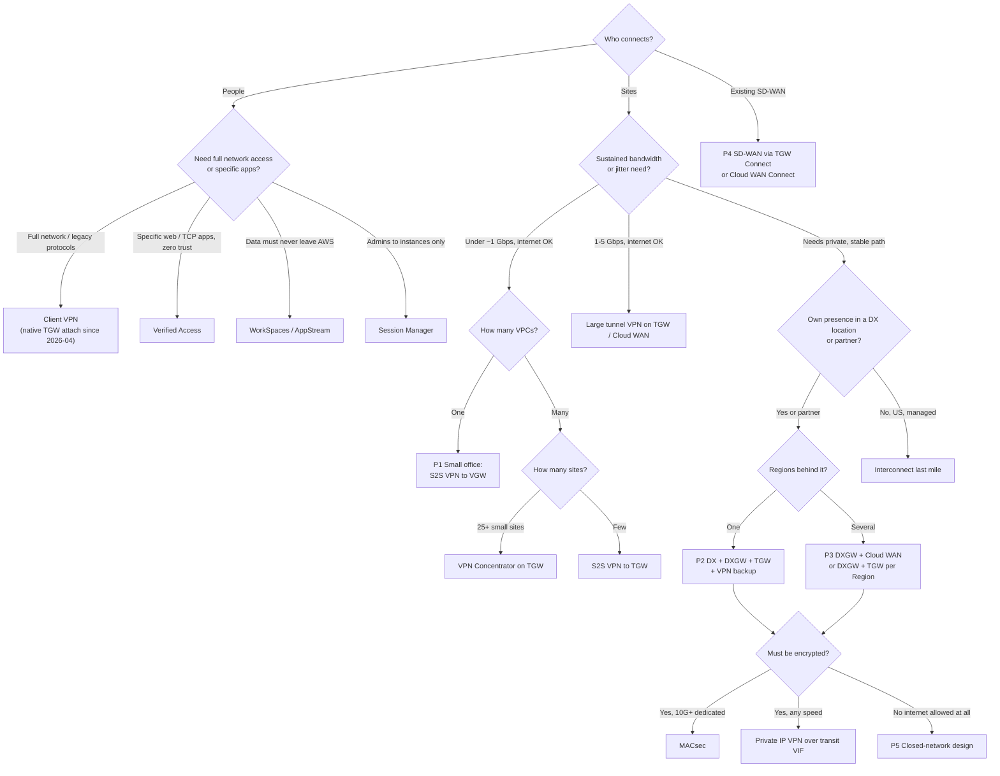
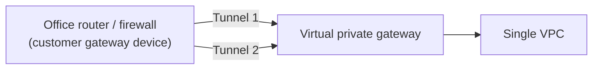
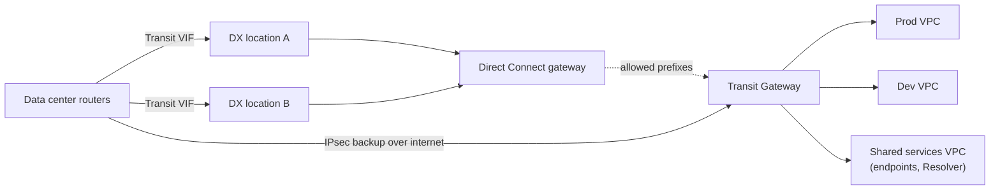
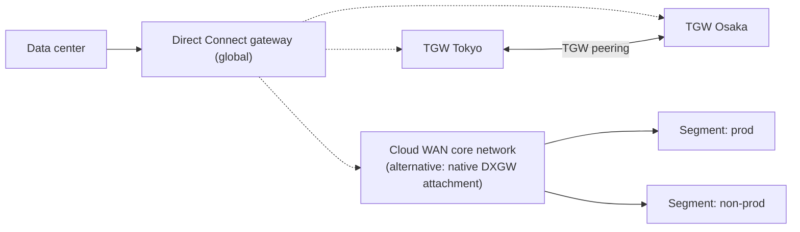
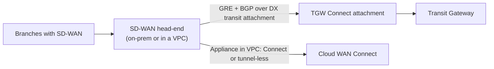
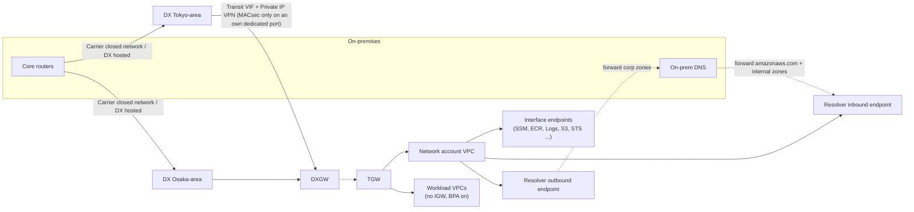

# Design patterns and decision tree

This page turns the path catalogue in [01-overview](01-overview.md) into reference architectures. It covers seven patterns: a small office, multi-VPC with Direct Connect and a VPN backup, multi-Region, SD-WAN, a Japan-style regulated "closed network only" (閉域) design, remote workforce, and M&A with overlapping CIDRs. A decision tree picks between them, a list of anti-patterns follows, and each pattern is mapped to AWS Well-Architected guidance and the Direct Connect resiliency models. Verified as of 2026-10-10. The decision tree is written as explicit rules so the explainer site can code it directly.

## Decision tree

The tree follows the order used by the *Hybrid Connectivity* whitepaper and the 2026 AWS decision-framework blogs. First ask who is connecting, then how much bandwidth and stability the path needs, then how many VPCs and Regions sit behind it, and last which encryption and compliance rules apply.

### Codeable rules

Each rule reads `if <condition> then <recommendation>`. Earlier rules win. `alt` lists an acceptable second choice.

1. `who = person AND need = full_network` → **Client VPN**; attach natively to TGW when more than one VPC is needed (2026-04); `alt` Verified Access for HTTP(S)/TCP apps.
2. `who = person AND need = per_app AND protocol in {http, https, tcp, ssh, rdp}` → **Verified Access**; `alt` Client VPN.
3. `who = person AND data_must_stay_in_aws = true` → **WorkSpaces or AppStream 2.0**.
4. `who = admin AND target = ec2_or_onprem_managed_node` → **Session Manager** (with interface endpoints in closed networks).
5. `who = site AND existing_sdwan = true` → **SD-WAN integration** (TGW Connect over a DX transit attachment or VPC transport; Cloud WAN Connect / tunnel-less Connect for appliances in a VPC).
6. `who = site AND sites >= 25 AND per_site_bw < 100 Mbps AND hub = tgw` → **VPN Concentrator**.
7. `who = site AND vpcs = 1 AND bw <= 1.25 Gbps AND internet_ok` → **P1 Site-to-Site VPN to VGW** (two tunnels, BGP).
8. `who = site AND vpcs > 1 AND bw <= 1.25 Gbps AND internet_ok` → **Site-to-Site VPN to TGW**; ECMP for more.
9. `who = site AND 1.25 < bw <= 5 Gbps AND internet_ok` → **Large bandwidth tunnel** on TGW or Cloud WAN.
10. `who = site AND remote_site_far_from_region AND internet_ok` → **Accelerated VPN** on TGW (cannot be combined with large tunnels).
11. `who = site AND (needs_consistent_latency OR bw > 5 Gbps OR internet_not_allowed)` → **Direct Connect**; dedicated if `bw >= 1 Gbps AND own_presence`, hosted if partner-delivered or `bw < 1 Gbps` (hosted connections go up to 25 Gbps, so partner delivery is an option above 1 Gbps too), **Interconnect – last mile** if `country = US AND partner_available`.
12. `uses_dx AND regions = 1` → **P2**: DX ×2 locations + DXGW + TGW + Site-to-Site VPN backup.
13. `uses_dx AND regions > 1` → **P3**: DXGW + Cloud WAN (native DXGW attachment since 2024-11) or DXGW + TGW per Region with TGW peering.
14. `uses_dx AND encryption_required AND dedicated_speed >= 10 Gbps AND macsec_location AND (own_port OR carrier_is_l2_transparent)` → **MACsec** (it needs a dedicated port and a direct Layer 2 adjacency, so it does not cover a hosted connection or a carrier that is not L2 transparent); else **Private IP VPN over transit VIF** (needs TGW).
15. `internet_egress_allowed = false` → **P5 closed network**: no IGW (enforce with VPC Block Public Access), interface endpoints, Resolver endpoints, Route 53 Profiles.
16. `cidr_overlaps_with_onprem_or_acquired = true` → **P7 overlap pattern**: service-level exposure (PrivateLink / Lattice resource configurations) first, private NAT gateway second, re-IP long term.
17. `workload_critical = true AND uses_dx` → resiliency **Maximum** (99.99% SLA: two or more connections on separate devices in each of two or more DX locations, four or more in total; needs Enterprise Support and a Well-Architected Review), else **High** (99.9%: one connection in each of two or more locations; needs Enterprise Support), and **Development and test** only for non-critical.

## Pattern P1: small office, one VPC (VPN to VGW)

- Components: one customer gateway, one Site-to-Site VPN connection (two tunnels in different AZs), one VGW, route propagation in the VPC route table.
- Use BGP (dynamic routing) so a failed tunnel is withdrawn automatically. With static routing on a stateful firewall, expect asymmetric-routing drops (see the re:Post article in Sources).
- Ceilings: 1.25 Gbps per tunnel, no ECMP on a VGW, up to 10 connections and 100 dynamic routes per VGW (per the 2026 VPN decision-framework blog). Large tunnels, Accelerated VPN and IPv6 outer tunnels need a TGW.
- Several offices can reach each other through the same VGW with **VPN CloudHub** (unique ASN per site).
- Upgrade trigger: a second VPC. Move to TGW instead of creating a VGW per VPC.

## Pattern P2: multi-VPC in one Region (TGW + DX + VPN backup)

- Components: two or more DX connections in **different DX locations**, transit VIFs to one DXGW, DXGW associated with a TGW (the DXGW and TGW must use different ASNs), and a Site-to-Site VPN attachment on the same TGW as backup.
- Failover logic: on a TGW, for the same prefix, Direct Connect gateway–propagated routes beat VPN-propagated routes no matter what the BGP attributes say. More specific prefixes still win first. So advertise the same prefixes over both paths, and do not advertise more-specifics over the VPN.
- MTU: a transit VIF supports 1500 or 8500. VPN traffic is limited to about 1446 bytes, so mixed paths need MSS clamping on premises.
- Well-Architected: REL02-BP02 recommends redundant connectivity. It describes Maximum resiliency (99.99%) as two or more connections on distinct devices in each of more than one DX location (four or more in total), High resiliency (99.9%) as one connection in each of two or more locations, and Site-to-Site VPN on TGW as a cost-effective backup.
- Test it: since 2025-12, AWS Fault Injection Service can disrupt BGP on a VIF to prove failover.

## Pattern P3: multi-Region (DXGW + TGW per Region, or Cloud WAN)

- Option A, **DXGW + TGW per Region**: one DXGW can be associated with TGWs in several Regions. Each TGW needs a unique ASN. East-west traffic between Regions uses TGW peering, because a DXGW does not pass traffic between its associations.
- Option B, **Cloud WAN**: since 2024-11 a DXGW can attach directly to a Cloud WAN core network without an intermediate TGW. Segments and service insertion (2024-06) are written once in the core network policy. Routing Policy (2025-11) adds filtering, summarization and BGP attributes.
- When to pick B: more than two or three Regions, or teams that want segmentation and inspection as policy instead of per-Region route tables. A DXGW associated with a core network cannot be used with other gateway types at the same time.
- Quota to watch: a DXGW supports at most six TGW associations (not adjustable; see [04-direct-connect.md](04-direct-connect.md)). Check the current Direct Connect quotas page before a design review.

## Pattern P4: SD-WAN integration

- TGW Connect: GRE plus BGP, 5 Gbps per Connect peer and up to four peers per attachment (20 Gbps with ECMP). The transport is a VPC attachment or a DX attachment. BGP is required; static routes are not supported.
- GRE is not encryption. Rely on the SD-WAN fabric's own IPsec or on MACsec on the DX.
- Cloud WAN tunnel-less Connect (2023-10) removes GRE and IPsec for SD-WAN appliances running in a VPC.
- Alternative for very small sites without SD-WAN: VPN Concentrator.

## Pattern P5: regulated closed-network-only design (閉域)

This pattern is common in Japanese finance, public sector and healthcare RFPs. There, "閉域" (closed network) means "no traffic may use the internet, including calls to AWS APIs". The AWS building blocks are standard, but every layer must be closed, not just the circuit.

- Underlay: Direct Connect, often as a hosted connection delivered by a carrier's closed IP-VPN, landing in DX locations in two different metro areas for location redundancy.
- Encryption: MACsec on 10/100/400 Gbps dedicated ports at supported locations (not on a hosted connection, and over a carrier circuit only if it is Layer 2 transparent), or **Private IP VPN** (IPsec with RFC 1918 / RFC 6598 outside addresses over a transit VIF, which requires a TGW). The Private IP VPN docs list finance, healthcare and federal compliance as primary use cases.
- No internet: no IGW or NAT gateway in workload VPCs. Enforce this with **VPC Block Public Access** (2024-11), which overrides route tables and IGW attachments.
- AWS API access: **interface endpoints** for every service the workload calls, centralized in a network or shared-services VPC and shared through Route 53 private hosted zones or Route 53 Profiles. S3 *gateway* endpoints cannot serve on-premises clients, so give on-premises an S3 interface endpoint; keep a free S3 gateway endpoint in the VPC (it is required for "private DNS only for inbound endpoint"), and give each spoke VPC its own.
- DNS: on-premises DNS forwards `amazonaws.com` (or the specific service zones) and internal AWS zones to the **Route 53 VPC Resolver inbound endpoint**. AWS-side workloads forward corporate zones to on-premises through **outbound endpoints and VPC Resolver forwarding rules**. Since 2025-06, inbound and outbound delegation with NS records is an alternative to conditional forwarding.
- Prove it: VPC Encryption Controls (2025-11, a paid feature since 2026-03) can monitor or enforce encryption in transit inside and across VPCs. Pair it with VPC Flow Logs and Network Access Analyzer.
- Japanese reference material: AWS Japan's *金融リファレンスアーキテクチャ日本版* (Financial Services Reference Architecture Japan) and the 2026 AWS Black Belt seminar on Direct Connect redundant connections.

## Pattern P6: remote workforce

| Need | Pick | Why | Watch out |
| --- | --- | --- | --- |
| Full network reach, legacy protocols, on-premises too | Client VPN | Managed OpenVPN; SAML, AD or certificates; native TGW attachment (2026-04) keeps client source IPs; device posture checks (2026-10) | Charged per endpoint association-hour and per connection-hour; split tunnel decides whether internet traffic hairpins through AWS |
| Specific internal apps, zero trust | Verified Access | Per-request policy (Cedar) on identity and device posture; HTTP(S) and, since 2025-02, TCP/SSH/RDP | Per-application model; not a general network |
| Data must not reach the endpoint | WorkSpaces / AppStream 2.0 | Only pixels leave AWS | WorkSpaces PCoIP and Pool features are being sunset (AWS service availability update, 2026-06) |
| Operators to servers | Session Manager | No inbound ports, IAM-authorized, logged | Needs SSM interface endpoints in closed networks |

## Pattern P7: M&A and overlapping CIDRs

- First choice, **expose services rather than networks**: PrivateLink endpoint services (NLB-fronted), or PrivateLink resource endpoints and VPC Lattice resource configurations (2024-12). These reach a database or IP in an overlapping network without routing the whole CIDR.
- Second choice, **private NAT gateway**: add a routable secondary CIDR, use the private NAT gateway for source NAT and an internal ALB or NLB for destination NAT, and route through TGW or VGW. This is the pattern in the multi-VPC whitepaper and the re:Post Knowledge Center.
- Constraint to remember: VPCs associated with one DXGW through VGWs cannot have overlapping CIDRs.
- New tool: TGW Policy-Based Routing (2026-07) can steer by source, port or protocol. It helps with segmentation during a migration, but it does not translate addresses.
- Long term: re-IP from a planned IPAM pool. The whitepaper treats IP planning as step zero for this reason.

## Anti-patterns

| Anti-pattern | Why it fails | Do instead |
| --- | --- | --- |
| One DX connection, no backup | Single Connection SLA is 95% (2026 SLA page); a device or fiber fault isolates you | Two DX locations, or DX plus a VPN backup on the same TGW |
| Two DX connections in the *same* location for a critical workload | Location failure takes both down; this is the "Development and test" model | Maximum resiliency model via the Resiliency Toolkit |
| Treating DX as encrypted | AWS docs: Direct Connect does not encrypt traffic in transit by default | MACsec, Private IP VPN, or TLS end to end |
| Using a DXGW as a VPC-to-VPC hub | DXGW does not forward between associated VPCs or VIFs | TGW, Cloud WAN, or VPC peering for east-west traffic |
| Advertising more-specific prefixes over the backup VPN | Longest prefix beats the DX-over-VPN preference, so the backup becomes primary | Advertise identical prefixes; use AS-path / MED within a type |
| S3 gateway endpoint for on-premises clients | Gateway endpoints are route-table targets inside the VPC only | S3 interface endpoint, or public VIF |
| Private link, public DNS | Clients resolve public IPs and leave through the internet | Resolver inbound endpoint + private hosted zones for endpoints |
| A VGW per VPC with a DX private VIF each | Does not scale, and has no inter-VPC routing | DXGW + TGW (transit VIF) |
| Static routing VPN on a stateful firewall | Asymmetric tunnels drop return traffic | BGP, or the static-routing workaround in re:Post |
| Mixed MTU (8500 transit VIF, 1446 VPN) with ICMP blocked | PMTUD fails, so large packets black-hole on failover | MSS clamping, consistent MTU per path |
| Overlapping CIDRs "fixed later" | Every hub forbids or complicates overlap | IPAM plan up front; PrivateLink / Lattice for unavoidable overlap |

## Mapping to Well-Architected and the DX resiliency models

| Pattern | Reliability | Security | DX resiliency model |
| --- | --- | --- | --- |
| P1 | REL02-BP02: two tunnels in different AZs, redundant CGW, diverse ISPs | IPsec by default | n/a |
| P2 | REL02-BP02: DX in two locations + VPN backup + BGP | Add MACsec or Private IP VPN if required | High (99.9%) or Maximum (99.99%) |
| P3 | Same, per Region; TGW peering or Cloud WAN for east-west | Cloud WAN segments and service insertion | Maximum for production |
| P4 | Redundant Connect peers, both BGP sessions per peer | SD-WAN fabric encryption | As P2 for the DX transport |
| P5 | As P2, plus DNS endpoints in two or more AZs | No IGW (BPA), interface endpoints, Encryption Controls | Maximum |
| P6 | Client VPN associations in two subnets / AZs | Identity + device posture | n/a |
| P7 | Avoid single NAT path; multi-AZ private NAT | Least exposure: services, not networks | n/a |

The Hybrid Networking Lens (2026-02-02 revision) applies the six pillars to hybrid links specifically and is the review checklist to run against any of these patterns.

## Sources

- <https://docs.aws.amazon.com/whitepapers/latest/hybrid-connectivity/hybrid-connectivity.html>
- <https://docs.aws.amazon.com/whitepapers/latest/building-scalable-secure-multi-vpc-network-infrastructure/welcome.html>
- <https://docs.aws.amazon.com/whitepapers/latest/building-scalable-secure-multi-vpc-network-infrastructure/private-nat-gateway.html>
- <https://docs.aws.amazon.com/wellarchitected/2025-02-25/framework/rel_planning_network_topology_ha_conn_private_networks.html>
- <https://docs.aws.amazon.com/wellarchitected/latest/hybrid-networking-lens/hybrid-networking-lens.html>
- <https://docs.aws.amazon.com/directconnect/latest/UserGuide/resiliency_toolkit.html>
- <https://aws.amazon.com/directconnect/sla/>
- <https://aws.amazon.com/blogs/networking-and-content-delivery/selecting-the-right-aws-vpn-solution-a-decision-framework/>
- <https://aws.amazon.com/blogs/networking-and-content-delivery/selecting-the-right-aws-private-connectivity-options-a-decision-framework/>
- <https://aws.amazon.com/blogs/networking-and-content-delivery/hybrid-cloud-architectures-using-aws-direct-connect-gateway/>
- <https://aws.amazon.com/blogs/networking-and-content-delivery/simplify-sd-wan-connectivity-with-aws-transit-gateway-connect/>
- <https://aws.amazon.com/blogs/networking-and-content-delivery/segmenting-hybrid-networks-with-aws-transit-gateway-connect/>
- <https://aws.amazon.com/blogs/networking-and-content-delivery/improving-performance-on-aws-and-hybrid-networks/>
- <https://aws.amazon.com/blogs/industries/enabling-a-new-aws-region-for-financial-services-enterprises/>
- <https://docs.aws.amazon.com/vpc/latest/tgw/how-transit-gateways-work.html>
- <https://docs.aws.amazon.com/directconnect/latest/UserGuide/direct-connect-transit-gateways.html>
- <https://docs.aws.amazon.com/directconnect/latest/UserGuide/virtualgateways.html>
- <https://docs.aws.amazon.com/directconnect/latest/UserGuide/encryption-in-transit.html>
- <https://docs.aws.amazon.com/vpn/latest/s2svpn/private-ip-dx.html>
- <https://docs.aws.amazon.com/network-manager/latest/cloudwan/cloudwan-dxattach-about.html>
- <https://repost.aws/knowledge-center/vpn-avoid-asymmetry-static-routing>
- <https://repost.aws/knowledge-center/direct-connect-gateway-primary-connection>
- <https://repost.aws/knowledge-center/s3-bucket-access-direct-connect>
- <https://repost.aws/knowledge-center/route53-resolve-with-inbound-endpoint>
- <https://repost.aws/knowledge-center/vpc-peering-connection-error>
- <https://aws.amazon.com/about-aws/whats-new/2024/11/aws-cloud-wan-on-premises-connectivity-direct-connect/>
- <https://aws.amazon.com/about-aws/whats-new/2024/06/aws-cloud-wan-service-insertion>
- <https://aws.amazon.com/about-aws/whats-new/2025/11/aws-cloud-wan-routing-policy/>
- <https://aws.amazon.com/about-aws/whats-new/2023/10/aws-cloud-wan-tunnel-less-high-performant-global-sd-wans/>
- <https://aws.amazon.com/about-aws/whats-new/2024/11/block-public-access-amazon-virtual-private-cloud>
- <https://aws.amazon.com/about-aws/whats-new/2025/11/aws-vpc-encryption-controls/>
- <https://aws.amazon.com/about-aws/whats-new/2026/03/vpc-encryption-controls-pricing/>
- <https://aws.amazon.com/about-aws/whats-new/2025/06/amazon-route-53-resolver-endpoints-dns-delegation-private-hosted-zones/>
- <https://aws.amazon.com/about-aws/whats-new/2025/12/direct-connect-resilience-testing-fault-injection-service/>
- <https://aws.amazon.com/about-aws/whats-new/2026/04/aws-client-vpn-transit-gateway/>
- <https://aws.amazon.com/about-aws/whats-new/2026/10/aws-client-vpn-device-posture/>
- <https://aws.amazon.com/about-aws/whats-new/2026/07/aws-transit-gateway-policy-based-routing/>
- <https://aws.amazon.com/about-aws/whats-new/2026/06/aws-service-availability/>
- <https://aws.amazon.com/jp/blogs/news/fin-reference-arch-v1-6/>
- <https://pages.awscloud.com/rs/112-TZM-766/images/AWS-Black-Belt_2026_AWS-DirectConnect-redundant-connection_0525_v1.pdf>
