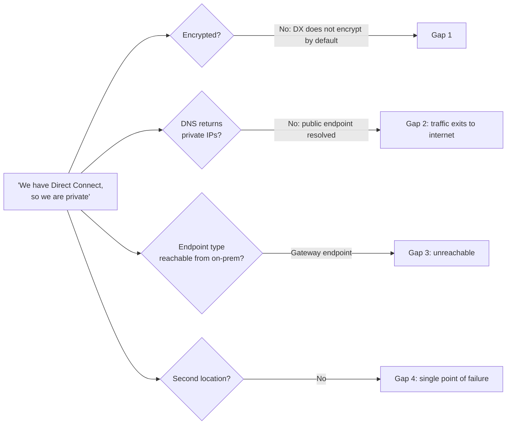

# 14. Why hybrid networking is hard

This page collects the places where people actually get confused when they connect a corporate network to AWS. Each point comes with evidence: an AWS re:Post Knowledge Center article, an AWS documentation rule that exists *because* people trip on it, or Japanese community material (Qiita, DevelopersIO / Classmethod, Serverworks, AWS Japan Black Belt, AWS Japan blog). Each point also gets a proposed visual or interactive fix for the explainer site. Verified as of 2026-10-10. The ranking is an editorial judgment that weighs how often the topic shows up in Knowledge Center and community articles against how badly a mistake hurts (outage, data exposure, or a redesign). It is not a measured statistic.

## The root cause in one picture

Hybrid networking is hard because one connection is really five decisions (underlay, overlay, hub, VPC, service), and AWS gives the same kind of thing several names: three different "gateways", three kinds of "virtual interface", and three products called "VPN". Most mistakes are a right answer at one layer combined with a wrong assumption at another.

## Top 15 confusion points (ranked)

| Rank | Confusion | What people get wrong | Evidence | Proposed interactive fix |
| --- | --- | --- | --- | --- |
| 1 | **Private ≠ encrypted** | Assume Direct Connect or a carrier closed network (閉域網) is encrypted | AWS docs: "AWS Direct Connect does not encrypt your traffic that is in transit by default"; re:Post "How do I establish an encrypted connection over Direct Connect?" | A packet-inspector toggle: drag a packet along DX and show plaintext at each hop; turn on MACsec (one hop green) or Private IP VPN (end-to-end green) |
| 2 | **VGW vs DXGW vs TGW** | Treat the three "gateways" as interchangeable or pick a VGW per VPC | Japanese comparison posts exist mainly to untangle this: Megaport JA "AWS VGW / DGW / TGW の比較", Qiita "Direct ConnectとGWを整理してみた", Qiita "VGWとTGWを徹底比較", ATBeX blog | A three-card "what does it attach to / does it forward data / scope (VPC, Region, global)" flip game; then a builder where the user wires a DC to 3 VPCs and sees which combinations are rejected |
| 3 | **DXGW is not a hub** | Expect VPC A ↔ VPC B traffic through the DXGW, or a hairpin through on-premises | AWS docs list "direct communication between the VPCs that are associated with a single Direct Connect gateway" as not supported; AWS blog calls the DXGW north-south only | Animated route-reflector view: the DXGW hands out route cards (dotted lines) but packets (solid dots) never pass through it; an attempted VPC-to-VPC packet bounces |
| 4 | **Hybrid DNS** | Private connectivity works by IP but names fail, or on-prem resolves AWS service names to public IPs and leaves through the internet | re:Post "configure a Route 53 Resolver inbound endpoint to resolve … private hosted zone from my remote network"; Classmethod "Route53 リゾルバー登場", "初めての Direct Connect 〜 Route 53 Resolver を添えて 〜"; Qiita (mksamba, takeda_h) | A DNS query tracer: type a name on the on-prem side and watch the forwarder, inbound endpoint, PHZ, then the IP; toggle "no forwarder" to see the public IP leak |
| 5 | **Gateway endpoints are VPC-only** | Create an S3 gateway endpoint and expect on-prem to use it over DX/VPN | re:Post "How can I access my Amazon S3 bucket over Direct Connect?": "on-premises traffic can't cross the gateway VPC endpoint"; Storage Gateway KC note | Side-by-side: gateway endpoint as a route-table arrow (on-prem packet has no arrow to follow) vs interface endpoint as an ENI with an IP the on-prem packet can target |
| 6 | **Route priority DX vs VPN** | Backup VPN unexpectedly carries production, or failover does not happen | re:Post "Why is Transit Gateway prioritizing my backup VPN connection over my primary Direct Connect gateway?"; TGW route evaluation order docs; VPC route priority docs | A route-table simulator: enter prefixes per path, flip links up or down, and show the winning route with the rule that decided it (longest prefix, then static, then attachment type, then AS path / MED) |
| 7 | **Resiliency ≠ two cables** | Two DX connections in one location counted as HA; mixed up SLA tiers | Resiliency Toolkit docs (Maximum 99.99%, High 99.9%, Dev/test no SLA); the re:Post KC "direct-connect-physical-redundancy" itself says "SLA of 99.9%" for Maximum, which contradicts the docs; 2026 SLA adds a 95% Single Connection tier | A failure-injection board: knock out a device, a fiber, or a whole location and see which designs survive; label each with its SLA tier |
| 8 | **Three kinds of VIF** | Use a private VIF where a transit VIF is needed, or expect a public VIF to reach VPCs | DX docs on private, public and transit VIFs; the "Prerequisites for transit virtual interfaces" page; AWS Black Belt Direct Connect decks | A VIF picker: choose the destination (VPC via VGW, many VPCs via TGW, AWS public endpoints) and the correct VIF lights up with its MTU (9001 / 8500 / 1500) |
| 9 | **VPN bandwidth ceilings** | Expect one VPN connection to fill a 10 Gbps internet link; expect ECMP on a VGW | Quotas: 1.25 Gbps per standard tunnel, 5 Gbps per large tunnel; re:Post "troubleshoot low transfer speed on my Site-to-Site VPN"; decision-framework blog: no ECMP on VGW | A throughput slider: add tunnels and pick VGW vs TGW; the bar caps at the right number and explains why |
| 10 | **Asymmetric and flapping tunnels** | Static-route VPN on a stateful firewall drops return traffic; tunnels go down "when idle" | re:Post "avoid asymmetry in route-based VPN with static routing"; re:Post "troubleshoot tunnel inactivity, flapping, or down tunnel" (DPD every 10 s, 3 misses) | Two-tunnel animation showing the return packet taking the other tunnel and the firewall dropping it; a DPD heartbeat visual |
| 11 | **MTU and PMTUD** | Large packets black-hole after failover from DX (8500/9001) to VPN (max 1446) | AWS blog "Improving Performance on AWS and Hybrid Networks"; DX VIF MTU docs | A packet-size slider across a path picker; show fragmentation or drop where ICMP is blocked, and the fix (MSS clamping) |
| 12 | **Edge-to-edge / transitive routing** | Reach a peered VPC through another VPC's VPN or DX link | re:Post "troubleshoot communication issues between Amazon VPCs over VPC peering": "VPC peering doesn't support edge-to-edge routing"; DX FAQ | A "can this packet get there?" maze with VGW, peering, TGW; only hub-based routes succeed |
| 13 | **Overlapping CIDRs** | Assume TGW or DXGW can route overlapping VPCs and on-prem | DX docs: VPCs on one DXGW "cannot have overlapping CIDR blocks"; whitepaper "Private NAT Gateway"; re:Post "Use AWS Transit Gateway for overlapping CIDR blocks" | An IP-collision game: drop two 10.0.0.0/16 networks onto a hub and pick a fix (PrivateLink, private NAT, re-IP) to see trade-offs |
| 14 | **"VPN" means three products** | Confuse Site-to-Site VPN, Client VPN and Verified Access (and WorkSpaces) when planning remote work | AWS VPN decision-framework blog (five VPN options, 2026-05); Client VPN vs Verified Access positioning | A persona switcher: pick "branch", "employee laptop", "contractor needing one app", "admin" and see the right product and its layer |
| 15 | **What "閉域" (closed network) requires** | Treat "we use DX" as satisfying "no internet", forgetting AWS API calls, DNS, IGWs and console access | SIOS blog "AWSで「インターネットに出てはいけない」要件を解決する方法～PrivateLink対応～"; Classmethod endpoint/Resolver consolidation articles; Serverworks Resolver + DNS Firewall article | A checklist overlay on the big map: each item (circuit, encryption, DNS, endpoints, no IGW via Block Public Access, console access) turns green only when its layer is closed |

## Honorable mentions

- **Allowed prefixes on the DXGW association.** People expect VPC CIDRs to be advertised automatically, but the allowed-prefixes list is what goes to on-premises. It can be any supernet, and it has a limit (re:Post "advertise VPC routes over a Direct Connect connection"). Fix: a two-pane editor that shows the allowed list on the left and the BGP table received on-prem on the right.
- **Prefix limits.** The inbound limit on a private or transit VIF was 100 prefixes until 2026-08, when inbound prefix controls raised it to 1,000. Older articles still say 100. Fix: a "verified as of" badge on every number.
- **Lead time.** Teams plan DX like a VPN. The whitepaper says connectivity can be ready in hours but "may take weeks or months if additional circuits must be installed". Fix: a Gantt strip comparing VPN, hosted DX, dedicated DX (LOA-CFA, cross connect, carrier tail) and Interconnect – last mile.
- **Cost surprises.** TGW per-GB data processing, DX data transfer out, and who pays. TGW Flexible Cost Allocation (2025-11) and DX flat-rate pricing (2026-09) changed the cost picture. Fix: a cost calculator that splits port, attachment, processing and transfer.
- **Naming drift.** "Route 53 Resolver" was renamed "Route 53 VPC Resolver" (2025-11) when Global Resolver arrived, and Japanese docs mix 伝達 and 伝播 for "propagation". Fix: a glossary hover with old names.

## Analogies that work

| Concept | English analogy | 日本語のたとえ | Where it breaks |
| --- | --- | --- | --- |
| Internet VPN vs Direct Connect | An armored car on public roads vs your own private road | 公道を走る装甲車 vs 自社専用道路 | The private road has no armor: DX is private but not encrypted |
| MACsec vs IPsec over DX | Locking the gate at your end of the private road vs locking the cargo in a safe for the whole trip | 専用道路の入口の門に鍵 vs 荷物そのものを金庫に入れて運ぶ | MACsec is hop-by-hop; IPsec is end-to-end between gateways |
| VGW / TGW / DXGW | VGW is a single house's front door; TGW is a regional train station; DXGW is the timetable office that tells every station which lines exist but never moves a passenger | VGW は一軒家の玄関、TGW は地域のターミナル駅、DXGW は路線図を配る案内所 (人は通らない) | DXGW does not forward packets at all |
| Cloud WAN | A national railway run from one rulebook instead of per-station agreements | 各駅の個別協定ではなく、一冊の運行規程で動く全国鉄道網 | Policy is declarative; the per-Region edges still exist |
| Hybrid DNS | A switchboard operator who forwards calls for internal extensions to the right building | 内線番号を正しい建物へ回す電話交換手 | Forwarding rules are per domain, not per host |
| Gateway vs interface endpoint | A private side road only reachable from inside the campus vs a reception desk with its own phone number anyone on the private network can call | 構内からしか入れない裏道 vs 内線番号を持つ受付窓口 | Interface endpoints cost per hour and per GB |
| Route priority | Sat-nav that always prefers the most specific address, then the toll road, then the shortest route | 住所が一番細かい案内を優先し、同じなら有料道路 (DX) を優先するカーナビ | Within one type, BGP attributes decide |
| Client VPN vs Verified Access | A building pass that opens every floor vs a guard checking ID and badge at each office door | 全フロアに入れる入館証 vs 部屋ごとに身分証と端末を確認する警備員 | Verified Access is per-app and policy-heavy |
| Resiliency models | Two bridges over the same river vs two bridges over two different rivers | 同じ川に橋を二本 vs 別々の川に橋を一本ずつ | Your side (routers, carriers) also needs diversity |

## Sources

- <https://docs.aws.amazon.com/directconnect/latest/UserGuide/encryption-in-transit.html>
- <https://repost.aws/knowledge-center/create-vpn-direct-connect>
- <https://www.megaport.com/ja/blog/aws-vgw-dgw-tgw-%E3%81%AE%E6%AF%94%E8%BC%83/>
- <https://qiita.com/zumax/items/e89918fc2918c284e692>
- <https://qiita.com/mkydk/items/2f2eeee27dea99518d13>
- <https://atbex.attokyo.co.jp/blog/detail/96/>
- <https://docs.aws.amazon.com/directconnect/latest/UserGuide/virtualgateways.html>
- <https://aws.amazon.com/blogs/networking-and-content-delivery/hybrid-cloud-architectures-using-aws-direct-connect-gateway/>
- <https://repost.aws/knowledge-center/route53-resolve-with-inbound-endpoint>
- <https://dev.classmethod.jp/articles/route53-resolver/>
- <https://dev.classmethod.jp/articles/direct-connect-with-route-53-resolver/>
- <https://dev.classmethod.jp/articles/route53-resolver-endpoint-vpc-endpoint-consolidation/>
- <https://qiita.com/mksamba/items/b16e99170e666b68f194>
- <https://qiita.com/takeda_h/items/bd7269a539079daeaa5d>
- <https://blog.serverworks.co.jp/resolver-dns-firewall-inbound-endpoint>
- <https://repost.aws/knowledge-center/s3-bucket-access-direct-connect>
- <https://repost.aws/knowledge-center/storage-gateway-file-gateway-private-s3>
- <https://repost.aws/knowledge-center/direct-connect-gateway-primary-connection>
- <https://docs.aws.amazon.com/vpc/latest/tgw/how-transit-gateways-work.html>
- <https://docs.aws.amazon.com/vpc/latest/userguide/route-tables-priority.html>
- <https://docs.aws.amazon.com/directconnect/latest/UserGuide/resiliency_toolkit.html>
- <https://repost.aws/knowledge-center/direct-connect-physical-redundancy>
- <https://aws.amazon.com/directconnect/sla/>
- <https://docs.aws.amazon.com/directconnect/latest/UserGuide/WorkingWithVirtualInterfaces.html>
- <https://docs.aws.amazon.com/directconnect/latest/UserGuide/create-vif.html>
- <https://d1.awsstatic.com/webinars/jp/pdf/services/20210209-AWS-Blackbelt-DirectConnect.pdf>
- <https://pages.awscloud.com/rs/112-TZM-766/images/AWS-Black-Belt_2026_AWS-DirectConnect-redundant-connection_0525_v1.pdf>
- <https://docs.aws.amazon.com/vpn/latest/s2svpn/vpn-limits.html>
- <https://repost.aws/knowledge-center/vpn-site-to-site-low-transfer-speed>
- <https://repost.aws/knowledge-center/vpn-avoid-asymmetry-static-routing>
- <https://repost.aws/knowledge-center/vpn-tunnel-instability-inactivity>
- <https://aws.amazon.com/blogs/networking-and-content-delivery/improving-performance-on-aws-and-hybrid-networks/>
- <https://repost.aws/knowledge-center/vpc-peering-connectivity>
- <https://aws.amazon.com/directconnect/faqs/>
- <https://docs.aws.amazon.com/whitepapers/latest/building-scalable-secure-multi-vpc-network-infrastructure/private-nat-gateway.html>
- <https://repost.aws/knowledge-center/vpc-peering-connection-error>
- <https://aws.amazon.com/blogs/networking-and-content-delivery/selecting-the-right-aws-vpn-solution-a-decision-framework/>
- <https://bcblog.sios.jp/aws-privatelink/>
- <https://repost.aws/knowledge-center/direct-connect-vpc-bgp>
- <https://aws.amazon.com/about-aws/whats-new/2026/08/aws-direct-connect-new-prefix-controls/>
- <https://docs.aws.amazon.com/whitepapers/latest/hybrid-connectivity/time-to-deploy.html>
- <https://aws.amazon.com/about-aws/whats-new/2025/11/aws-transit-gateway-flexible-cost-allocation/>
- <https://aws.amazon.com/about-aws/whats-new/2026/09/aws-direct-connect-announces-flat-rate-pricing/>
- <https://aws.amazon.com/about-aws/whats-new/2025/11/amazon-route-53-global-resolver-secure-anycast-dns-resolution-preview/>
- <https://docs.aws.amazon.com/ja_jp/vpc/latest/tgw/how-transit-gateways-work.html>
