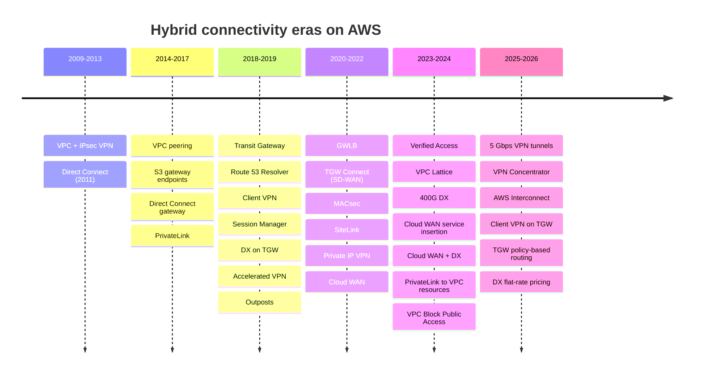

# Timeline of AWS hybrid networking, 2009–2026

This page lists the launches that changed how a corporate network can reach AWS. It starts with Amazon VPC and its IPsec VPN in 2009 and runs through the 2025–2026 wave (large VPN tunnels, VPN Concentrator, AWS Interconnect, Client VPN on Transit Gateway, Direct Connect flat-rate pricing). Verified as of 2026-10-10. Each entry links to the AWS What's New post or, where that post could not be found, to the AWS blog or doc that records the date. Dates are the posted date when it was confirmed. `YYYY-MM` means only the month was confirmed (from the What's New URL path). Regional expansions are left out unless they changed what was possible.

## Eras at a glance

## Full timeline

| Date | Launch | Why it matters for hybrid | Source |
| --- | --- | --- | --- |
| 2009-08-25 | Amazon VPC (limited beta), connected to your network with IPsec VPN | The first hybrid path: VPC was VPN-only at launch | <https://aws.amazon.com/blogs/aws/introducing-amazon-virtual-private-cloud-vpc/> |
| 2011-08-03 | AWS Direct Connect (one location, Equinix Ashburn; 1 and 10 Gbps) | Private dedicated circuits to AWS | <https://aws.amazon.com/about-aws/whats-new/2011/08/03/Announcing-AWS-Direct-Connect/> |
| 2014-03-24 | VPC peering (within a Region) | VPC-to-VPC links; not transitive, so no edge-to-edge routing | <https://aws.amazon.com/about-aws/whats-new/2014/03/24/announcing-vpc-peering/> |
| 2015-05-11 | VPC endpoints for Amazon S3 (gateway endpoint) | Private S3 from inside a VPC; not reachable from on-premises | <https://aws.amazon.com/about-aws/whats-new/2015/05/introducing-amazon-vpc-endpoints-for-amazon-s3/> |
| 2017-11-01 | Direct Connect gateway | One DX connection reaches VPCs in any Region (except China) | <https://aws.amazon.com/about-aws/whats-new/2017/11/aws-direct-connect-enables-global-access> |
| 2017-11-28 | AWS PrivateLink for customer and partner services (interface endpoints for AWS services launched earlier that month) | Private, on-prem-reachable service endpoints over DX/VPN | <https://aws.amazon.com/about-aws/whats-new/2017/11/aws-privatelink-now-available-for-customer-and-partner-services/> |
| 2017-11-29 | Inter-Region VPC peering | Cross-Region private links | <https://aws.amazon.com/about-aws/whats-new/2017/11/announcing-support-for-inter-region-vpc-peering> |
| 2018-09-11 | Systems Manager Session Manager | Admin access with no inbound ports or bastions | <https://aws.amazon.com/about-aws/whats-new/2018/09/introducing-aws-systems-manager-session-manager/> |
| 2018-11-19 | Route 53 Resolver endpoints and rules | Managed hybrid DNS (inbound/outbound forwarding) | <https://aws.amazon.com/about-aws/whats-new/2018/11/amazon-route-53-announces-resolver-with-support-for-dns-resolution-over-direct-connect-and-vpn/> |
| 2018-11-26 | AWS Transit Gateway (VPC and VPN attachments) | Regional hub replaces VPC meshes and transit VPCs | <https://aws.amazon.com/about-aws/whats-new/2018/11/introducing-aws-transit-gateway> |
| 2018-12-19 | AWS Client VPN | Managed OpenVPN remote access | <https://aws.amazon.com/blogs/networking-and-content-delivery/introducing-aws-client-vpn-to-securely-access-aws-and-on-premises-resources/> |
| 2019-04 | Direct Connect support for Transit Gateway (transit VIF); regional expansions followed in 2019-06, 2019-07 and 2019-09 | DX to many VPCs through one hub | <https://aws.amazon.com/about-aws/whats-new/2019/09/aws-direct-connect-support-for-aws-transit-gateway-is-now-available-in-six-additional-regions> (the original April post was not found; the 2019-04-30 date comes from a partner source) |
| 2019-12-03 | Accelerated Site-to-Site VPN (Global Accelerator) | VPN enters the AWS backbone at the nearest edge | <https://aws.amazon.com/about-aws/whats-new/2019/12/announcing-accelerated-site-to-site-vpn-for-improved-vpn-performance/> |
| 2019-12-03 | Transit Gateway inter-Region peering | Multi-Region hub-to-hub on the AWS backbone | <https://aws.amazon.com/about-aws/whats-new/2019/12/aws-transit-gateway-supports-inter-region-peering> |
| 2019-12-03 | AWS Outposts GA | AWS racks on-premises, linked back by a service link | <https://aws.amazon.com/about-aws/whats-new/2019/12/announcing-general-availability-of-aws-outposts> |
| 2020-02-05 | AWS-provided Client VPN desktop client | No third-party OpenVPN client needed | <https://aws.amazon.com/about-aws/whats-new/2020/02/introducing-the-desktop-client-for-aws-client-vpn> |
| 2020-11-11 | Gateway Load Balancer | Inline inspection appliances for hybrid traffic | <https://aws.amazon.com/about-aws/whats-new/2020/11/introducing-aws-gateway-load-balancer> |
| 2020-12-10 | Transit Gateway Connect (GRE + BGP) | Native SD-WAN integration | <https://aws.amazon.com/about-aws/whats-new/2020/12/introducing-aws-transit-gateway-connect-to-simplify-sd-wan-branch-connectivity> |
| 2021-03-31 | MACsec on 10/100 Gbps dedicated DX | Line-rate L2 encryption on the DX hop | <https://aws.amazon.com/about-aws/whats-new/2021/03/aws-direct-connect-announces-macsec-encryption-for-dedicated-10gbps-and-100gbps-connections-at-select-locations/> |
| 2021-12-01 | Direct Connect SiteLink | Site-to-site over the AWS backbone, bypassing Regions | <https://aws.amazon.com/about-aws/whats-new/2021/12/aws-direct-connect-sitelink> |
| 2021-12 | AWS Cloud WAN preview | Policy-driven global network | <https://aws.amazon.com/blogs/networking-and-content-delivery/introducing-aws-cloud-wan-preview/> |
| 2022-06-22 | Private IP VPN over Direct Connect | IPsec over a transit VIF with private addresses | <https://aws.amazon.com/about-aws/whats-new/2022/06/aws-site-vpn-introduces-private-ip-security-privacy> |
| 2022-07-12 | AWS Cloud WAN GA | Global hub with segments and central policy | <https://aws.amazon.com/about-aws/whats-new/2022/07/general-availability-aws-cloud-wan/> |
| 2023-03-31 | Amazon VPC Lattice GA (preview 2022-11-29) | Service-to-service networking across VPCs and accounts | <https://aws.amazon.com/blogs/aws/introducing-vpc-lattice-simplify-networking-for-service-to-service-communication-preview/> |
| 2023-04-28 | AWS Verified Access GA (preview 2022-11) | VPN-less, per-app zero-trust access | <https://aws.amazon.com/about-aws/whats-new/2023/04/aws-verified-access-generally-available/> |
| 2023-10 | Cloud WAN tunnel-less Connect | SD-WAN appliances in a VPC without GRE or IPsec | <https://aws.amazon.com/about-aws/whats-new/2023/10/aws-cloud-wan-tunnel-less-high-performant-global-sd-wans/> |
| 2024-04-22 | Route 53 Profiles | Share DNS configuration (PHZs, Resolver rules, DNS Firewall) across VPCs and accounts | <https://aws.amazon.com/about-aws/whats-new/2024/04/amazon-route-53-profiles/> |
| 2024-06-11 | Cloud WAN service insertion | Inspection written into the core network policy | <https://aws.amazon.com/about-aws/whats-new/2024/06/aws-cloud-wan-service-insertion> |
| 2024-07-01 | Native 400 Gbps dedicated DX connections | Largest single port | <https://aws.amazon.com/about-aws/whats-new/2024/07/aws-direct-connect-native-400-gbps-dedicated-connections-select-locations/> |
| 2024-11-19 | VPC Block Public Access | Authoritatively block IGW traffic, which supports closed-network designs | <https://aws.amazon.com/about-aws/whats-new/2024/11/block-public-access-amazon-virtual-private-cloud> |
| 2024-11-25 | Cloud WAN native Direct Connect gateway attachment | DX straight into Cloud WAN, no intermediate TGW | <https://aws.amazon.com/about-aws/whats-new/2024/11/aws-cloud-wan-on-premises-connectivity-direct-connect/> |
| 2024-11-26 | PrivateLink cross-Region connectivity (endpoint services) | Interface endpoints to services in other Regions | <https://aws.amazon.com/about-aws/whats-new/2024/11/aws-privatelink-across-region-connectivity> |
| 2024-12-01 | PrivateLink access to VPC resources (resource gateways and resource configurations, with VPC Lattice) | Share a database or IP, including on-premises, without an NLB | <https://aws.amazon.com/about-aws/whats-new/2024/12/access-vpc-resources-aws-privatelink> |
| 2025-01 | Client VPN concurrent VPN connections | Multiple profiles at once on one device | <https://aws.amazon.com/about-aws/whats-new/2025/01/aws-client-vpn-concurrent-vpn-connections> |
| 2025-02 | Verified Access for non-HTTP(S) (TCP, SSH, RDP) | Zero-trust access to databases and servers | <https://aws.amazon.com/about-aws/whats-new/2025/02/aws-verified-access-zero-trust-resources-non-https-protocols/> |
| 2025-06 | Resolver endpoints support DNS delegation for private hosted zones | NS delegation instead of conditional forwarding | <https://aws.amazon.com/about-aws/whats-new/2025/06/amazon-route-53-resolver-endpoints-dns-delegation-private-hosted-zones/> |
| 2025-08 | Client VPN access to IPv6 workloads | IPv6-only and dual-stack endpoints | <https://aws.amazon.com/about-aws/whats-new/2025/08/aws-client-vpn-connectivity-ipv6-resources/> |
| 2025-11-12 | Site-to-Site VPN 5 Gbps (large bandwidth) tunnels | 4× per-tunnel bandwidth without ECMP | <https://aws.amazon.com/about-aws/whats-new/2025/11/aws-site-to-site-vpn-5-gbps-bandwidth-tunnels/> |
| 2025-11-19 | Site-to-Site VPN Concentrator | Many small sites on one TGW attachment | <https://aws.amazon.com/about-aws/whats-new/2025/11/aws-site-to-site-vpn-concentrator/> |
| 2025-11 | Site-to-Site VPN with eero | Zero-touch VPN for small sites (US) | <https://aws.amazon.com/about-aws/whats-new/2025/11/site-to-site-vpn-eero-simplify-remote-connectivity/> |
| 2025-11 | TGW Flexible Cost Allocation | Charge data processing to source, destination or central account | <https://aws.amazon.com/about-aws/whats-new/2025/11/aws-transit-gateway-flexible-cost-allocation/> |
| 2025-11 | Cloud WAN Routing Policy | Route filtering, summarization and BGP attributes in policy | <https://aws.amazon.com/about-aws/whats-new/2025/11/aws-cloud-wan-routing-policy/> |
| 2025-11 | PrivateLink cross-Region connectivity for AWS services (for example S3, Route 53, ECR) | Reach some AWS services in another Region privately | <https://aws.amazon.com/about-aws/whats-new/2025/11/aws-privatelink-cross-region-connectivity-aws-services/> |
| 2025-11 | Route 53 Global Resolver (preview); Route 53 Resolver renamed Route 53 VPC Resolver | Anycast resolver for clients anywhere, with split DNS | <https://aws.amazon.com/about-aws/whats-new/2025/11/amazon-route-53-global-resolver-secure-anycast-dns-resolution-preview/> |
| 2025-11 | VPC Encryption Controls | Audit and enforce encryption in transit | <https://aws.amazon.com/about-aws/whats-new/2025/11/aws-vpc-encryption-controls/> |
| 2025-11 | AWS Interconnect – last mile (gated preview, Lumen) | Managed last-mile private circuits from the console | <https://aws.amazon.com/about-aws/whats-new/2025/11/gated-preview-interconnect-last-mile/> |
| 2025-11-30 | AWS Interconnect – multicloud (preview, Google Cloud) | Managed private links to other clouds | <https://aws.amazon.com/about-aws/whats-new/2025/11/preview-aws-interconnect-multicloud/> |
| 2025-12 | Direct Connect resilience testing with AWS FIS | Inject BGP failures on VIFs | <https://aws.amazon.com/about-aws/whats-new/2025/12/direct-connect-resilience-testing-fault-injection-service/> |
| 2026-01 | Client VPN Quickstart setup | Endpoint from three inputs | <https://aws.amazon.com/about-aws/whats-new/2026/01/aws-client-vpn-onboarding-quickstart-setup/> |
| 2026-03 | Route 53 Global Resolver GA (30 Regions) | Anycast DNS with filtering for remote clients | <https://aws.amazon.com/about-aws/whats-new/2026/03/amazon-route-53-global-resolver/> |
| 2026-03 | Direct Connect resources in CloudFormation | DX connections, VIFs, DXGWs and LAGs as code | <https://aws.amazon.com/about-aws/whats-new/2026/03/aws-direct-connect-supports-aws-cloudformation/> |
| 2026-03 | VPC Encryption Controls becomes a paid feature (from 2026-03-01) | Cost line for compliance designs | <https://aws.amazon.com/about-aws/whats-new/2026/03/vpc-encryption-controls-pricing/> |
| 2026-04-13 | AWS Interconnect – last mile GA (Lumen, US; 1–100 Gbps, MACsec default) | Managed resilient DX-class access | <https://aws.amazon.com/about-aws/whats-new/2026/04/aws-announces-ga-AWS-interconnect-last-mile/> |
| 2026-04-13 | AWS Interconnect – multicloud GA (Google Cloud first) | Managed multicloud private links | <https://aws.amazon.com/about-aws/whats-new/2026/04/aws-announces-ga-AWS-interconnect-multicloud/> |
| 2026-04 | Client VPN native Transit Gateway attachment | No intermediate VPC; client source IPs preserved | <https://aws.amazon.com/about-aws/whats-new/2026/04/aws-client-vpn-transit-gateway/> |
| 2026-05 | Modify VPN tunnel bandwidth on existing connections | Standard ↔ large without new tunnel IPs | <https://aws.amazon.com/about-aws/whats-new/2026/05/aws-site-to-site-vpn-modify-bandwidth/> |
| 2026-05 | Resolver endpoints: DNS64 inbound, IPv6 forwarding outbound | IPv6-only on-prem clients reach IPv4 services | <https://aws.amazon.com/about-aws/whats-new/2026/05/amazon-route-53-resolver-ipv6/> |
| 2026-05 | VPC Lattice resource configurations with private domain-name targets | Share privately resolved FQDNs (for example, on-premises) | <https://aws.amazon.com/about-aws/whats-new/2026/05/amazon-vpc-lattice/> |
| 2026-05 | Interconnect – multicloud with OCI (preview) | Third cloud partner | <https://aws.amazon.com/about-aws/whats-new/2026/05/aws-announces-AWS-interconnect-multicloud-oci-preview/> |
| 2026-06 | Interconnect – last mile with AT&T (gated preview, from 2026-06-30) | Second last-mile partner | <https://aws.amazon.com/about-aws/whats-new/2026/06/aws-announces-AWS-interconnect-last-mile-ATT-gated-preview/> |
| 2026-07 | Direct Connect BGP route visibility on VIFs | See accepted and advertised routes in the console/API | <https://aws.amazon.com/about-aws/whats-new/2026/07/aws-direct-connect-bgp-visibility/> |
| 2026-07 | Interconnect – multicloud with OCI GA (us-east-1) | — | <https://aws.amazon.com/about-aws/whats-new/2026/07/aws-announces-AWS-interconnect-multicloud-OCI-GA/> |
| 2026-07 | VPC Encryption Controls declarative policies | Organization-wide enforcement | <https://aws.amazon.com/about-aws/whats-new/2026/07/vpc-encryption-controls-declarative-controls/> |
| 2026-07-30 | Transit Gateway Policy-Based Routing GA | Steer by source, port or protocol (for example, DX vs VPN per app) | <https://aws.amazon.com/about-aws/whats-new/2026/07/aws-transit-gateway-policy-based-routing/> |
| 2026-08 | Direct Connect inbound prefix controls; VIF limit 100 → 1,000 prefixes | Removes summarization workarounds | <https://aws.amazon.com/about-aws/whats-new/2026/08/aws-direct-connect-new-prefix-controls/> |
| 2026-08 | Client VPN client v6 with CLI and admin controls | Scriptable, centrally managed VPN client | <https://aws.amazon.com/about-aws/whats-new/2026/08/aws-client-vpn-cli/> |
| 2026-09-15 | Direct Connect flat-rate pricing (10G/100G dedicated; port-pair) | No per-GB DTO within tier; second port in a pair at no charge | <https://aws.amazon.com/about-aws/whats-new/2026/09/aws-direct-connect-announces-flat-rate-pricing/> |
| 2026-10 | Client VPN device posture assessment (CrowdStrike, Jamf, JumpCloud) | Posture checks move into network VPN | <https://aws.amazon.com/about-aws/whats-new/2026/10/aws-client-vpn-device-posture/> |

## Availability changes worth knowing

- AWS Snowball Edge is no longer available to new customers. AWS points new customers to DataSync, AWS Data Transfer Terminal, partners, or Outposts.
- The 2026-06 AWS service availability update moves Amazon WorkSpaces PCoIP and WorkSpaces Pool into "sunset". No other hybrid networking service in this research set (Verified Access, Client VPN, Cloud WAN, VPC Lattice, Direct Connect, VPN, PrivateLink) appears on that list.

## Sources

All URLs in the table above, plus:

- <https://docs.aws.amazon.com/directconnect/latest/UserGuide/AboutThisGuide.html>
- <https://docs.aws.amazon.com/vpn/latest/s2svpn/WhatsNew.html>
- <https://docs.aws.amazon.com/network-manager/latest/cloudwan/doc-history.html>
- <https://www.megaport.com/blog/the-enterprises-guide-to-aws-direct-connect-and-transit-gateway/>
- <https://docs.aws.amazon.com/snowball/latest/developer-guide/snowball-edge-availability-change.html>
- <https://aws.amazon.com/about-aws/whats-new/2026/06/aws-service-availability/>
